## Prerequisite

To use the **Interbank GIRO** feature, you must have the **Interbank GIRO** module enabled in SQL Account.

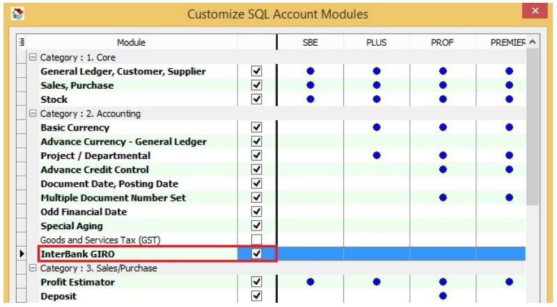

## Bank File Format

The following shows the list of bank file formats that are currently supported.

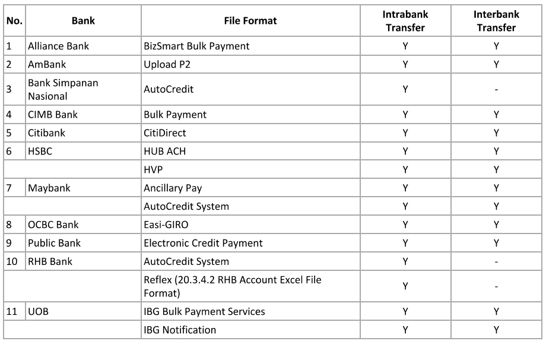

## Payment Method

1. Click the **Bank Info** button.

     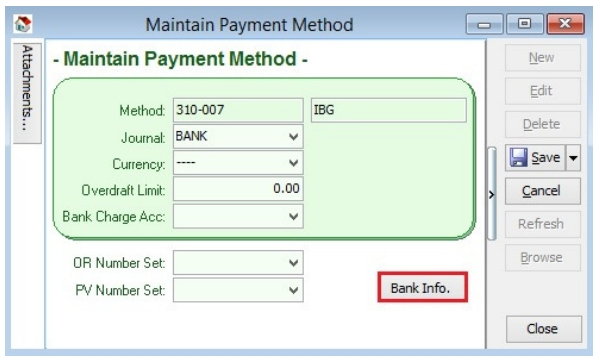

2. Choose a **bank**.

      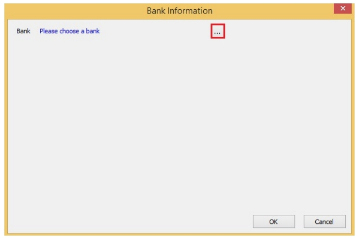

3. Click the **OK** button.

      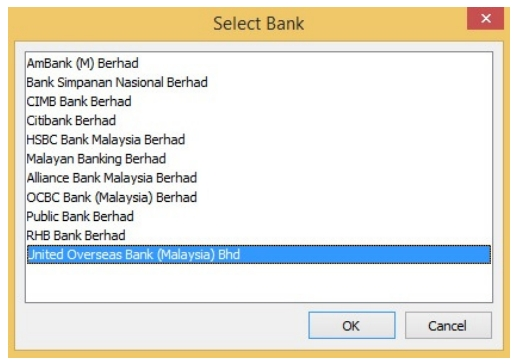

4. The bank you have chosen may have **more than one file format**, please ensure you have selected the **correct file format**.

      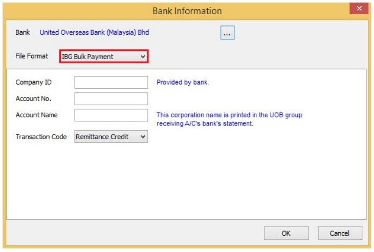

5. Enter the **bank information**, click the **OK** button, then Save.

      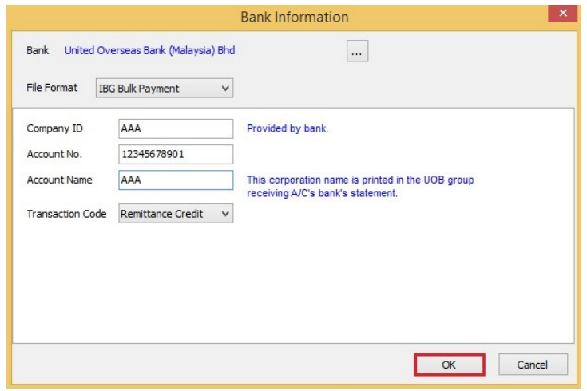

## Supplier Bank Account

1. Add a **bank account**, then Save.

      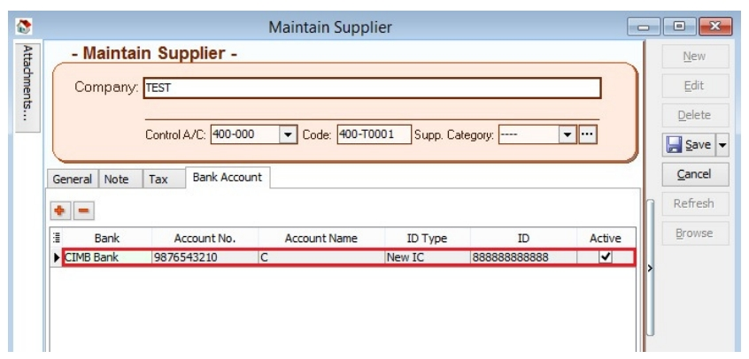

## Supplier Payment Method

1. Select **Supplier Bank** from the drop-down list.

      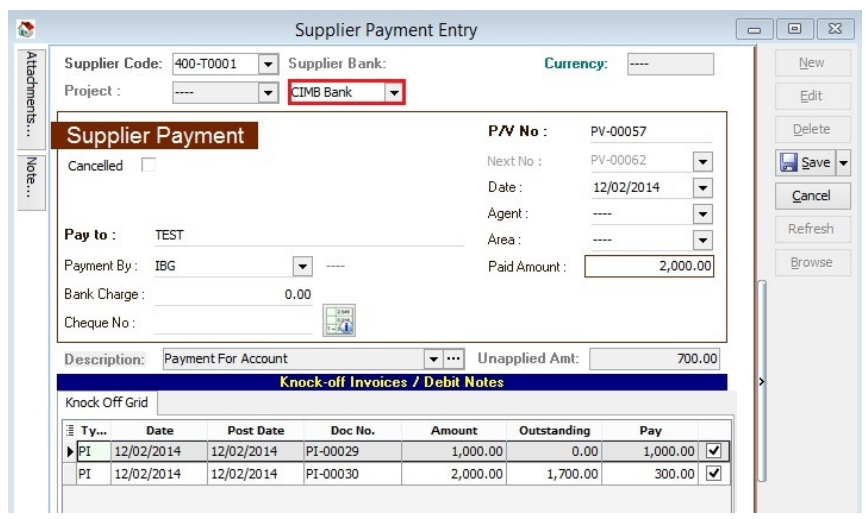

2. Choose the **payment method** that contains **bank information**, then Save.

      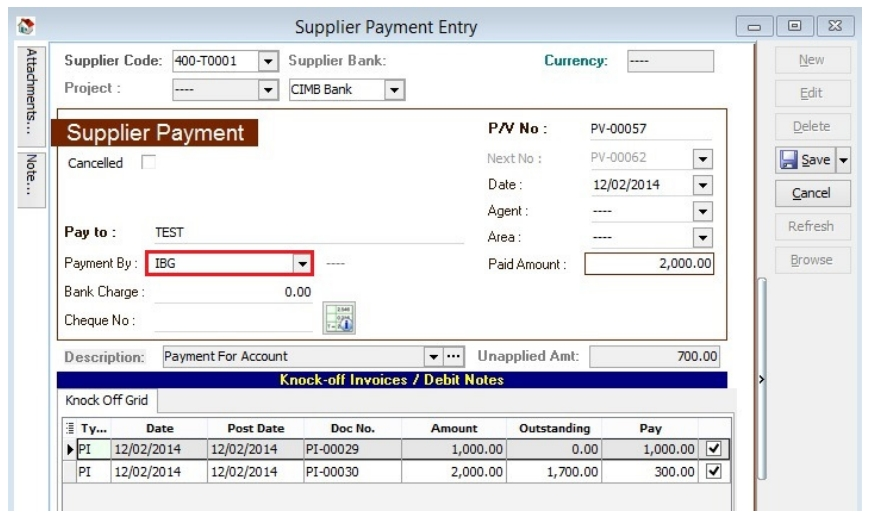

## Print Supplier Document (Interbank GIRO) Listing

1. Click the **GIRO** button.

      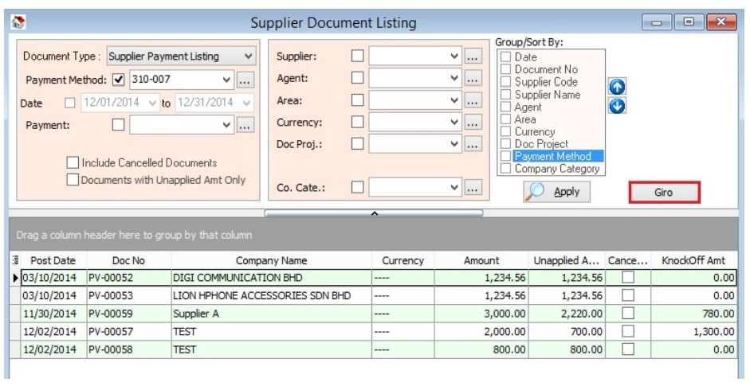

2. Enter additional information, then click the **Save** button.

      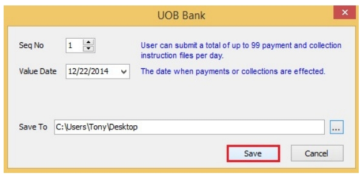

3. You can now upload the bank instruction file to the bank host.

## Excel Format

By default, the system automatically saves an Excel file in XLSX format. Some banks (**Alliance Bank, Public Bank, RHB**) require the bank instruction file in XLS format. First, you must have **Microsoft Excel 2007** or a version above installed on your machine.

Then, **open** the Excel file and **save it as XLS** format.
