## Customer Invoice

Invoice with amount USD100 | Rate 3.00 | Local net total = RM300

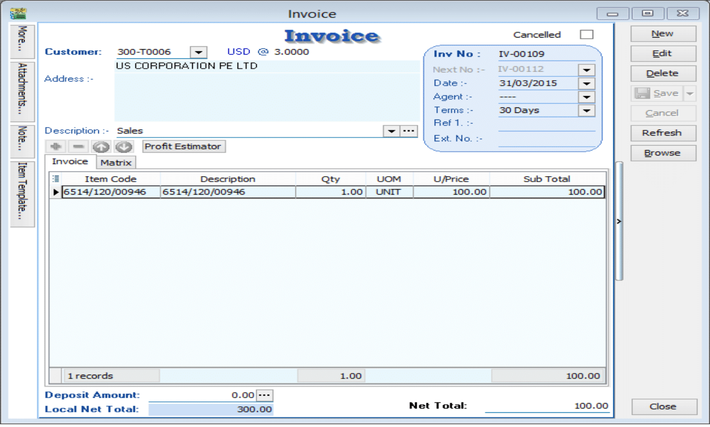

### Situation 1: Received payment RM330, so Gain RM30

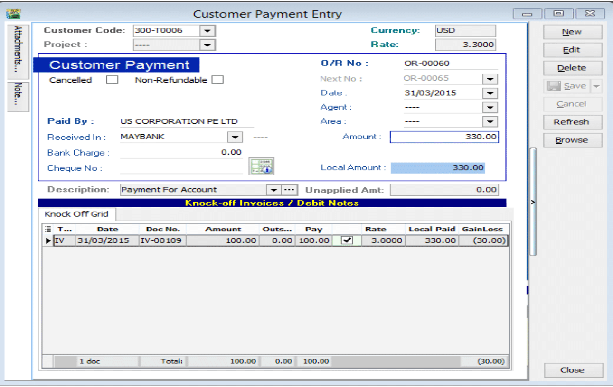

Please follow the steps below to do the bounce payment:

1. **Issue a Customer Debit Note as the previous invoice that had issue.**

    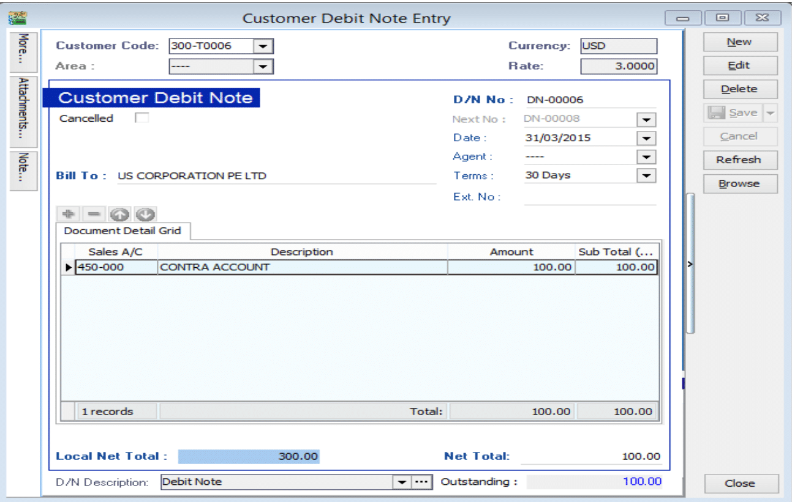

2. **Issue a payment voucher to credit out the amount that already knock off.**

    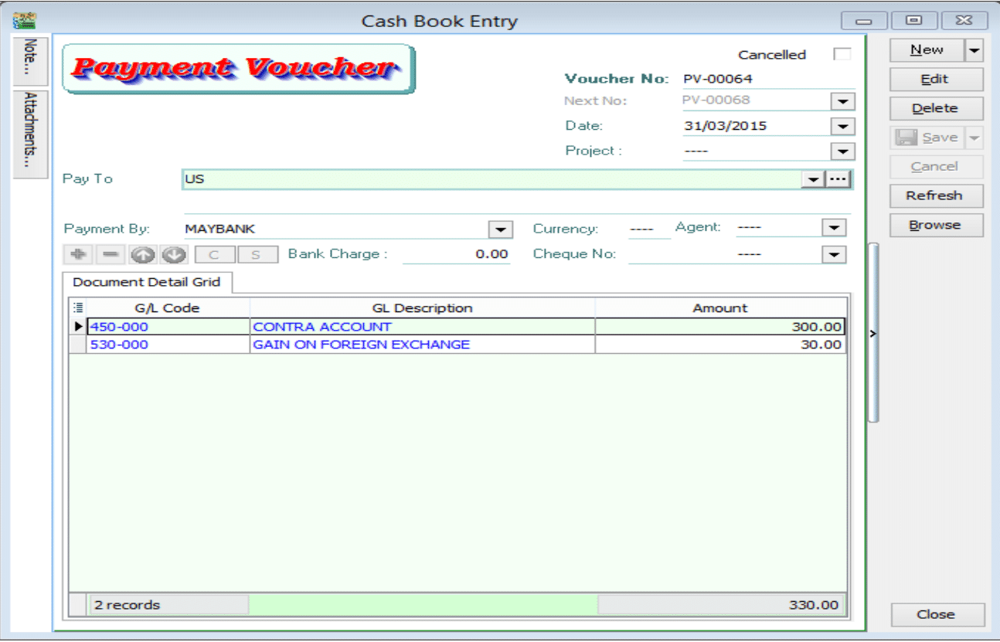

### Situation 2: Received payment RM270, so Loss RM30

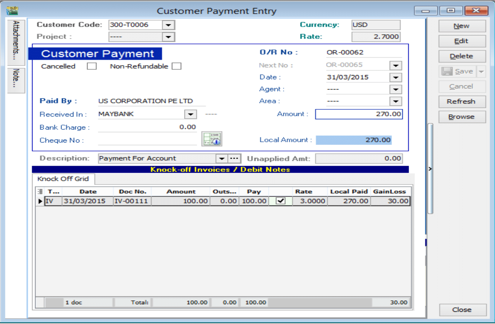

Please follow the steps below to do the bounce payment:

 1. **Issue a Customer Debit Note as the previous invoice that had issue.**

     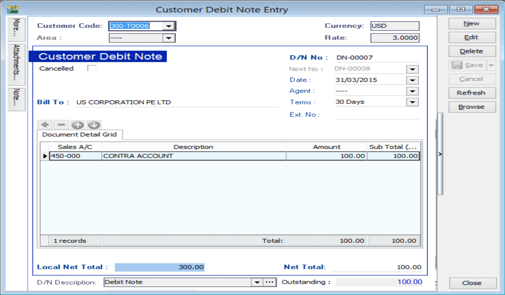

 2. **Issue a payment voucher to credit out the amount that already knock off.**

     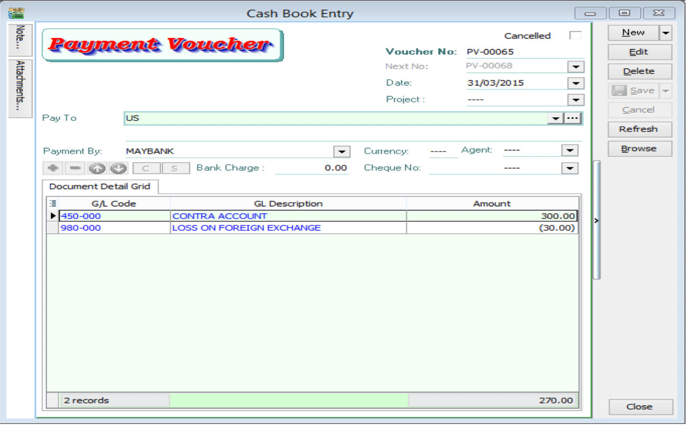

## Supplier Invoice

Supplier Invoice with amount USD100 | Rate 3.00 | Local net total = RM300

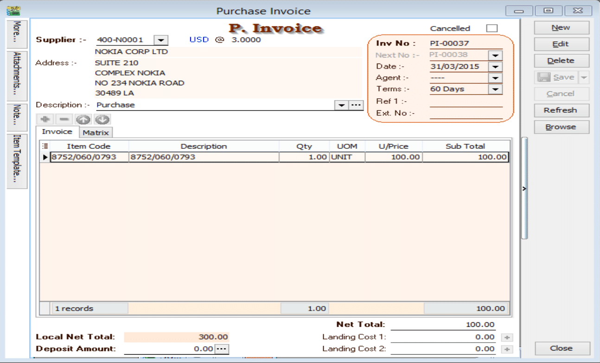

### Situation 1: Make payment RM330, so Loss RM30

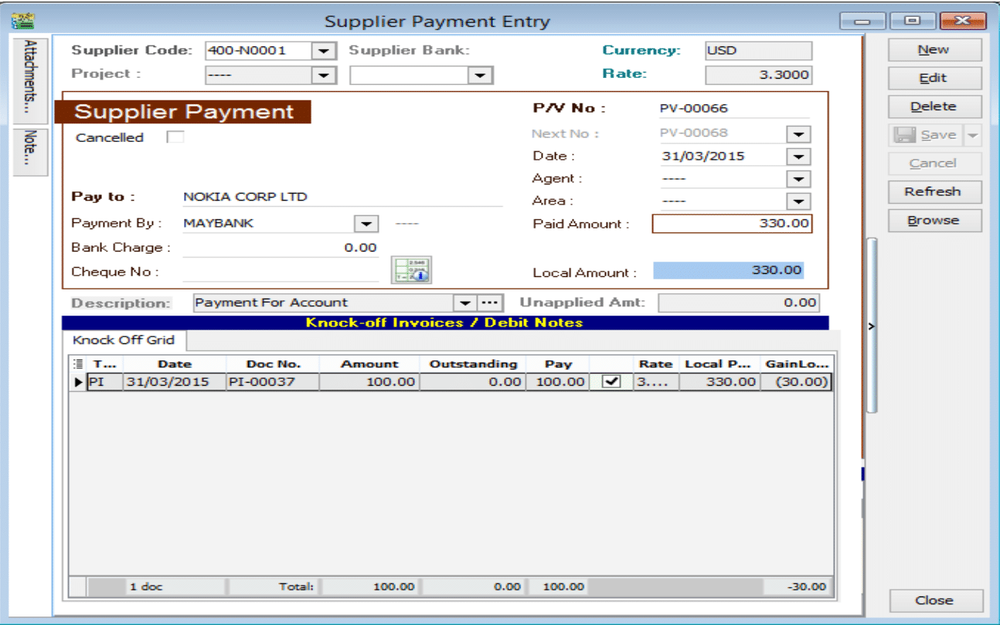

Please follow the steps below to do the bounce payment:

 1. **Issue a Supplier Debit Note as the previous invoice that had issue.**

     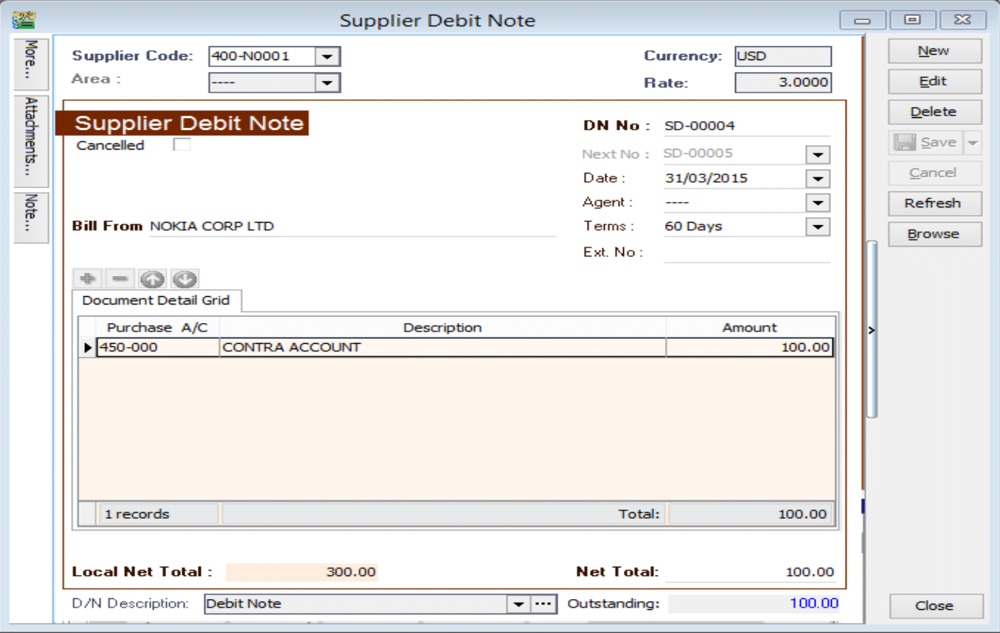

 2. **Issue an Official receipt to debit the amount that already knock off.**

     ***Put USD30 into loss GL account because we need to paid more USD30 to supplier,but we loss USD**.

     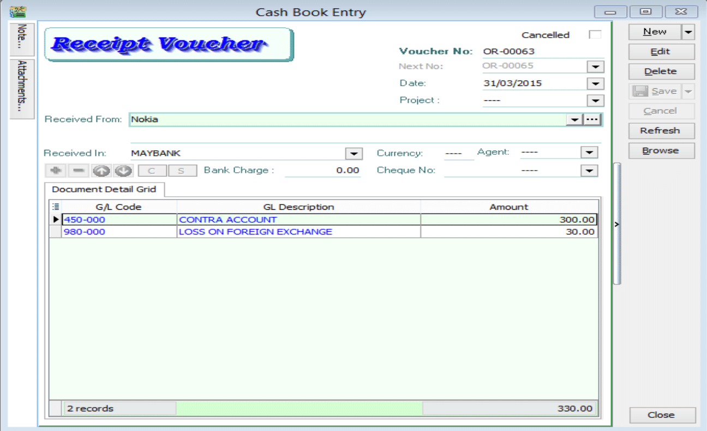

### Situation 2: Make payment RM270, so Gain RM30

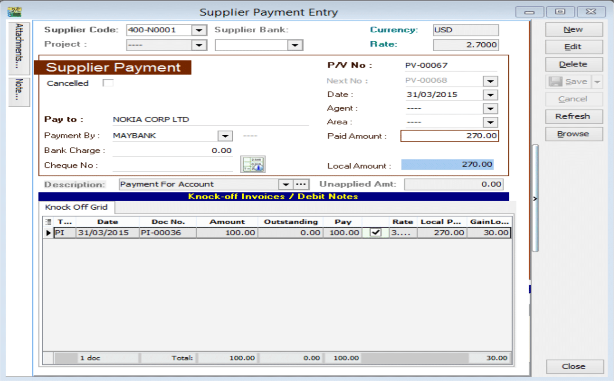

Please follow the steps below to do the bounce payment:

 1. **Issue a Supplier Debit Note as the previous invoice that had issue.**

     

 2. **Issue an Official receipt to debit the amount that already knock off.**

     **\*Put USD -30 into gain GL account because we pay less USD30 to supplier,but we gain USD30.**

     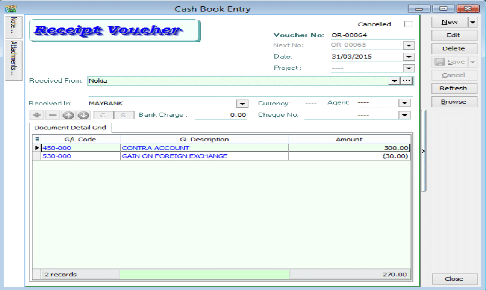
