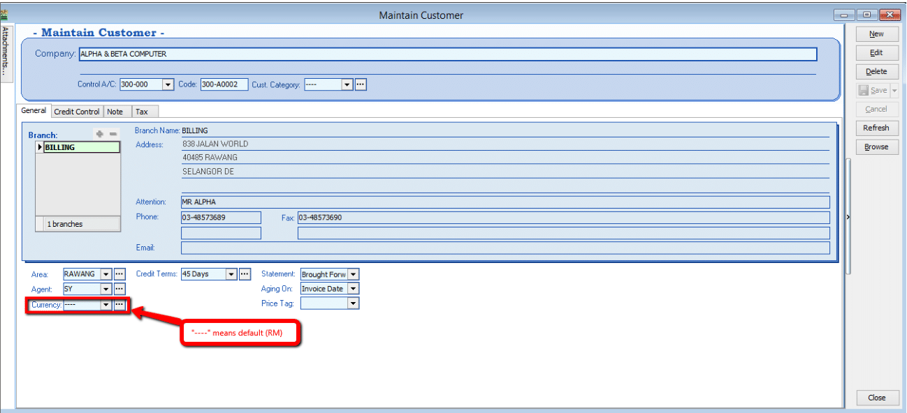
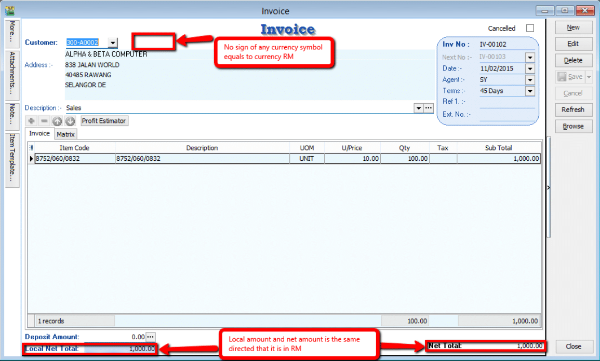
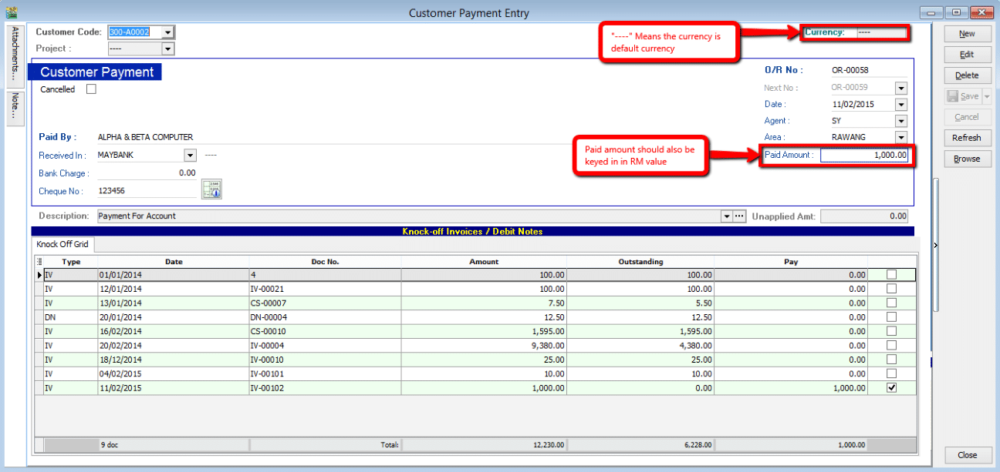
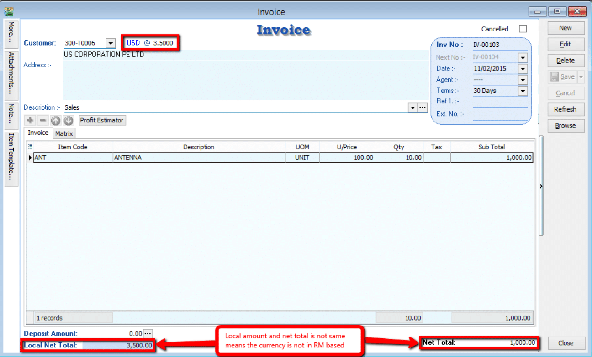
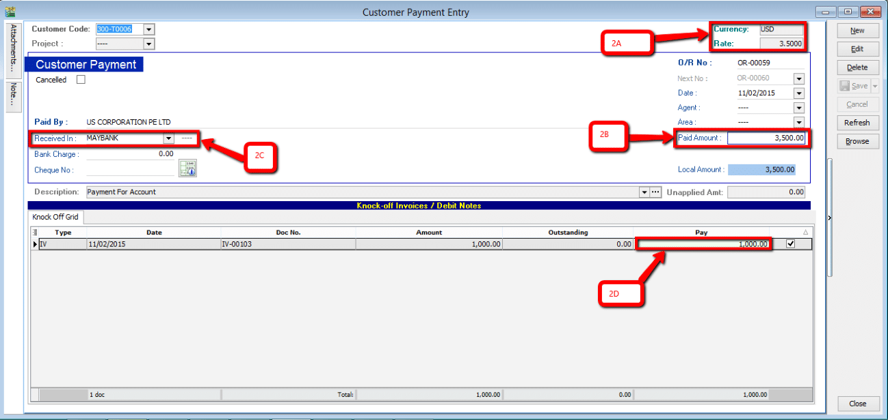
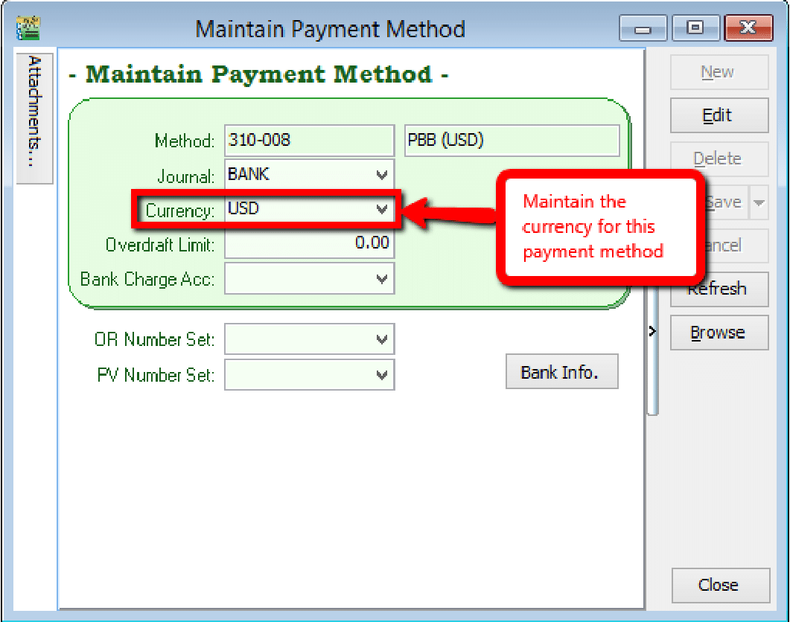
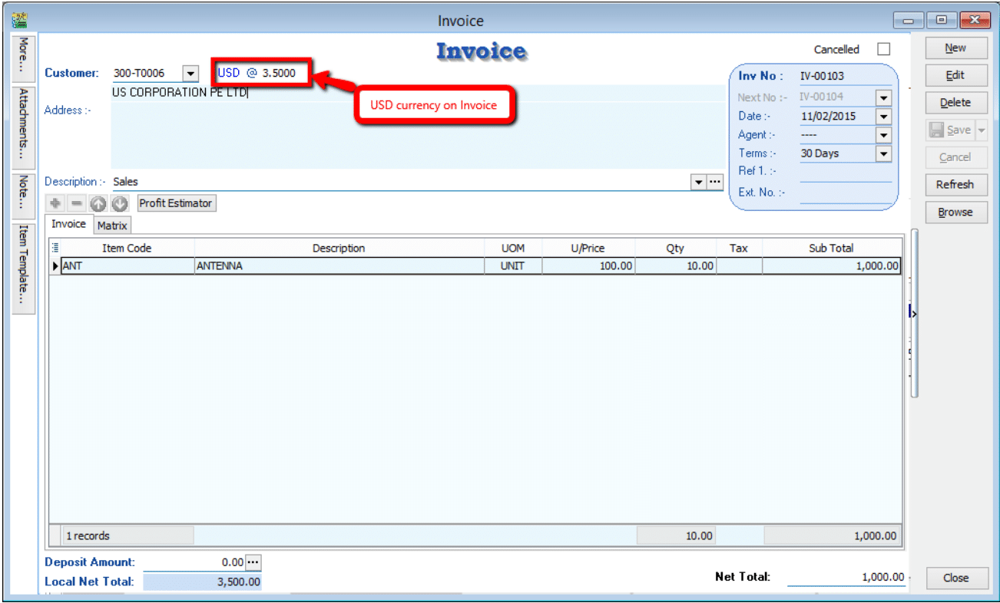
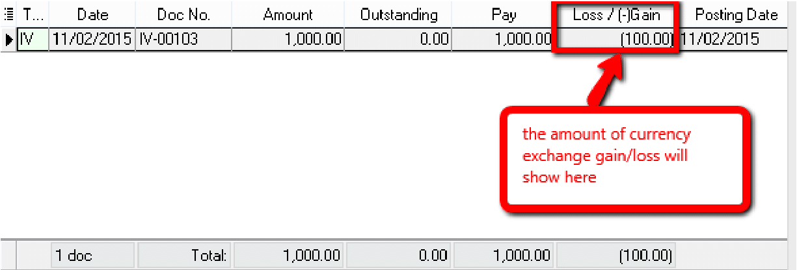
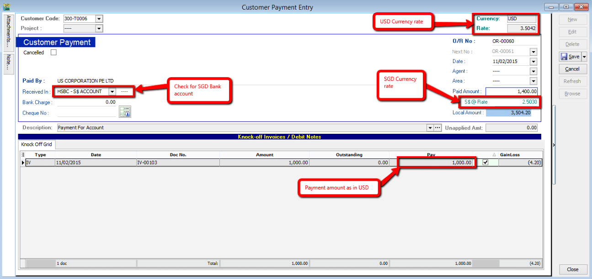

## Customer Payment Scenario

|#|Customer Pay| You Receive|
|---|---|---|
|1|RM|RM|
|2|USD|RM|
|3|USD|USD|
|4|USD|SGD|

### 1. Customer Paid in RM & Payment Received in RM

1. First step to know the customer for currency RM by default is with “----“ sign.

    **Tools > Maintain Customer**

    

2. Customer order and proceed to Invoice

    **Sales > Invoice**

    

3. Proceed to Payment

    **Customer > Payment**

    

Make sure the above step for Customer in RM currency, payment in default is RM currency also.

### 2. Customer Paid in USD & Payment Received in RM

:::note
Refer to  Step 1 in [Scenario 1](#1-customer-paid-in-rm--payment-received-in-rm) to know if the customer using USD currency.
:::

1. Check the local amount and net total. Is it different with the previous one? If yes, proved that the document amount is in USD currency.

   **Sales > Invoice**

    

2. Proceed to Payment

    **Customer > Payment**

    

    - 2A. Currency rate for knocking off the payment (System auto calculate)

    - 2B. Payment Amount made in RM (Note: This payment amount is based on Bank payment method currency) **[check on Tools >     Maintain payment method to know more!]**

    - 2C. Bank payment method, make sure you choose the correct bank.

    - 2D. This pay amount you can either put it on your desire amount and check on the 2A, you’ll notice that currency rate will change once you try to knock off the amount.

### 3. Customer Paid in USD & Payment Received in USD

1. For this case where customer currency is USD and payment also in USD, there’ll be a few more step to do.

    1. you have to maintain a USD Bank in GL Account (**GL > Maintain Account**) where this will be the bank you’ll be getting your
    payment in.

    2. after maintain the GL Account, go to **Tools > Maintain Payment Method** to assign the currency of the
    payment method in the particular bank.

    

2. After maintained payment method, we can proceed to do transaction for cases similar (USD Currency on Invoice).

    **Sales > Invoice**

    

3. Proceed to Payment

    **Customer > Payment**

    :::info
    Only Customer currency that is same with payment currency will enable the editing of Rate for currency on top right corner
    :::

    

   1. Now, this rate can be changed as the currency rate change according to the currency rate

   2. Select the correct payment method in order to allow USD payment knocking off USD Invoice

   3. Paid amount will be the amount of USD you receive

   4. Local amount is the amount of conversion of (paid amount x currency rate at the moment)

   5. This IV amount will always be following the currency amount not local amount.

    After confirming all the related info is correct may save it. If your currency rate is different from the one stated in the Invoice, a message should prompt out defining your gain/loss on foreign exchange.

    

    :::note
    If your Invoice currency is stated 3.5 at the moment, and when your customer pay to you on 3.6 rate, the system will auto calculate the amount of gain/loss you actually got from this transaction and show to you the amount when you click save. Above prompt dialog will appear.
    :::

### 4. Customer Paid in USD & Payment Received in SGD

For customer on USD and receiving payment on different currency you just need to main the payment method.

:::note
How to maintain payment method? – Refer to [Scenario 3](#3-customer-paid-in-usd--payment-received-in-usd)
:::

1. Select for the payment method ( Bank account in SGD ).

2. Put in the payment amount and change the currency rate of SGD, check the amount for confirmation.

    :::note
    Only Customer currency that is same with payment currency will enable the editing of Rate for currency on top right corner
    :::

3. Put in the payment amount on `Pay` column, tick on the payment knocking invoices check for the USD rate as it change.

    

The knock-off amount will calculate automatically. If there’s any currency exchange gain/loss, simply click on the save button and you'll be notify about the amount of gain/loss on foreign currency exchange.
