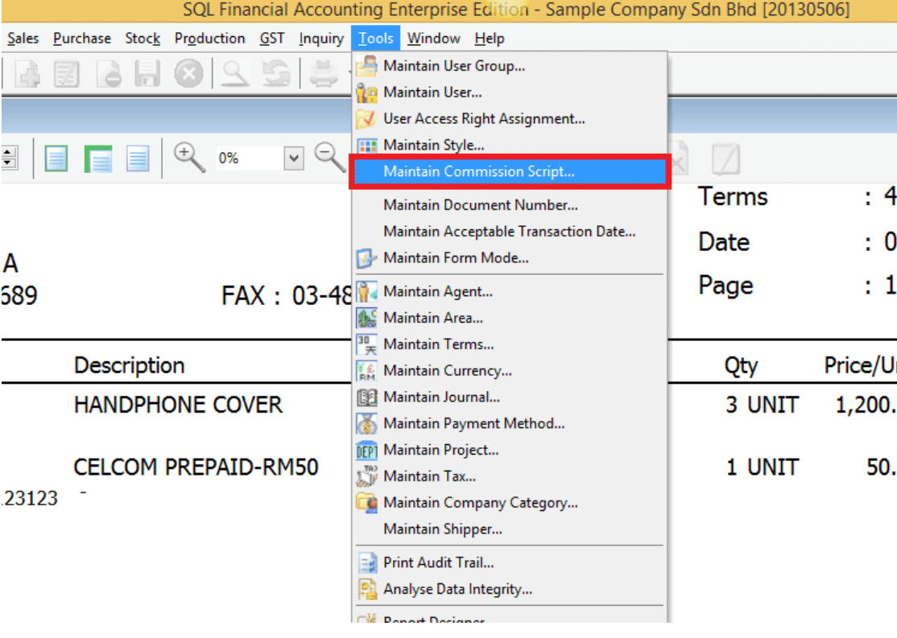
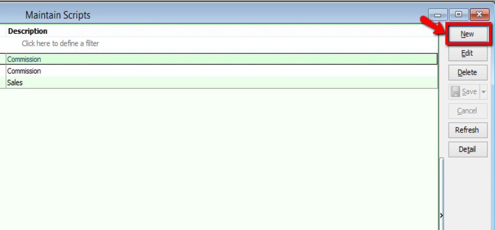
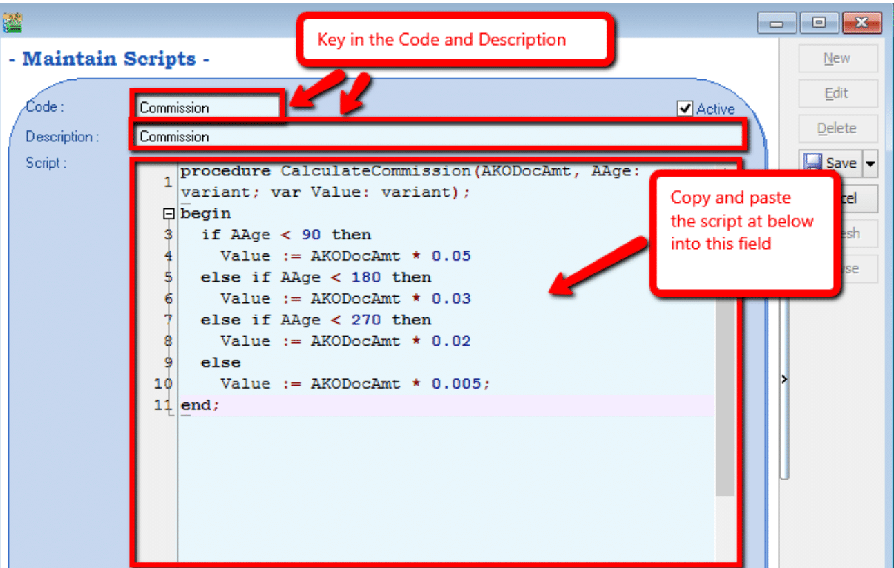
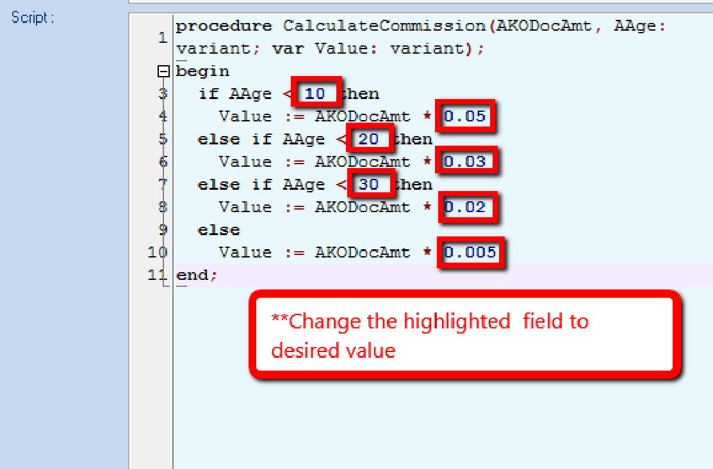
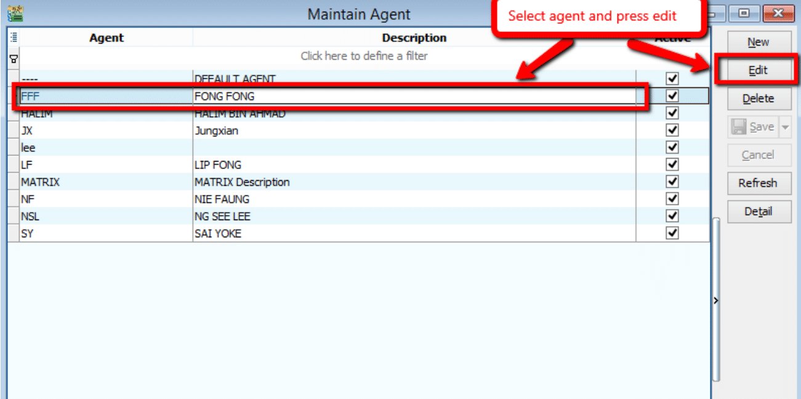
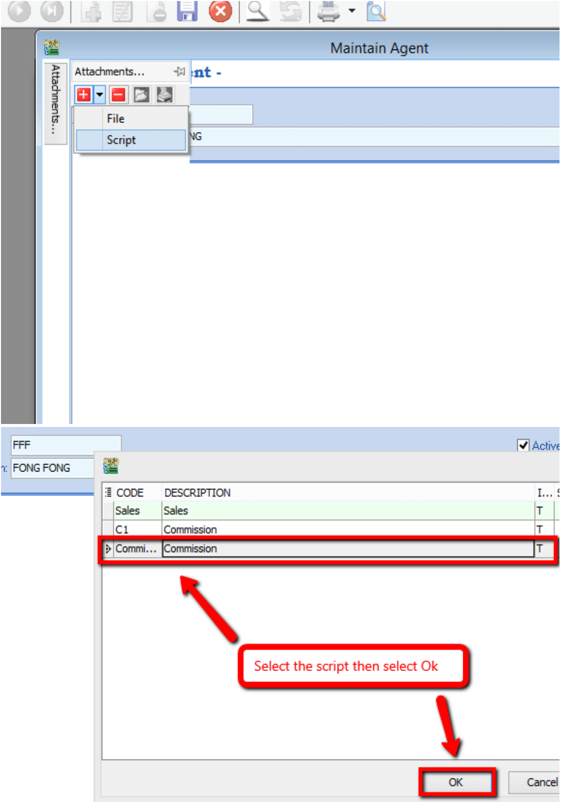
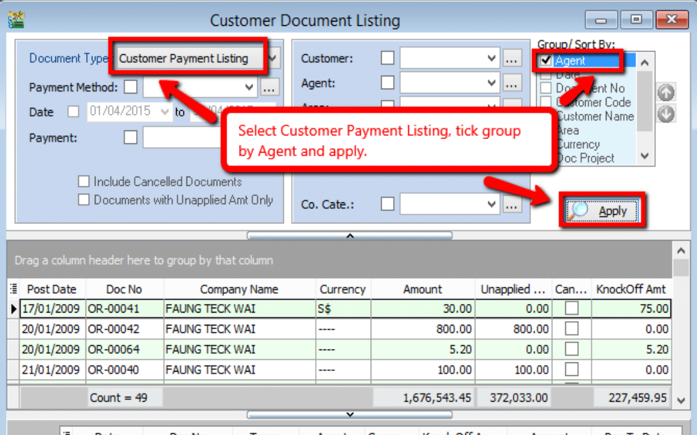
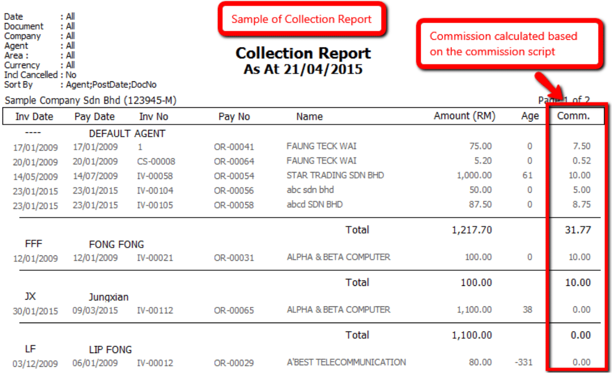

### Guideline: Commission Report

1. Go to **Tools > Maintain Commission Script > New** to add in the commission
   script. Fill in the Code and Description.

    :::note
    Maintain Commission Script requires additional module
    :::

    

    

    

    Default commission script:

    ```pascal
    procedure CalculateCommission(AKODocAmt, AAge: variant; var Value: variant);
    begin
        if AAge < 10 then
            Value := AKODocAmt * 0.05
        else if AAge < 20 then
            Value := AKODocAmt * 0.03
        else if AAge < 30 then
            Value := AKODocAmt * 0.02
        else
            Value := AKODocAmt * 0.05005;
    end;
    ```

2. Change the value highlighted as below according to commission rate for agent and Save.

   

    1. Value 10, 20, 30 = Age

    2. Value 0.05, 0.03, 0.02, 0.005 = Commission Rate

3. Go to **Tools > Maintain Agent** and select the agent that need to load the commission script.

    

4. At the attachment tab, add in the commission script by selecting it as shown below and click Save after adding the script.

    

5. Go to **Customer > Print Customer Document Listing**, select **Document Type** as **Customer Payment Listing**, group by Agent and apply. Preview the result with **Cust Local - Payment Listing - Collection Report**.

    

    

    
