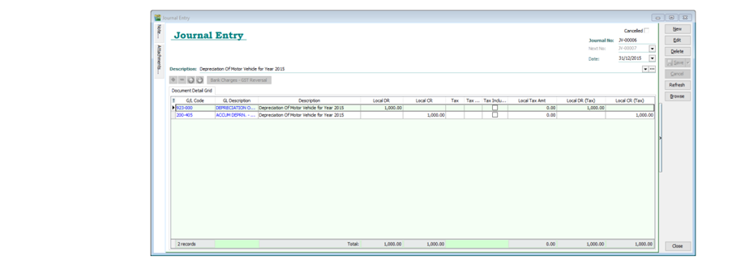
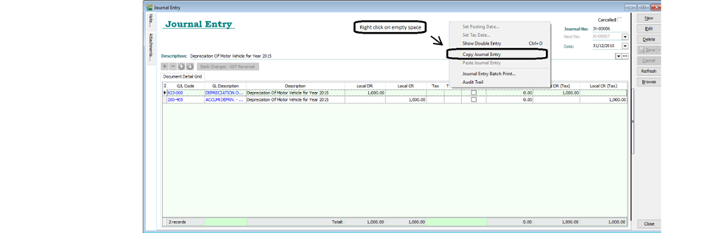
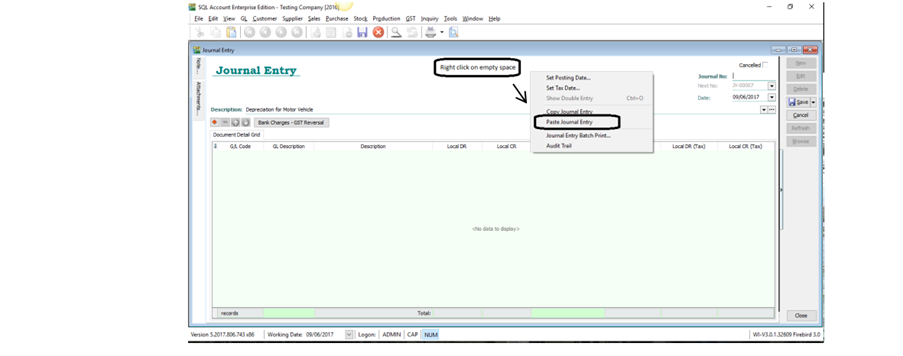
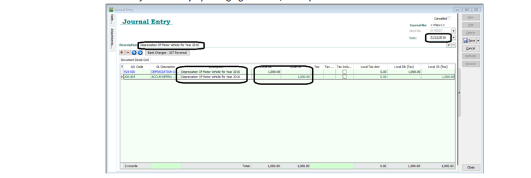

## Record accumulated depreciation for fixed asset

1. **GL > Journal Entry > New**

2. Key in the double entry for recording accumulated depreciation

   :::info
   Eg: Record the depreciation of motor vehicle in year 2015
   Debit Depreciation Expenses RM1000
   Credit Accumulated Depreciation of Motor Vehicle RM1000
   :::

3. Save

   

## The Next Year

1. **GL > Journal Entry**. Open the journal entry of depreciation in year 2015

2. Right click on empty space, refer picture , **Copy Journal Entry**

   

3. **New**

4. Right click on empty space, refer picture, **Paste Journal Entry**
   

5. Edit the journal entry by changing the date, description and amount

   

6. Save!
