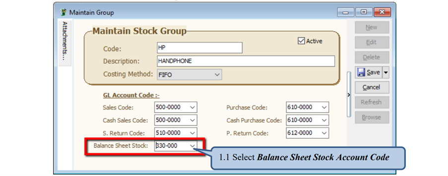
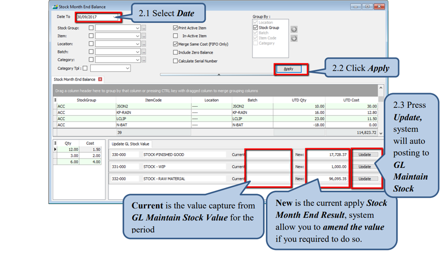
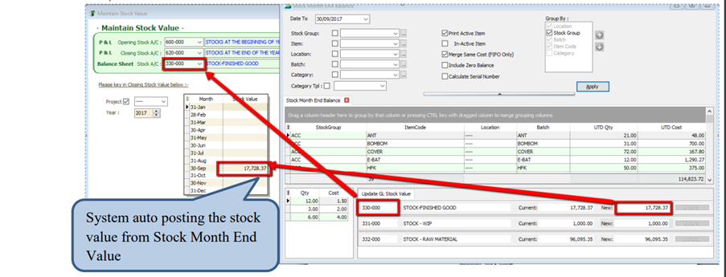

:::warning
Require SQL Account version 748 & above.
:::

This feature allow system auto post the stock value from Maintain Month End value to GL Maintain Stock Value.

## Setup

### 1. Stock > Maintain Stock Group

### 2. Stock > Stock Month End Balance Report

:::info Note :
Required to fill in Balance Sheet Account in Stock Group in order able to show the update GL Stock Value.
:::

### 3. GL > Maintain Stock Value

