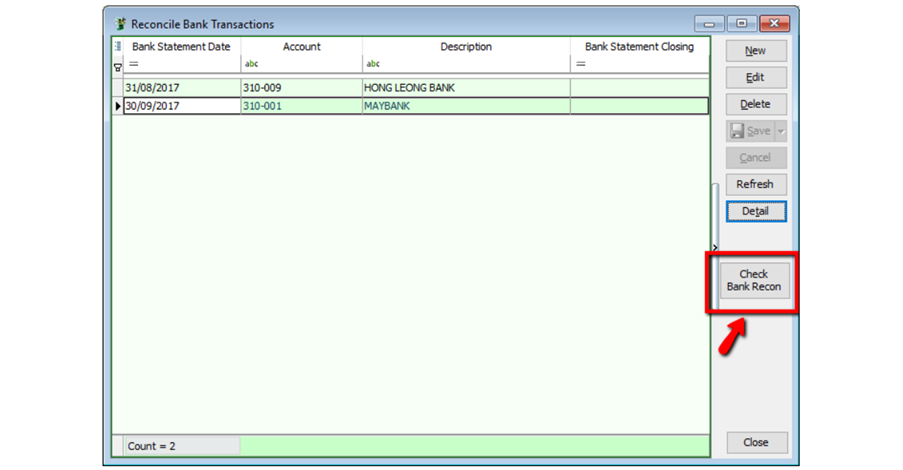
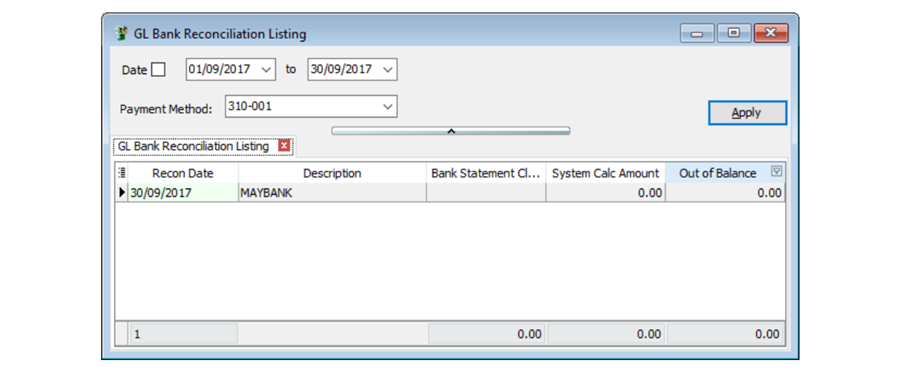
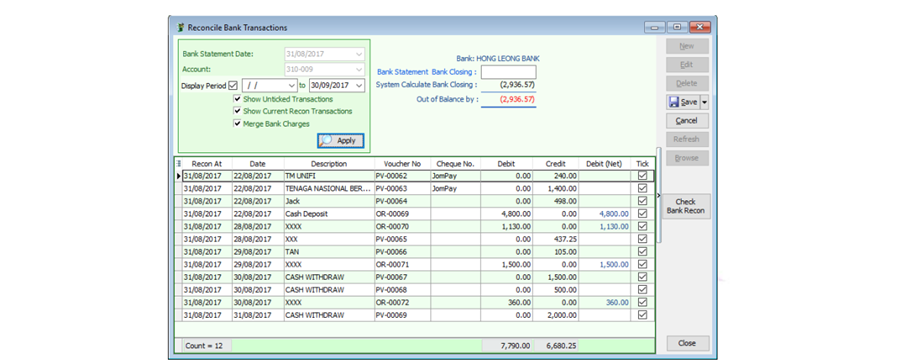
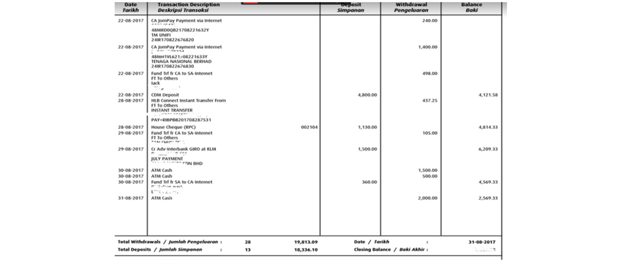
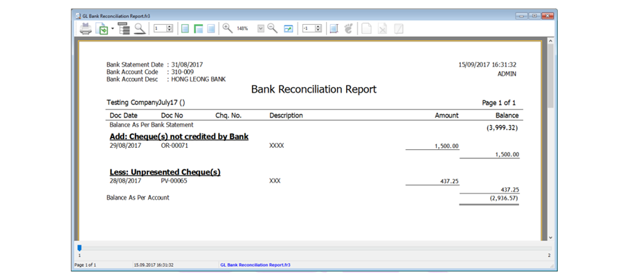

:::note
For Opening Bank Reconciliation, you may refer this [Guide](../../usage/general-ledger.md#bank-reconciliation).
:::

A bank reconciliation is a process performed by a company to ensure that the company's records
(check register, **general ledger account**, **balance sheet**, etc.) are tally with bank's records.

## Setup

### 1. Reconciliation Bank Transaction

   GL | Bank Reconciliation
   

   

### 2. Bank Reconciliation

- Select the Bank Statement Date
- Select the Bank Account, eg. Hong Leong Bank
- Display Period (normally the date from period will be BLANK, and date to will be same as per Bank Statement Date)
- Check(√) Show Unticked Transaction
- Check(√) Show Current Recon Transaction
- Check (√) Merge Bank Charges
- Click Apply
- You may tick the bank transaction reconcile with the transaction show in Bank Statement and save

   

   

   As attached bank statement is the sample, compare with the transaction, if exist then you may check as sample picture above.

### 3. Print Bank Reconciliation Report

After reconciliation done, you can save and preview reconciliation report

:::note
You can press F6 button for preview report.
:::
