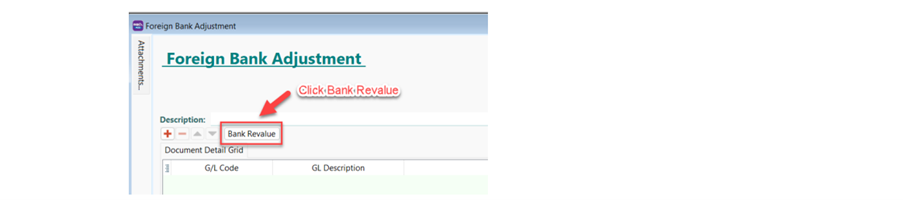
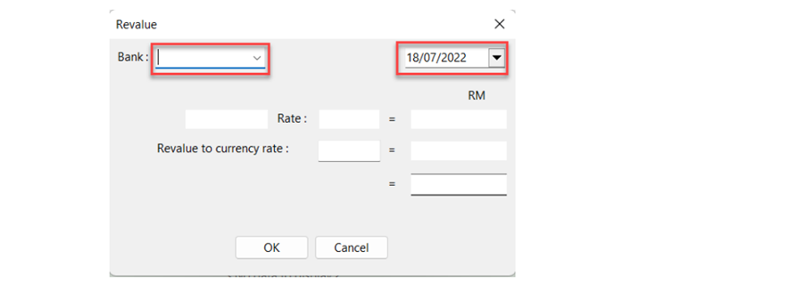
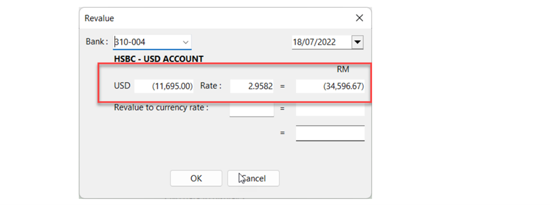
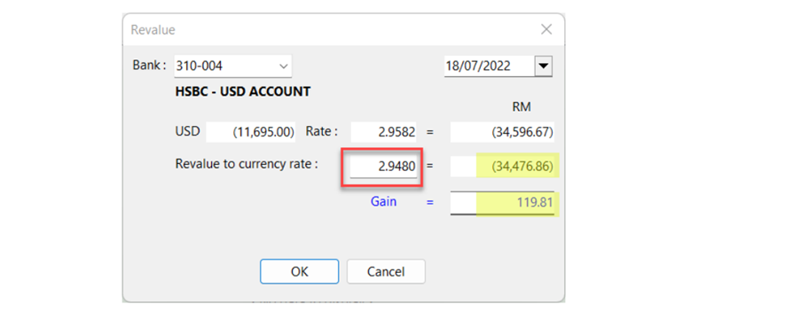
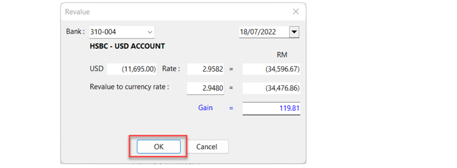
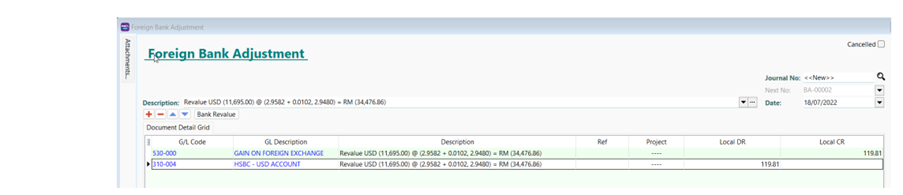

## Setup

1. Go to GL > Foreign Bank Adjustment > Create New > Click Bank Revalue

    

2. In Revalue windows > Select Bank Account Code & Date

    

3. balance USD & local amount are shown as per ledger report

    

4. Enter the Revalue to currency rate, system will auto recalculate the

   - new local balance amount
   - Gain/Loss Amount

    

5. Click OK

    

6. System will auto post the double entries

    

7. Click Save

8. Please check the ledger for the adjustment post
