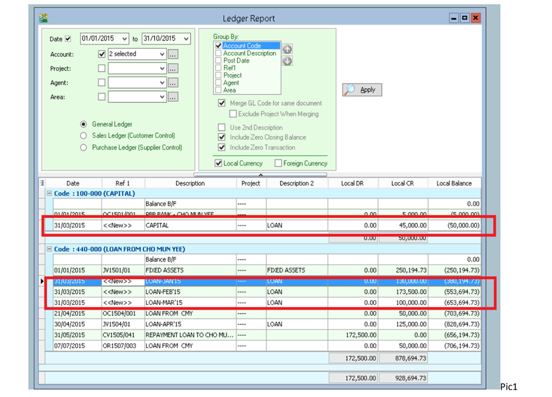
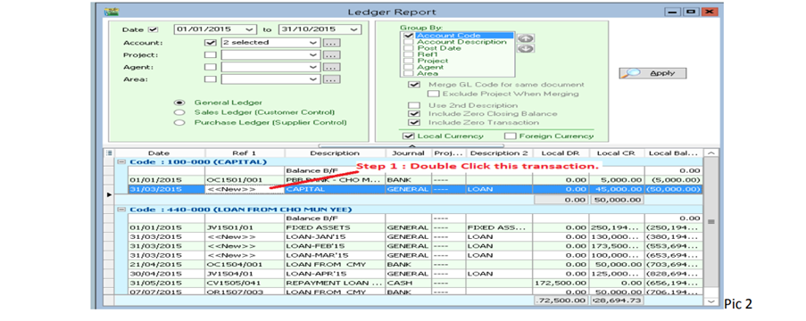
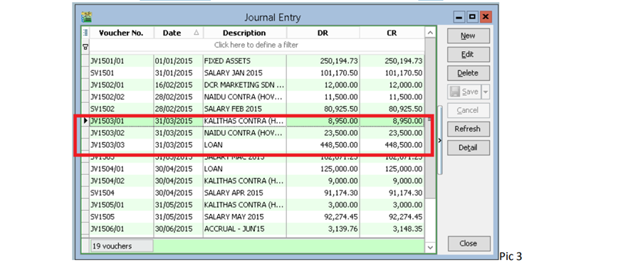
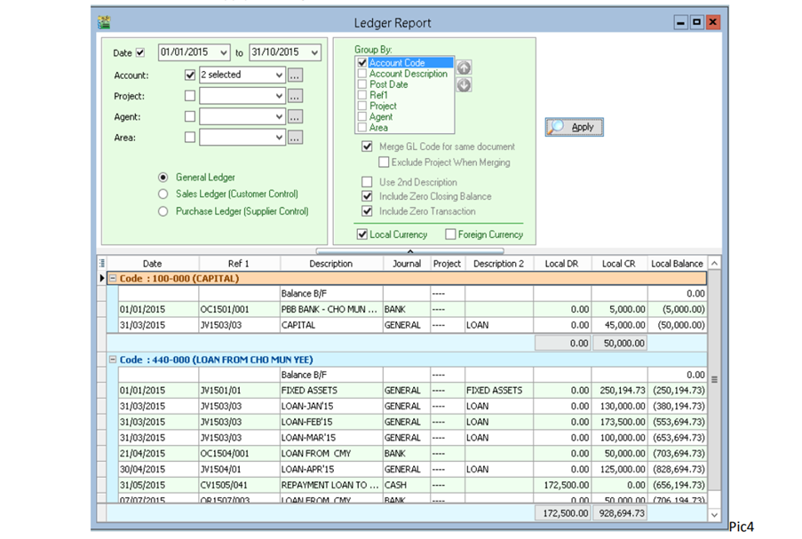

## Example

When you see General Ledger Report `Ref1(DocNo)` appeared as `<<New>>`, use the method below to fix it.

## Fix

1. Find out the document to check the source for this document.

    

2. Go to **Journal Entry**, look for the Date 31/03/2015 (Because Ledger Date is 31/03/15)

    

3. Press Edit and Save Button for all the Date is 31/03/2015.

4. After Edit and Save, apply the Ledger to see the result.

    

5. Done
