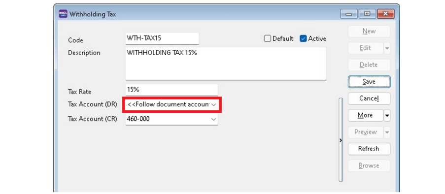
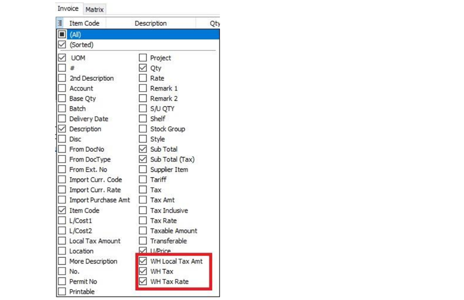
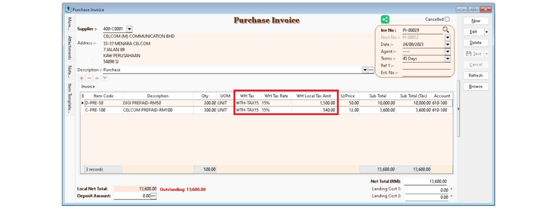
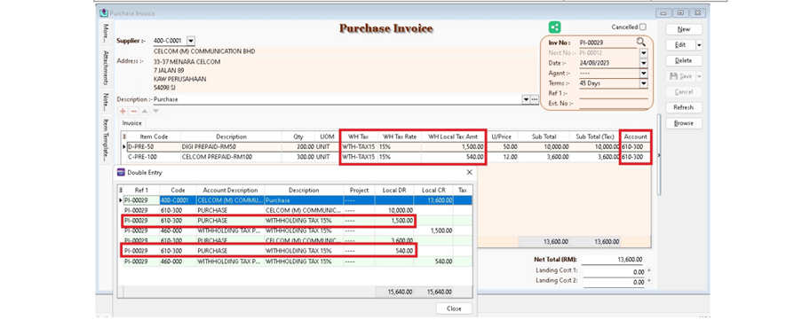
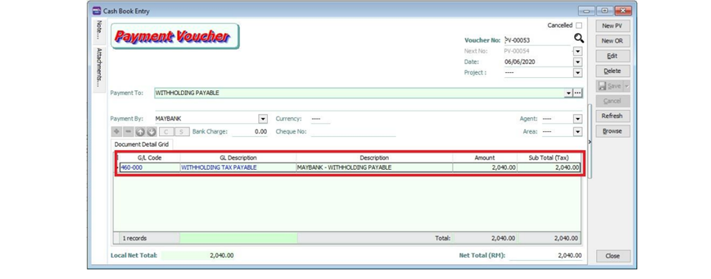

## Withholding Tax Account

Go to **GL > Maintain Account**

| GL Account |     Description      |       Remark            |
|------------|----------------------|-------------------------|
|460-XXX     |Witholding Tax Payable|Under Current Liabilities|

:::note
GL Account not compulsory to be the same.
:::

## Maintain Withholding Tax

Go to **Tools > Maintain Withholding Tax**

1. Click New.

2. Input the following data:

    | Field Name     |     Explanation                          |       Remark                                                                               |
    |----------------|------------------------------------------|--------------------------------------------------------------------------------------------|
    |Code            |Set a code                                |WTH-TAX15                                                                                   |
    |Description     |Describe the meaning/usage of this code   |Withholding Tax 15%                                                                         |
    |Tax Rate        |Witholding Tax Rate                       |15%                                                                                         |
    |Tax Account(DR) |Expenses Account                          |**&lt;&lt;Follow document accounts>>** if leave blank here                                  |
    |Tax Account(CR) |Set to **Withholding Tax Payable** account|At GL\Maintain Account, create the Withholding Tax Payable account under Current Liabilities|

    

    :::note
    Tax Account (DR) leave blank
    :::

3. Click on Save.

## Withholding Tax Purchase Entry

Available in multiple menus:

|Purchase|Supplier|
|---|---|
|Purchase Invoice|Supplier Invoice|
|Cash Purchase|Supplier Invoice|
|Purchase Debit Note|Supplier Debit Note|
|Purchase Returned| Supplier Credit Note|

1. In **Purchase Invoice**, insert the following columns:

    - WH Local Tax Amt
    - WH Tax
    - WH Tax Rate

    

2. Select the Withholding Tax Code in **WH Tax** column.

    

3. System will auto post the withholding tax double entry. Press **CTRL + O** to check the double entry.

    | GL Description                                         |  Local DR |  Local CR  |
    |--------------------------------------------------------|-----------|------------|
    |Expenses Account (follow the document detail GL Account)|XXX        |            |
    |Withholding Tax Payable                                 |           |  XXX       |

    

:::note
Withholding tax amount will not add into the purchase invoice amount.
:::

## Payment of Withholding Tax

1. Go to **GL > Cash Book Entry..**

2. Create new PV.

3. Enter Payee name.

4. Select bank account to pay.

5. In detail grid, select the GL Account **(Withholding Tax Payable)**.

6. Enter the withholding tax amount to be paid. Save it.

    

7. You can check the ledger report for Withholding Tax Payable outstanding balance
