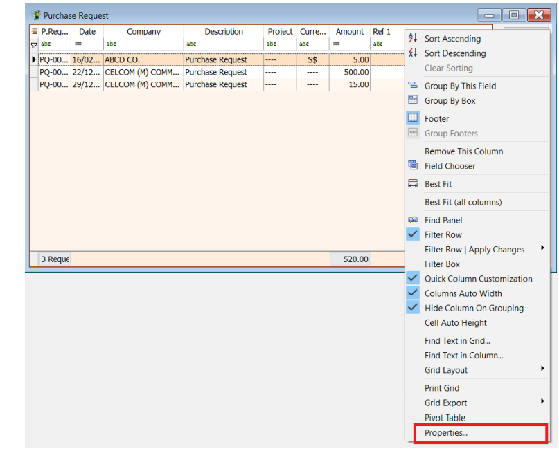
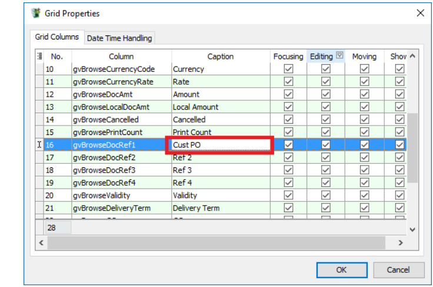
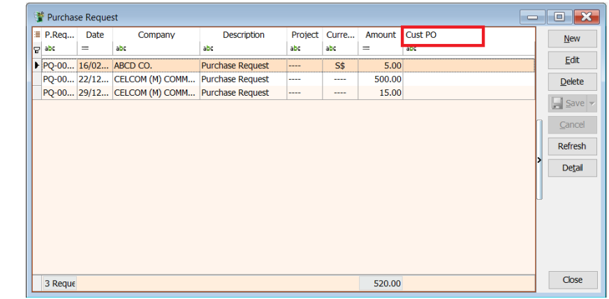

## Steps & Instruction

   1. Right click on any grid header. From the small menu, select **Properties**.

      

   2. Look for the column and change the caption. Click Ok to confirm.

      

   3. Original column name “Ref 1” has been changed to “Cust PO”.

      
