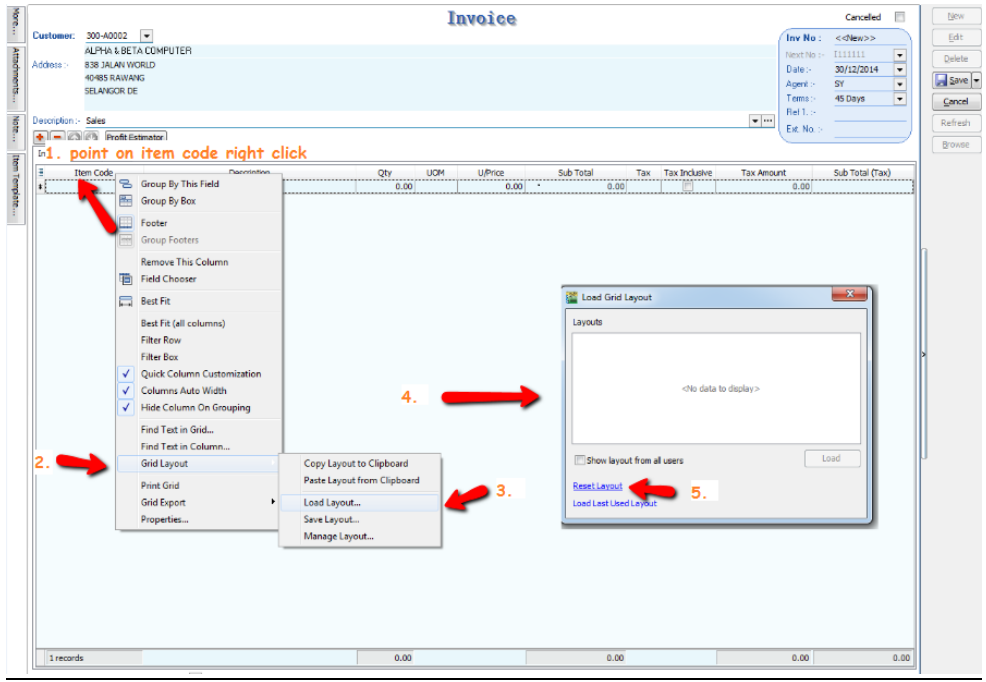
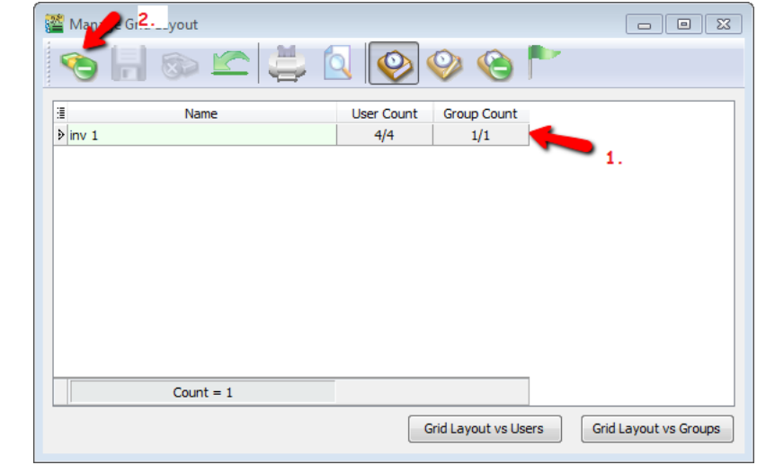
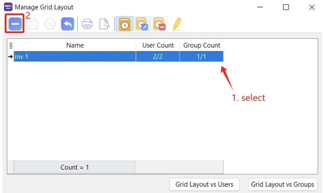

## Step to reset layout

1. Hover over **Item code** and **right click**

2. Select **Grid Layout**

3. Click on **Load Layout**

   

4. Press **Reset Layout**

## Step to delete Existing Layout

1. Hover over **item code** and right click

2. Select **Grid Layout**

3. Click on **Manage Layout**

If your screen looks like the one above , **select the layout** |  press **DELETE** | **SAVE**
