List of frequently-asked questions.

### Error When install SQL POS : Must specify additional Parameter

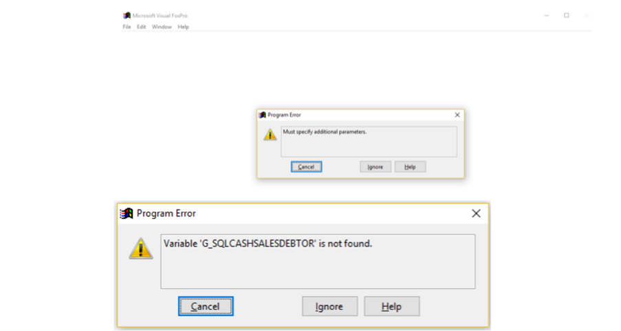

**Solution:**

    - **If New Installation:**


    ```
    1. Delete all the Item from C:\itUnicode
    2. Control Panel | Uninstall SQL-POS
    ```

- **If already have transactions:**

    

    1. Backup SQL POS first

    2. Delete all the Item from C:\itUnicode

    3. Control Panel | Uninstall SQL-POS

### Use Offline Mode

- Unable to capture live Master Transaction from SQL Acc Master

### SQL POS is only Standalone PC

- The reason due to when Database corrupt, it won’t corrupt all, so preferable
    Standalone

### Even though I set to Each Bill(Real Time) still unable to get the UTD QTY in SQL POS?

- In Setting - > SQL Account -> Need to ticked Run This POS When call from
    SQLAcc

    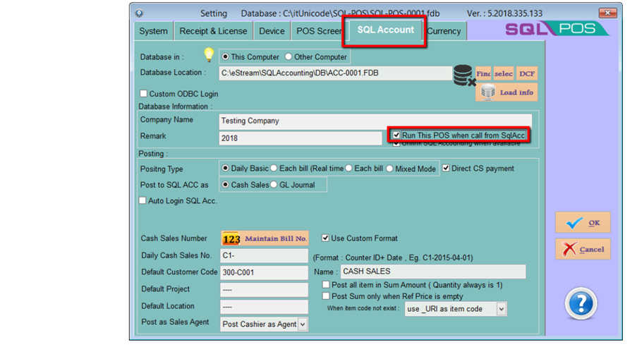

### Why keep prompt me Network failed?

1. Make sure have install Firebird

2. SQL Account have to Set to **Firebird Server** if setting ticked **Run this POS when call from SQLAcc**

### Added Stock Item Code with Chinese word, prompt me unable to find this Product Code ???

- SQL POS unable to support Unicode on Code, may key in the Chinese Word in Item Description
- Code Only Alphanumeric

### Previously using IT Uni POS, how should I integrate in SQL?

#### .1 SQL POS 316 -> FoxPro

1. In SQL Account -> Click on SQL POS(to generate New POS Database)

2. In SQLPOS-> Setting -> System Tab -> Tools -> Select UniPos Migration ->

    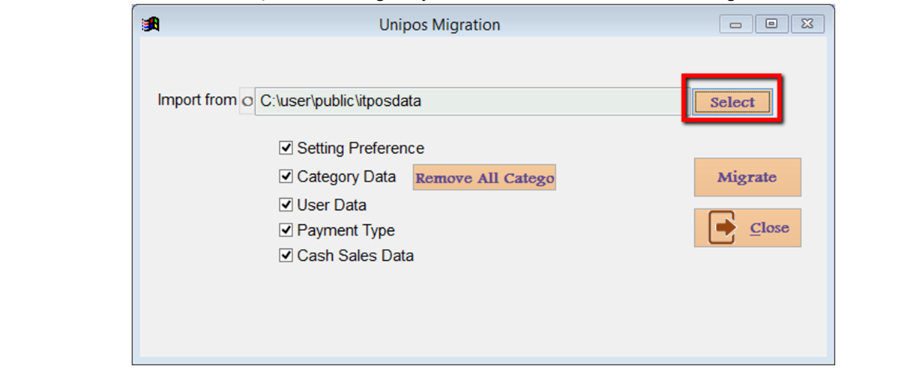

    1. Import From : C:\user\public\itposdata or C:\user\public\unipos

    2. Ticked all the Setting

    3. Click on Migrate

#### .2 SQL POS 333 - > Firebird Database

In SQL POS System -> Double click SQL POS -> Logon Screen -> Right Click
Restore Database

### Print Receipt Chinese word show in ???

- Reason due to Non-Unicode program set to Chinese

Solution :

- Control Panel -> Regional -> Language for Non Unicode -> Set to English (United States)

    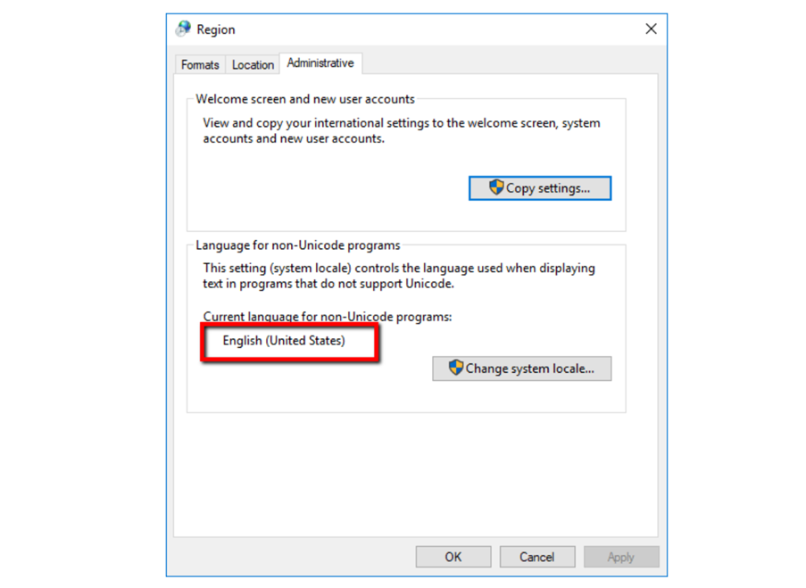

- Font change to Arial

1. Click on Design report

    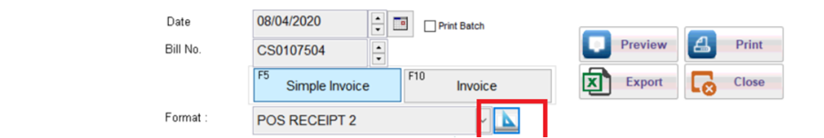

2. Click on Modify

    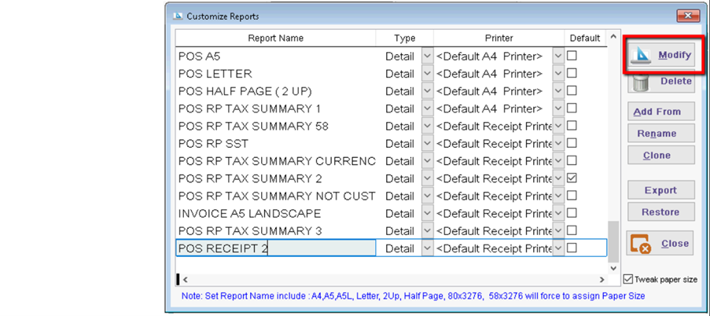

3. Click on Description Text Object -> Menu select Format -> Font

    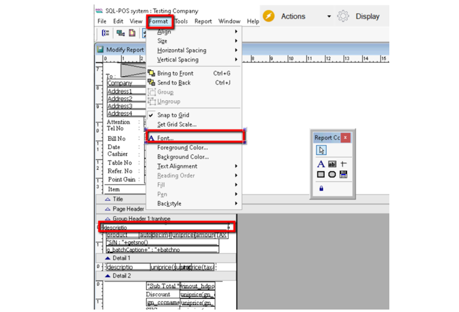

4. Change to Arial

    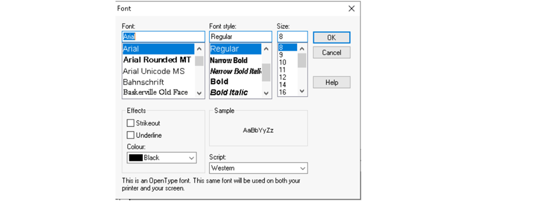

5. Save the report

### Error Message : Warning : Assigned Printer does not exist : Print to PDF (Mac Desktop)

    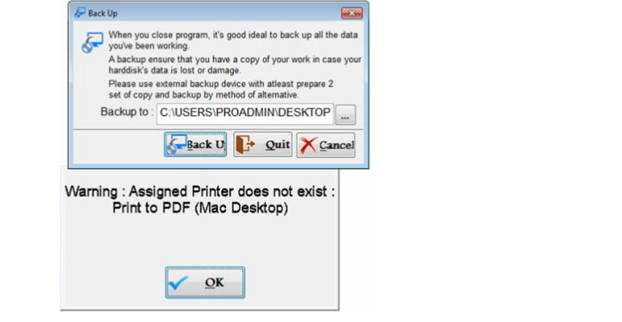

Solution:

1. **Testing Database only** - Delete whole ITUnicode database
2. **Real Database** – May request backup from user upload to us to check (suspect file corrupted)

### Unable to capture correct price Tag Price

Assigned price tag for item A and Item B, how come only first Item A will capture price tag
price, but second item B ref price?

Solution :

Setting -> SQL Account -> Ticked Unlink SQL Accounting when available

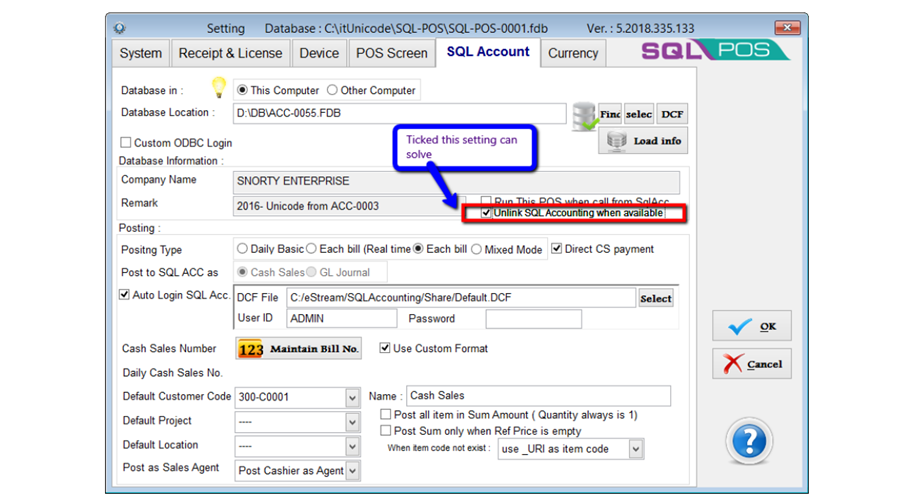

### Error Message : Failed to Set

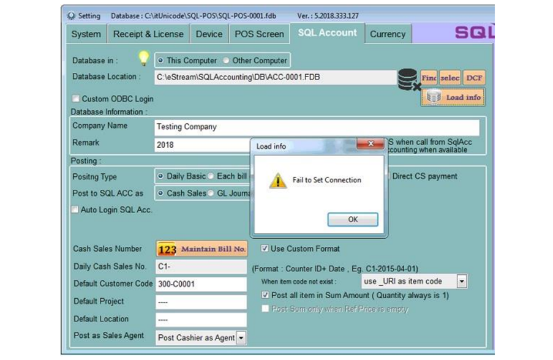

**Solution :**

- Make sure install SQL With 759 & above

### What is Price Set in Stock Item?

- Multiple price set in Maintain Stock Item, user allow to set multiple price with comma.

- Example :
  - Price 1 : RM 10.
  - Price 2 : RM 15.
  - Price 3 : RM 20.

    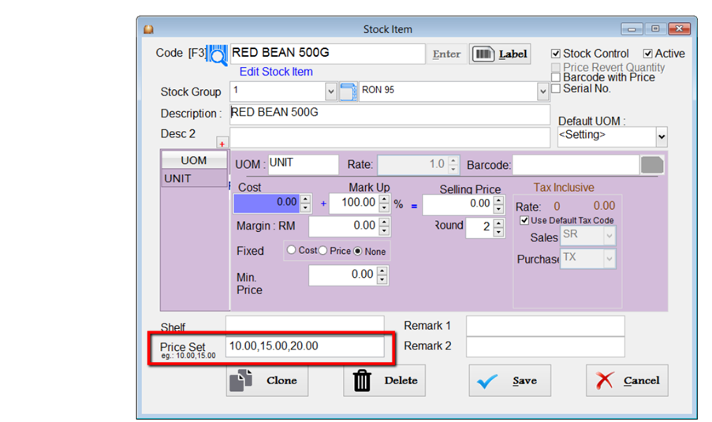

- When select itemcode RED BEAN 500G, auto prompt the price for user to select

    

### What to do if I want to print Barcode Label with Chinese Company Name?

- Save as JPEG, then load the picture into Foxit Design ~

### Error Message : File in use when design barcode report

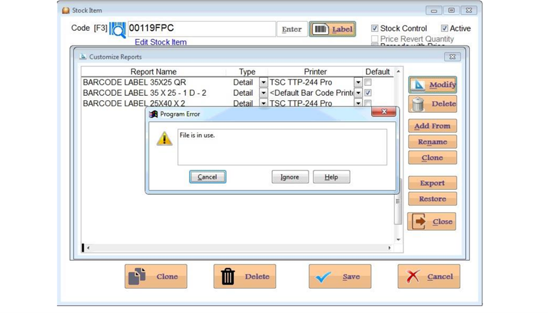

- Try Exit the program and logon
- Delete this report and design again

### Backup Error : C:\itUnicode\SQL-POS\SQL-POS-0001.fdb could not be read

- Is due to IT Sync is running behind, may shut down IT Sync before Backup

### Close Counter Collect Payment Type is not match with Payment Method select in Bills

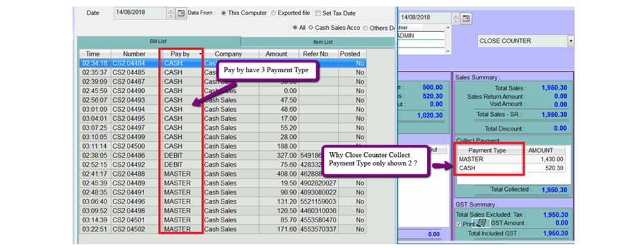

- Collect Payment Summary Payment Type is group by Account Code, may check
    whether the payment method is using same account code ~

:::info
Step to check Payment Method post to what Account

- Setting -> POS Screen -> Payment Method - > Double click on the Payment Name

:::

### Why in Setting Receipt & License Retrieve From SQL button is missing

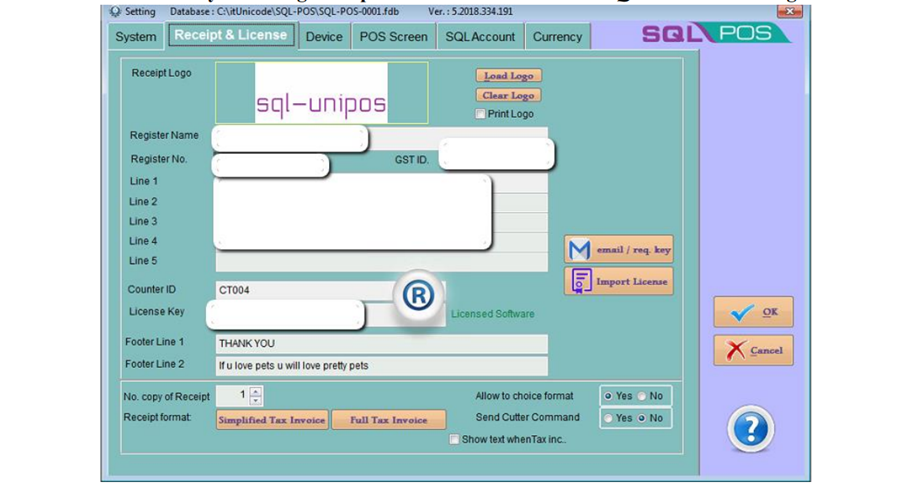

- Once License Registered, the button will disable ~

### Same receipt will auto cut to few pages

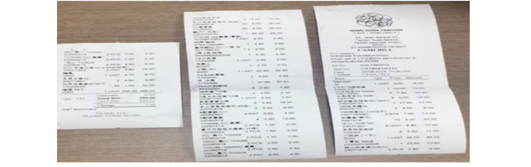

**Solution :**

- Upgrade to latest version of 334, some of the printer after design, paper size changed incorrectly, need to Tweak it again

**Step to Tweak :**

- In Print Receipt -> Follow below step

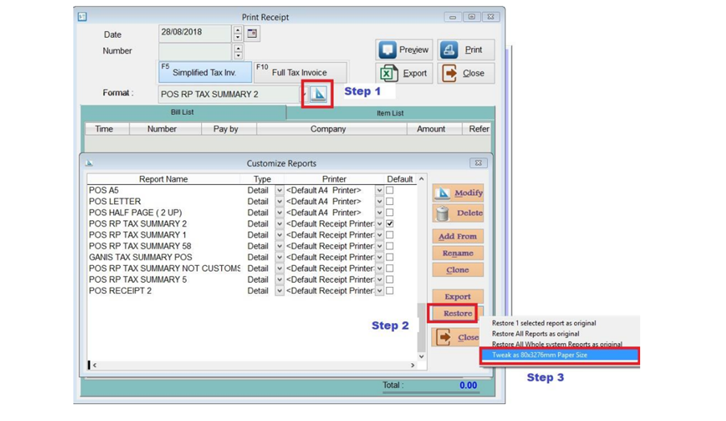

### Unable to key In Daily Cash Sales No with message : The Control is Read Only

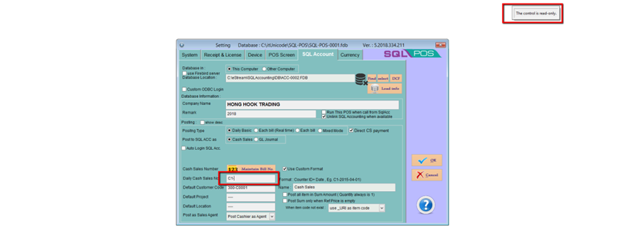

**Answer :**

- Control by license, need email to request new license key, mean Counter ID and CashSales number prefix based on license.

### Receipt format unable to show Chinese word

1. Menu Screen -> Select **Print Receipt**

2. Click on **Modify** - >

3. Select the **Report Name** - > Click on **Modify**

4. Double click on the object to show in Chinese

    

:::caution
After Fill in \<UTF-8\> , remember save the report.
:::

### Proper Step to set Branch SQL POS (Error Failed to Set )

1. Configure and make sure SQL able to test successful

2. Add Port 3050

3. In SQL POS :

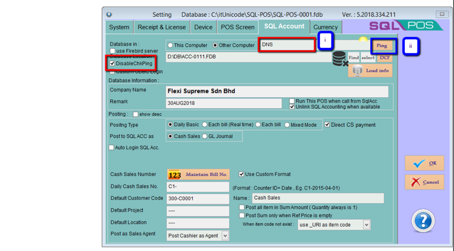

- Put in DNS Number
- Ping result lost 0 = 0%
- Unticked **DisableChkPing**

### Fail to assign Printer

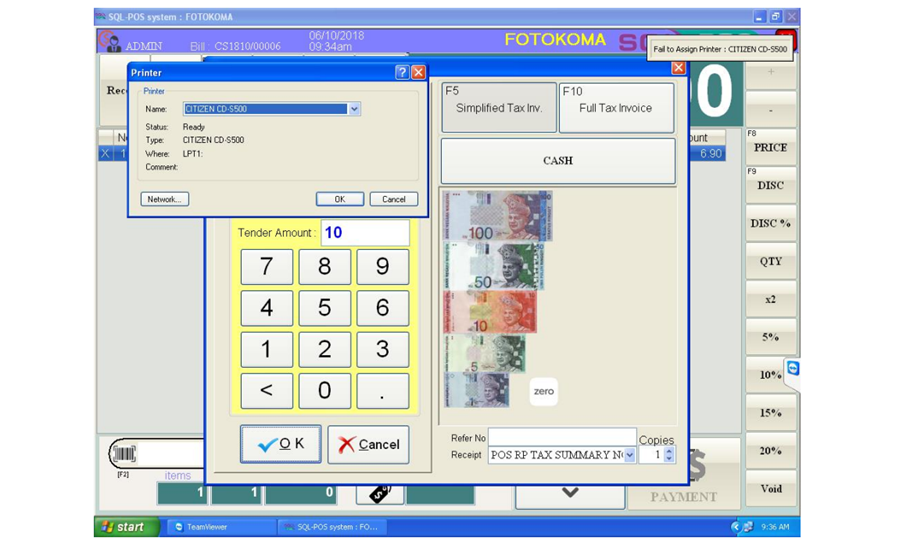

**Solution :**

1. Check in **Setting** - > **Device** - > Receipt Printer -> assigned valid Receipt Printer
    **A4 Printer** Normally use EPSON LQ-310 or other laser printer - > Assigned
    valid Laser Printer

2. Check Report Format may assigned to valid printer

3. Window XP -> Upgrade to Window 7 & Above

### How to disable preview receipt when payment done

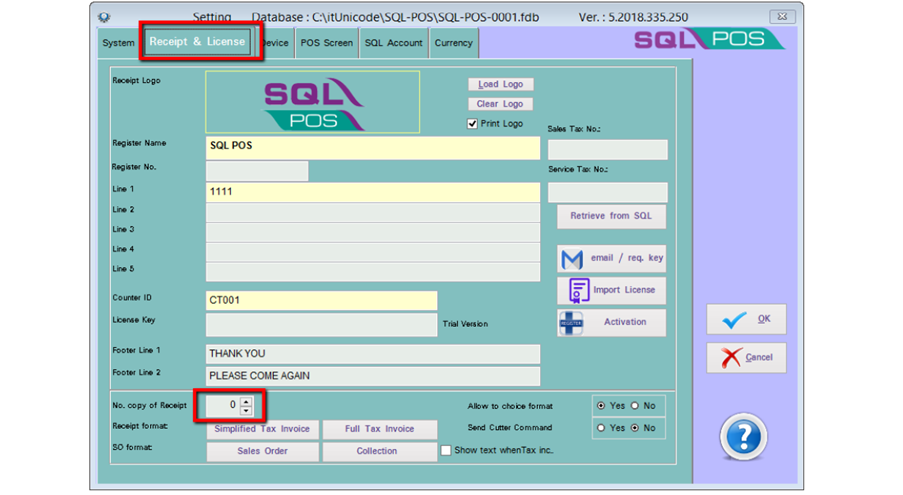

Solution :

- SQL POS **Setting** - > **Receipt & License** Tab -> **No Copy of Receipt** set to **0**

### What to do if disallow User to return stock?

Maintain User -> Refund Item ->

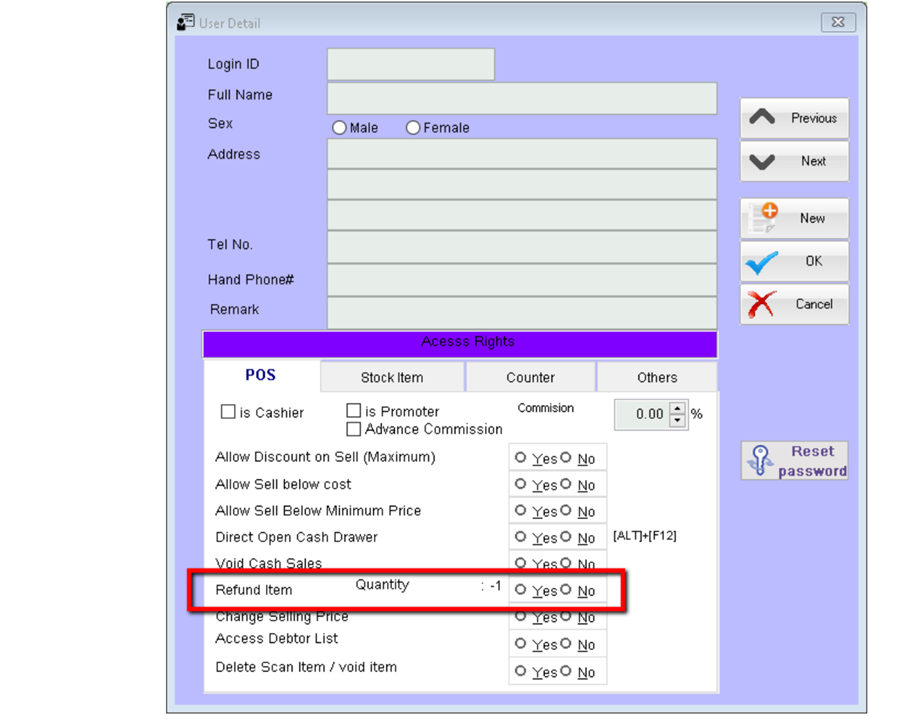

:::note
Set to Yes, user allow to return stock with enter - 1

Set to No, user disallow to save negative stock
:::

### How to un-closed counter?

➔ Close Counter -> Right click un-closed counter

### Unable to Sent Email from Gmail : Fail to sent email

:::info
*(Menu -> Export Cash Sales -> Email Button -> Setting Email Server Button)*
:::


**Solution :**

1. Follow this [link](https://myaccount.google.com/security)

2. Click on **Less Secure App Access**

    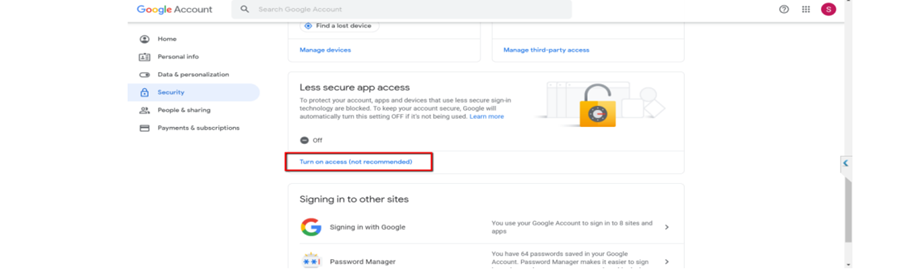

3. Press the scrolling bar to Turn on

    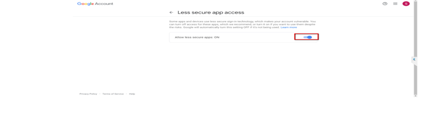

### Post to SQL Account raise Error: Failed to Psot Payment of 02/6/2020 OLED IDispatch exception code 0 from : knockoff amount (0.00) must not exceed outstanding amount (321.6)

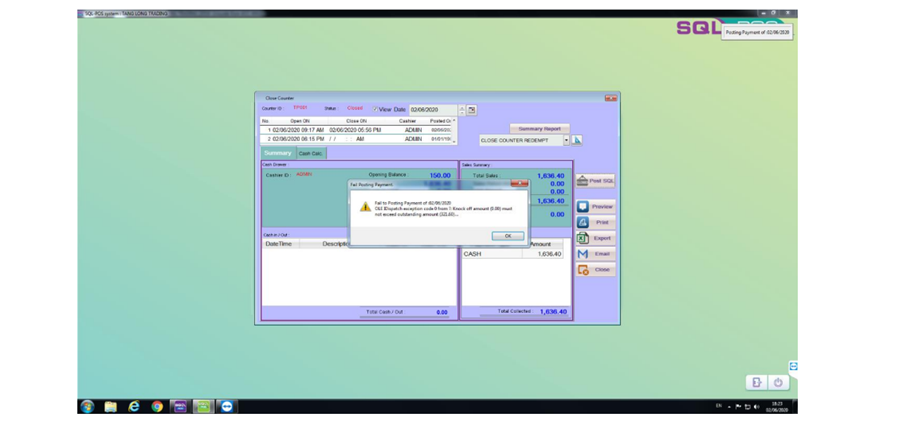

**Solution :**

1. Make sure SQL Pos version 340 & Above

2. SQL POS Setting -> SQL Account -> Ticked **Direct write to SQLAcc** & try to post again

## SQL POS F&B

### Error Message : Counter is closed, wait for Main Counter to open

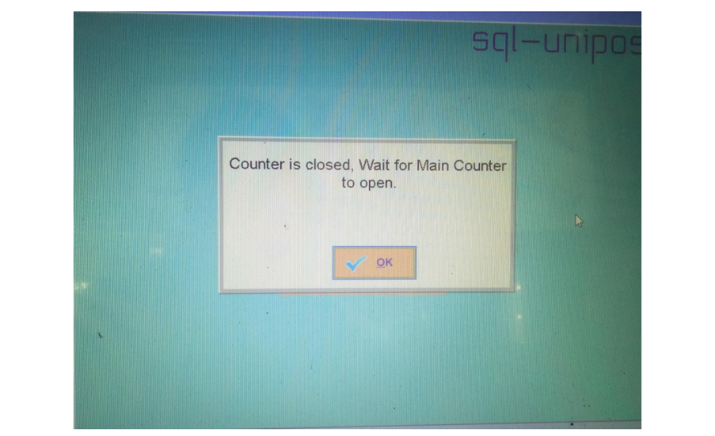

- This error message mean when there have multiple POS link together, make sure Main Counter have to Open Counter first.
