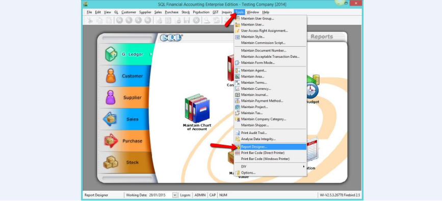
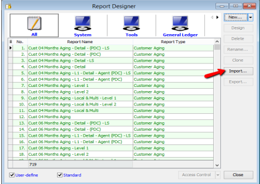
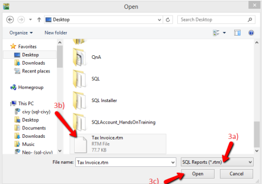

## Load Report Template

1. **Tools** > **Report Designer**

   

2. Press on **IMPORT**

   

3. Follow the steps below :

   1. Change the report type to **SQL Report(*rtm)**

   2. Select your **Report**

   3. Press **OPEN**

   
