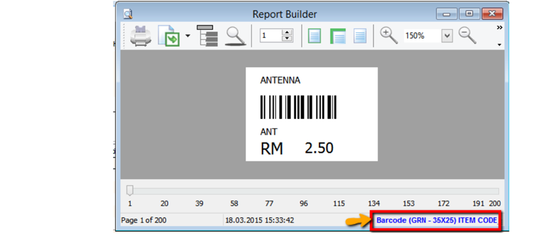
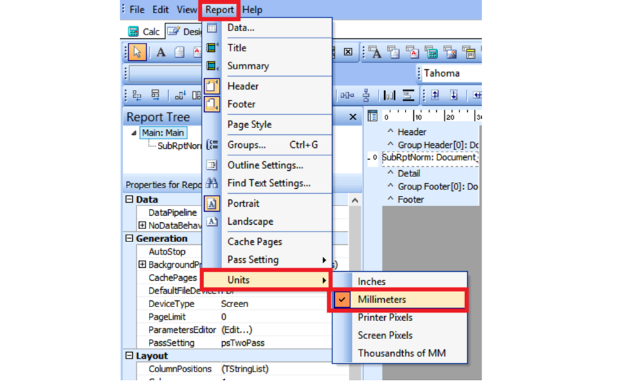
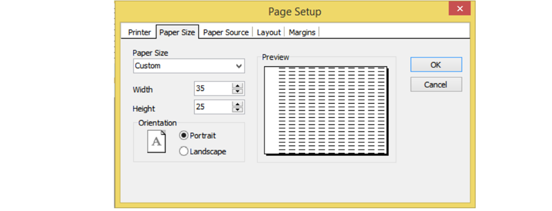
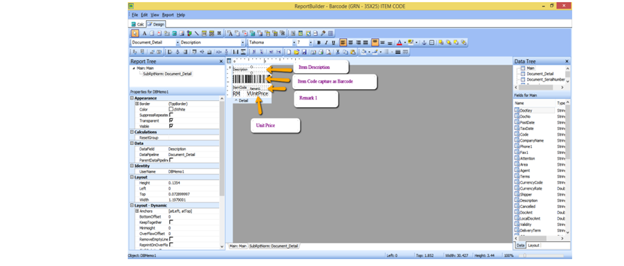
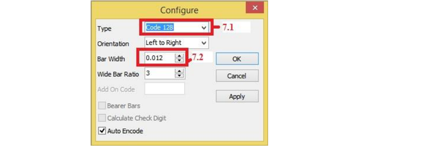
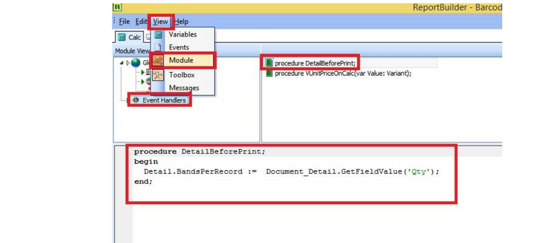

## Setup

1. Download GRN Barcode Report Template from below link

   1. Barcode Capture from Maintain Stock Item Barcode as Barcode
      - Template: [GRN BarCode (20×40) Capture Item BarCode](https://www.sql.com.my/webstore/templates/template-detail/?id=4047)

   2. Barcode Capture from Maintain Stock Item as Barcode
      - Template: [GRN BarCode (35×25) Capture Item Code](https://www.sql.com.my/webstore/templates/template-detail/?id=4058)

2. Step to Import the report to SQL

    :::info
    Refer to this [guide](http://localhost:3000/faq/report/rtm/basic-guide#load-report-template) for details
    :::

   1. Logon to SQL Account
   2. Go to **Tools > Report Designer > Import**
   3. Change the file type from *Fast Report(\*.fr3)* to  *SQL Reports(\*.rtm)*
   4. Select the report downloaded from Step1.1 or 1.2

3. Purchase > Goods Received Note > Preview >

    

   - Click on blue color link to enter into Report Design.

4. Change the Report type to MM due to Barcode size is small

    

5. Change barcode size - > File > Page Setup > Paper Size >

    

   - Currently this sample is Width = 35mm > Height = 25mm

6. Click on SubRptNorm : Document_Detail

    

   - **From here you may change the Barcode layout.**

7. Click on DBBarcode > Right click > Configure

    

   1. Type : Select 128

   2. Bar Width : This is barcode width

8. GRN Barcode Event

   - View > Module > Click on Event Handlers > Procedure DetailBeforeDetail

   

    This step is to capture Item Qty, if Qty 10, will repeat 10 Barcode label.
