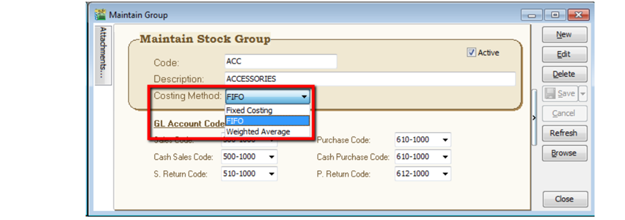
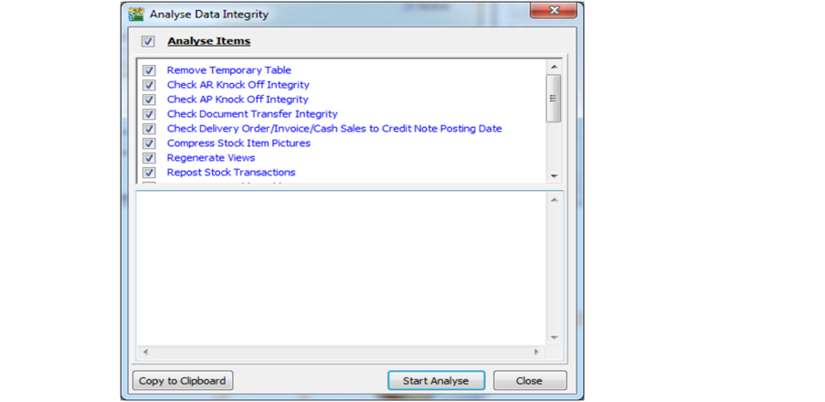

## Setup

1. Go to Stock > Maintain Stock Group

    

2. There have 3 method let you to assign

   1. FIFO - cost flow assumption that the first goods purchased are also the first goods sold.
   2. Fixed Costing –fixed cost where had maintain under maintain stock item
   3. Weighted Average -average cost of production to a product

3. If you **change** your costing method (previously with transaction existing)

   1. Please remember must run **analyse data integrity** (tools | analyse data integrity) before you check the costing report again.

   

   :::tip
   System will auto update from first date until current date transaction with new costing
   method cost….
   :::
