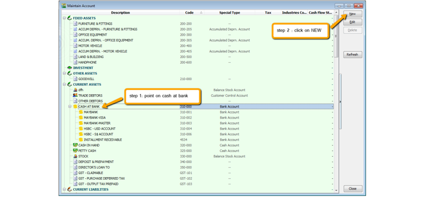
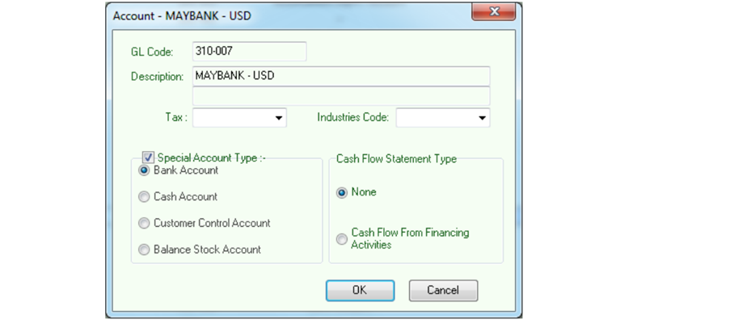
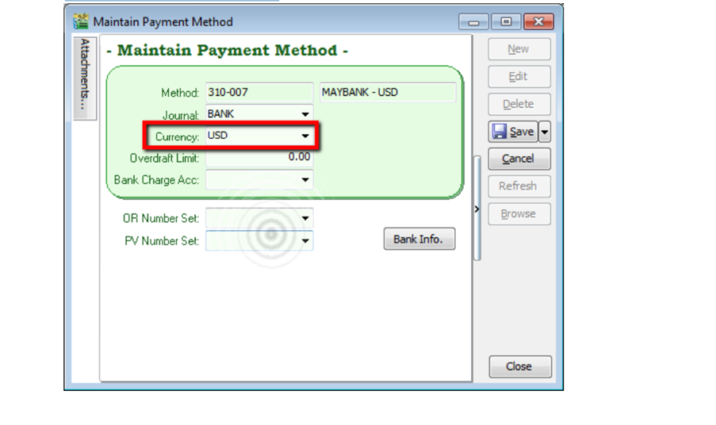

:::info
This module is required if you are using foreign banks.

Related: [Payment from Foreign Customer](../../usage/tools.md#maintain-currency)
:::

## Setup Foreign Currency Payment Method

### 1. GL > Maintain Account

### 2. Create your bank respectively

### 3. Tools > Maintain Payment Method

