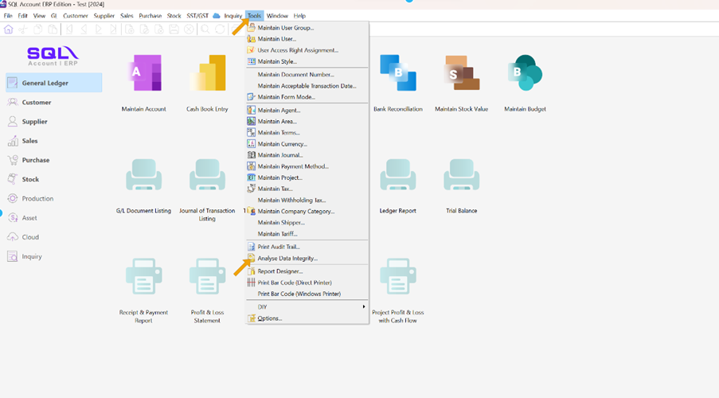
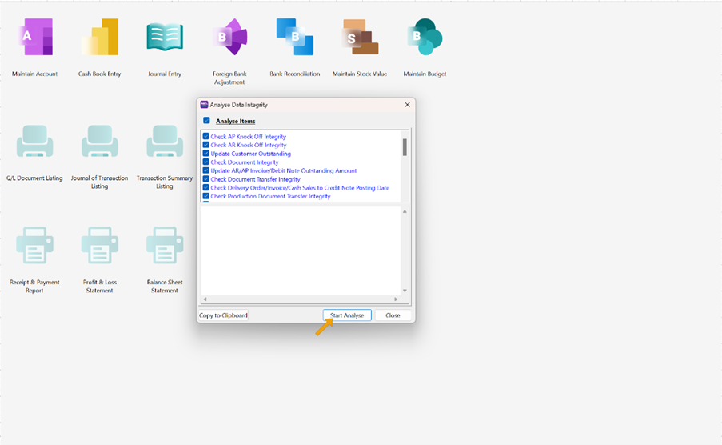
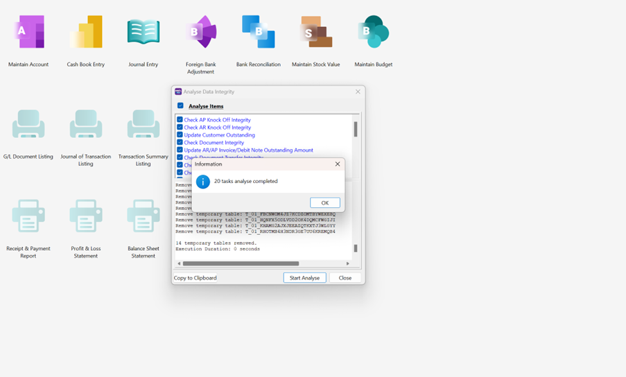

:::caution Reminder
Recommended to run every day or at least once per week.
:::

## Setup

1. Go to Tools > Analyse data integrity

    

2. Click Start Analyse

   - Proceed if user wanted to run for all option for Analyze Item checkbox

    

3. Click on Ok and Close

    

    Check on the item you want to analyse. **(Recommend all)**

:::danger
If there is any error message when running analysis, save the error message and consult your SQL Service Consultant.
:::

:::info

1. If your SQL is not responding during analysis, do not worry because it is in the midst of analysing your data unless it took too long then feel free to contact your SQL Service Consultant.
2. It is important for you to backup your data everyday.

:::
