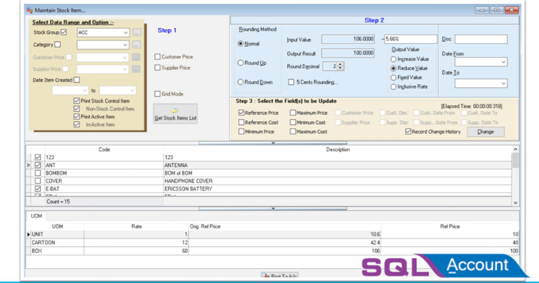
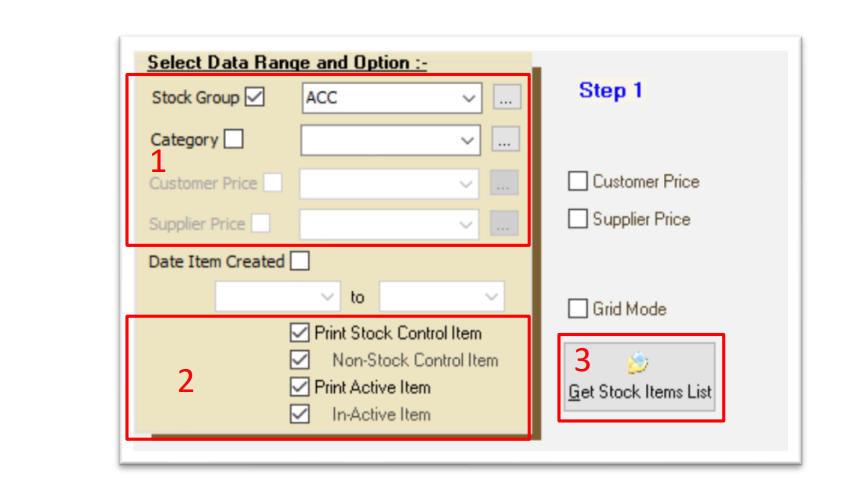
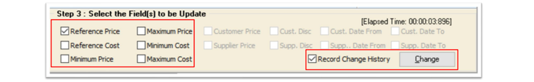
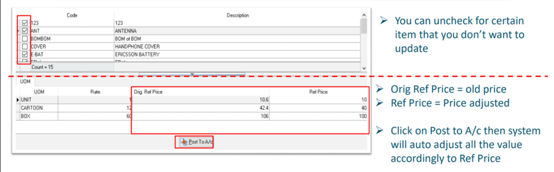
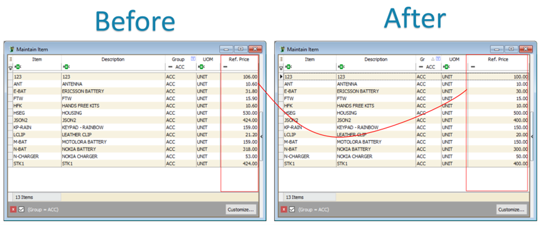

SQL Global Price change will help you mark down price for all items with few clicks

:::info
Contact your SQL Service to get this standalone application.
:::



## Setup

1. Select your group of item

   1. You can select on certain stock group/ category, if you want all items, then left stock group and category blank
   2. You can also choose only active item
   3. Once your group of item selected, click on Get Stock Items List

    

2. Setting on value to be adjust

    :::note
    Scenario: You are trying to reduce price due to removal of GST (6% > 0%)
    :::

    

    - Rounding Method (Assuming Round Decimal is 2)
      1. Normal : Example : 0.1234 => 0.12
      2. Round Up : Example : 0.1234 => 0.13
      3. Round Down : Example : 0.1274 => 0.12

    - Input Value = Sample Value
    - Output Result = Sample Result
    - Round decimal = No. of Decimal Point

    It may looks like a **6%** reduction but it is actually **5.66%**

    Example:

    ```text
    Item price = RM 100

    With 6% GST = RM 100 * 1.06 = RM 100 + 6% = RM 106
    Removal of 6% GST = RM 106 / 1.06 = RM 106 - 5.66% = RM 106
    ```

    - Mark down = 5.66 %
    - Why 5.66% instead of 6% ?
    - 30 May 2018 selling price = RM 106 GST Inclusive
    - 01 June 2018 selling Price RM 106 – 5.66% = RM 100
    - **NOT RM 106 – 6% = RM 99.64**

3. Select fields to be update

    

    - Tick on which option you want to adjust / update eg : Reference Price
    - You can also tick Record change history then system will update this changes history in your note
    - Once you complete setting, click on Change

### 4. Check & Post




