## User

### Create a new user and assign password

1. Tools > Maintain User

    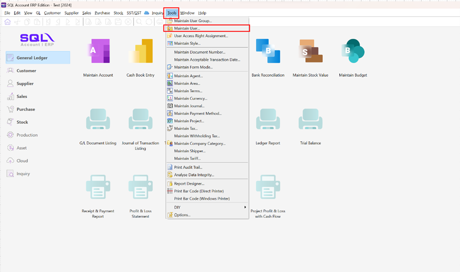

2. Click New

    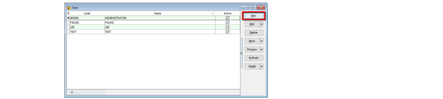

3. Assign the Code and Name and click SAVE

    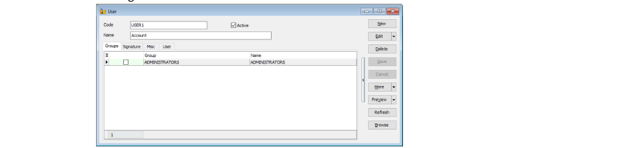

4. Assign password (Edit > More > Change Password)

    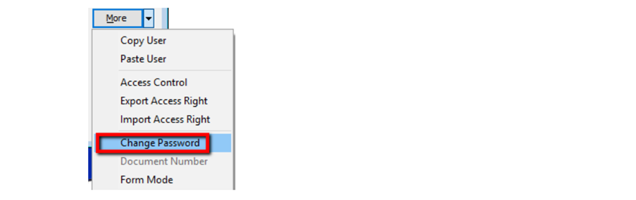

    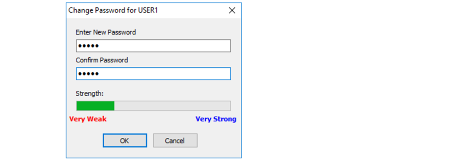

### Reset Password

1. After save, click on MORE button, and select reset password

    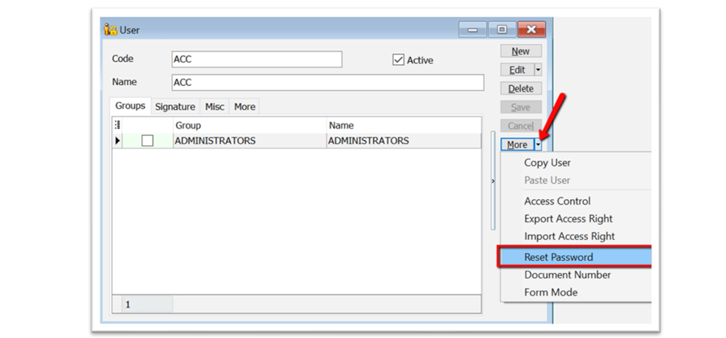

2. Click yes, to copy the temperorily password

    

3. Click on File > Logon to Logout your current user

    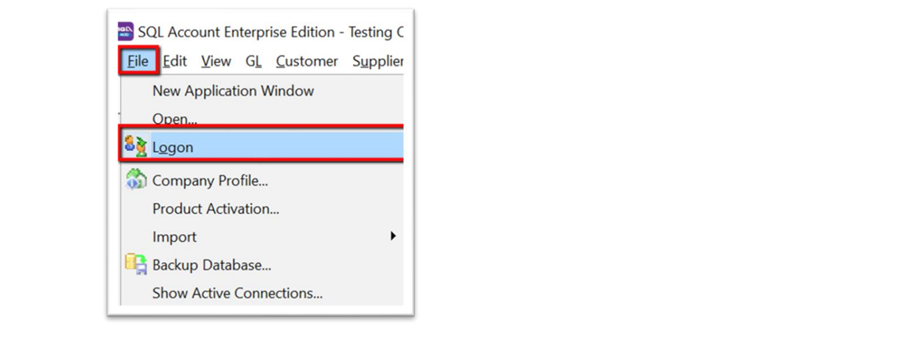

4. Insert the Login Code & paste the temporarily password, then click on the Log On button

    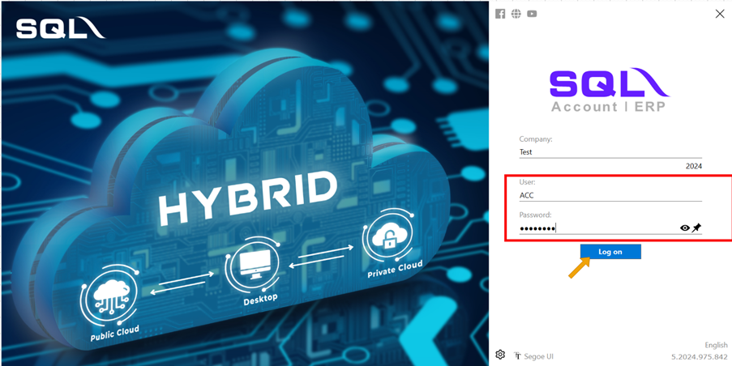

5. Paste again the temporarily password & click on OK

    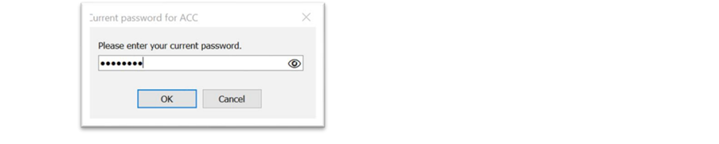

6. Insert your new password

    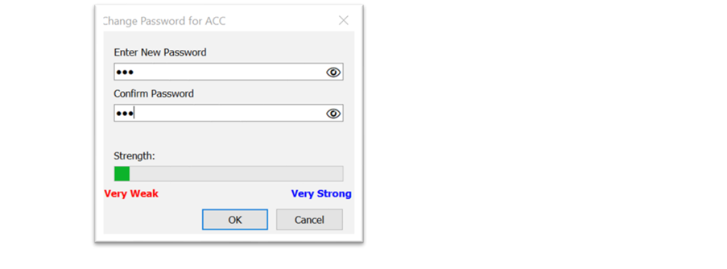

7. Click OK once your new password set

    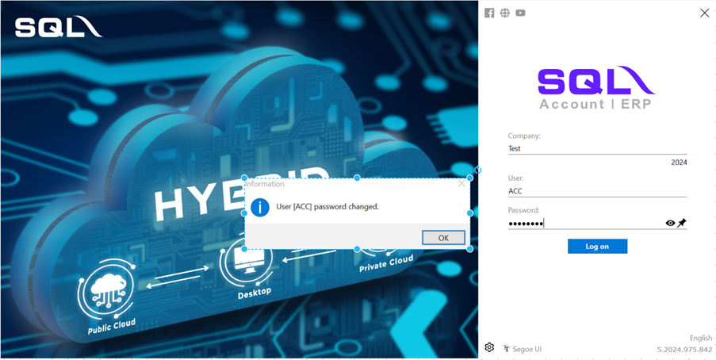

## Access Right

### Assign the access rights for user

1. Tools > Maintain User

2. Double click the user, and Edit > More > Access Control

    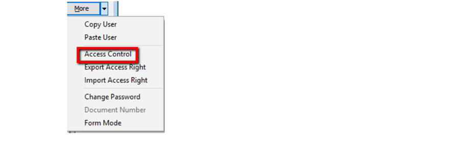

3. You will found the full list of access control and please find below explanation for the setting of access control

    | No |  Label Name   |       Explaination                            |
    |----|---------------|-----------------------------------------------|
    |1   |Execute        |To use the functions from the menu list.       |
    |2   |New            |To create new documents.                       |
    |3   |Edit           |To modify the documents.                       |
    |4   |Delete         |To delete the documents.                       |
    |5   |Process        |N/A to SQL Accounting. It apply to SQL Payroll.|
    |6   |Print          |To print.                                      |
    |7   |Preview        |To preview.                                    |
    |8   |Export         |To export.                                     |

    | No |  Label Name   |       Explaination                            |
    |----|---------------|-----------------------------------------------|
    |1   |Grant          |Action button to grant the access rights       |
    |2   |Revoke         |Action button to disallow the access rights    |
    |3   |Grant All      |Action button to grant all the access rights   |
    |4   |Revoke All     |Action button to disallow all the access rights|

    :::caution
    Read the description check and uncheck accordingly what user can do or cannot do
    :::

    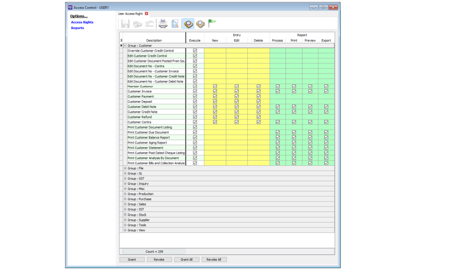

4. For reports, you can assign the access rights user to view certain report / hide reports.

    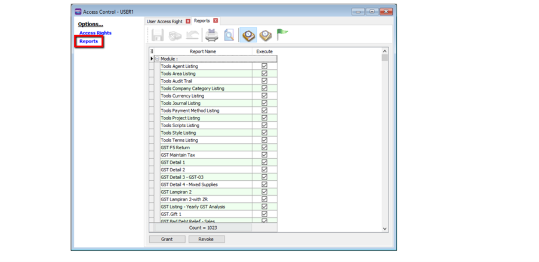

### Copy paste full access rights for others user

:::note
You are able to export the access rights set of one user and apply to another user.
:::

1. Create a new user [Guide](#create-a-new-user-and-assign-password)

2. Open the user you wish to export access rights, and go to More > Export Access Rights.

    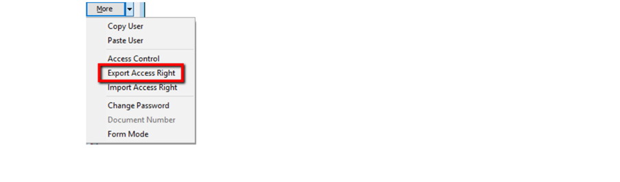

3. Save it to a file.

    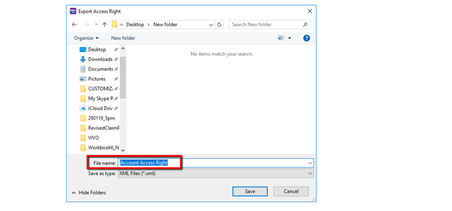

4. Back to the newly created user, go to More > Import Access Rights.

    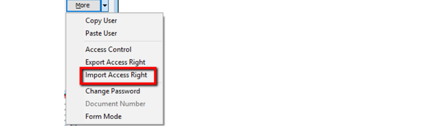

5. Select the file you saved to in Step 3.

    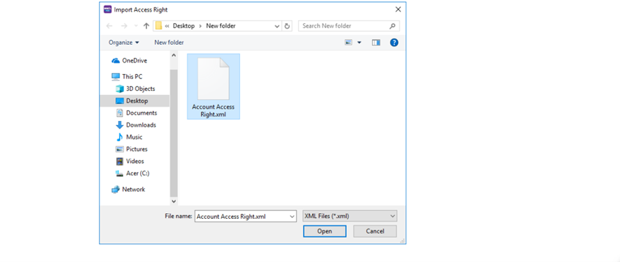

6. Click Yes

    
