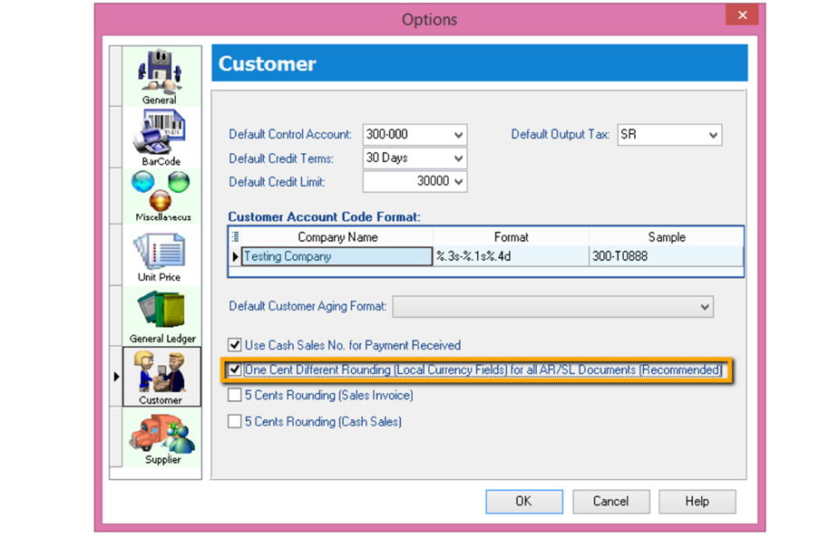
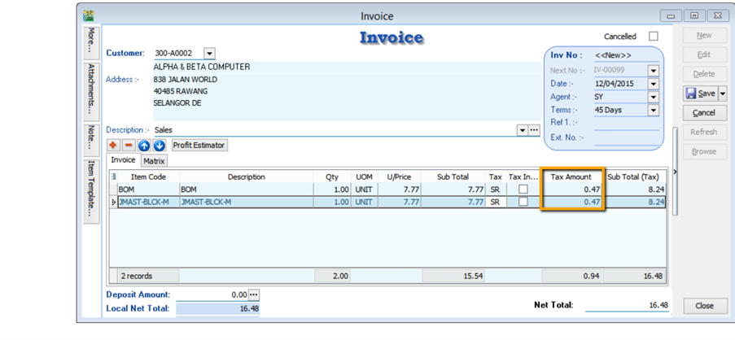
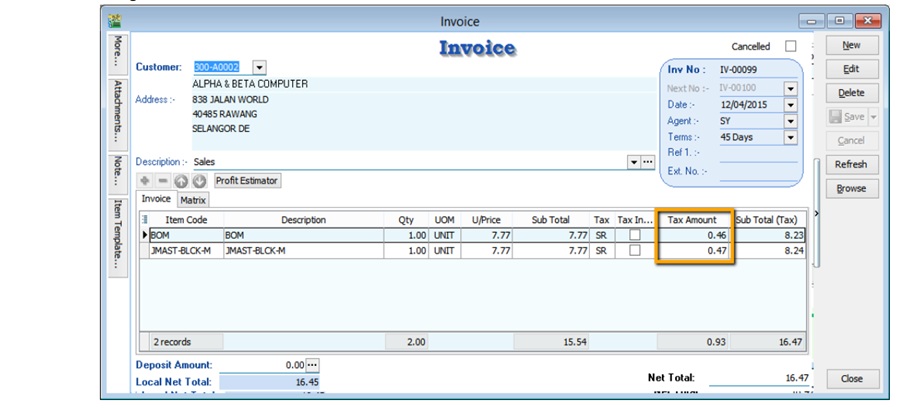

One Cent (0.01$) difference Rounding(Local Currency Fields) for all AR/SL Documents **(Recommended)**

## Setup

1. Go to Tools > Option > Customer

    

    1. Tick One Cent Different Rounding (Local Currency Fields) for all /AR/SL Documents **(Recommend)**

    2. Press OK

2. Sales Invoice > New > Refer below screen

    

    :::caution
    But once you save you will notice the first line of the Tax Amount will be different, this is because system
    using Total Amount of IV to calculate 6%. Refer below Screen:
    :::

    

    Formula: Sum up SubTotal with Tax, Multiple with 6% **(Note : system will exclude the Subtotal if the Tax Rate is 0%)**

    Tax Amount Calc = RM 15.54 * 6% = 0.93, mostly system will reverse on first line of the Item.

    :::note
    If you don’t want system to help you to do the One Cent Rounding, please refer Step 1 to un-tick the option will do.
    :::
