## Setup

1. Place the MYOB Backup file to Desktop. For example: C:\Users\SQL\Desktop\MYOB.

2. Extract MYOB Backup file.

3. Refer Image below on How to Extract MYOB Backup file.

   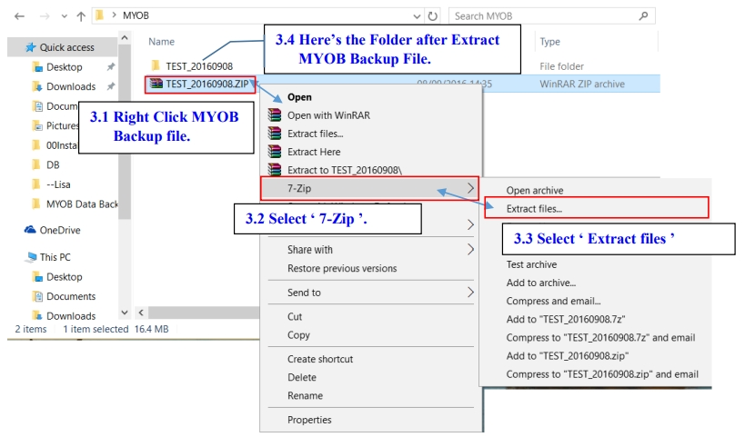

4. **Create New Database** then **Log On** New Company with ADMIN User

   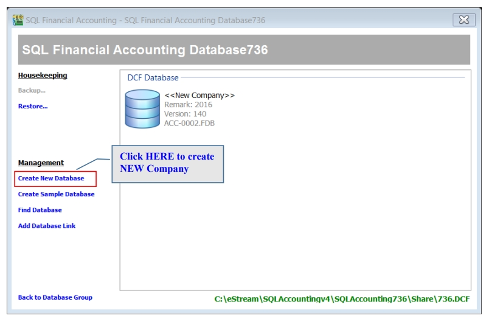

5. Once Log On, Go to **File** | **Data Import** | Select **MYOB**.

   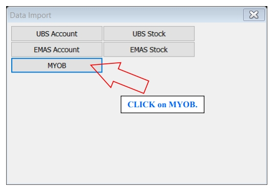

6. Follow Step 1 in image below : Click the ‘Download’ button to download the needed tool for MYOB migrate.

   Then place the ‘myData CLI’ to C:\Users\SQL\Desktop\MYOB.

   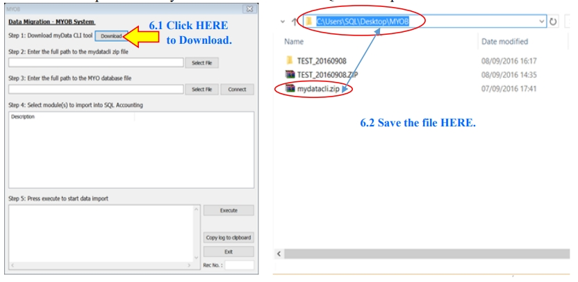

7. Follow Step 2 of the Image below, Click ‘Select File’ button then look into

   C:\Users\SQL\Desktop\MYOB to select ‘mydatacli.zip’.

   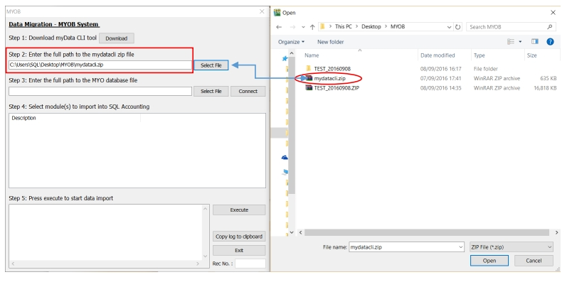

8. Follow Step 3 of the Image below, Click ‘Select File’ button then look into

   C:\Users\SQL\Desktop\MYOB\ **TEST_20160908**\DATAFILES\MYOB DATA CD\MYOB Data Backup to select ‘**Test 2015-2016v161.MYO**’ a MYO File Type.

   :::note

   Those highlighted in **BOLD** is based on own Company Name of MYOB Backup.

   :::

   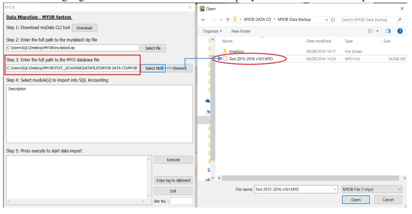

9. Follow step below to start Import.

   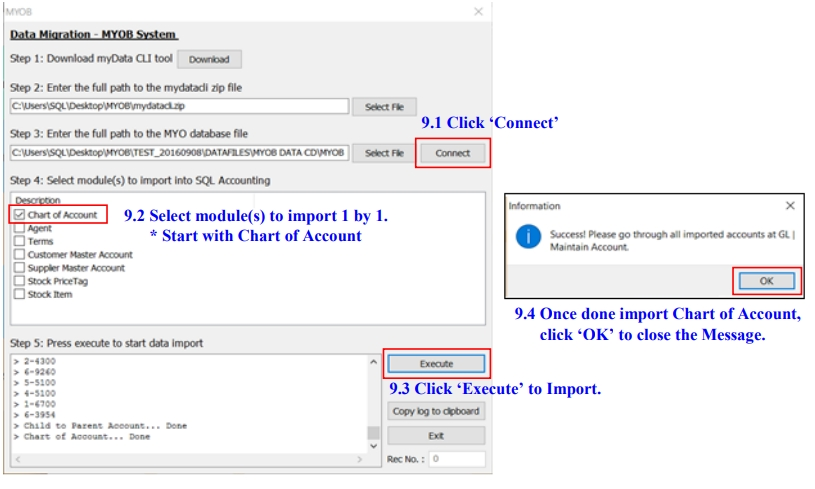

10. Few Important settings MUST do before continue Import.

      1. In this window

         1. Read the Information then click ‘OK’ to close it.

         2. Close the Data Import.

            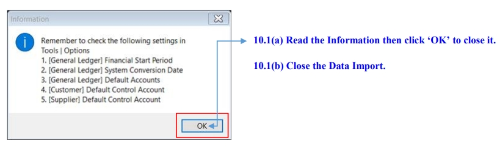

      2. Go to GL /Maintain Account, verify the Imported Chart of Account & set the necessary Special Type.

         Especially for Trade Debtor, Trade Creditor, Bank/Cash Account, Stock & etc.

         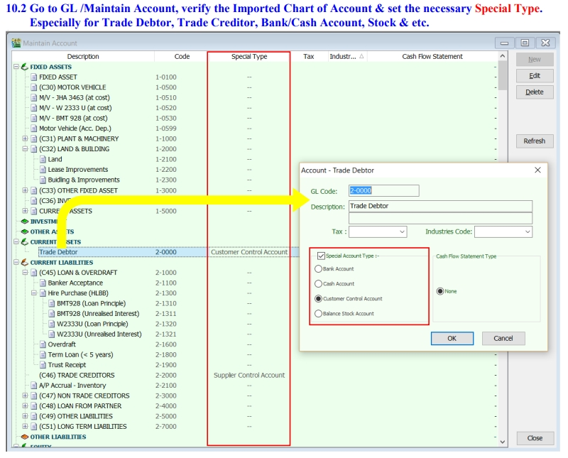

      3. Go to Tools /Options /General Ledger, to setup for :

         -Financial Start Period

         -System Conversion Date

         -Default Account

         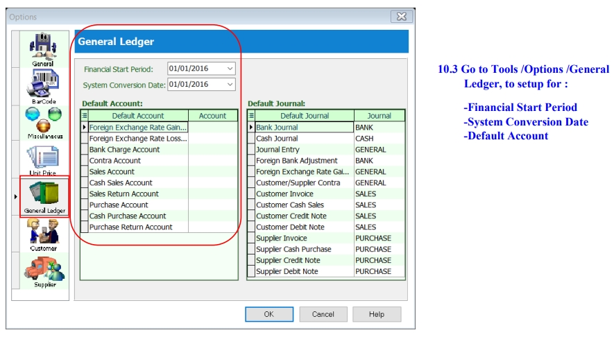

      4. Next

         1. Still in ‘Options’ tab select ‘Customer’ then fill in the Customer Control Account.

         2. Vice Versa for Supplier Control Account setting.

            

11. Once DONE settings, Repeat Step 5, 7 & 8 to continue import.

      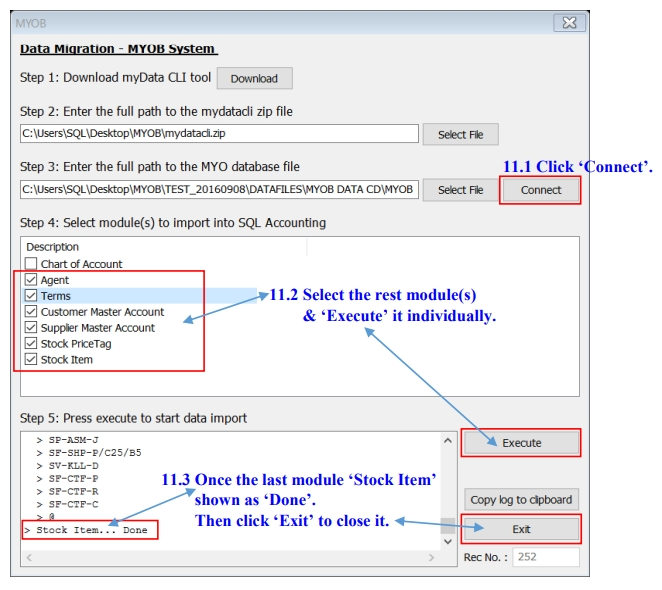

   :::info

   Kindly check **ALL** the Imported Master File from MYOB to SQL system before proceed to use it.

   :::
