## Setup

:::warning[IMPORTANT]
only valid for SQL Account version **693** and above.
:::

1. Place the UBS backup file to `C:\UBSACC90\DB\20140704`, every time create new folder under `DB` folder.

2. Unzip the UBS Backup file (only for Import Master File). Alternatively, you may restore it to the UBS program.

   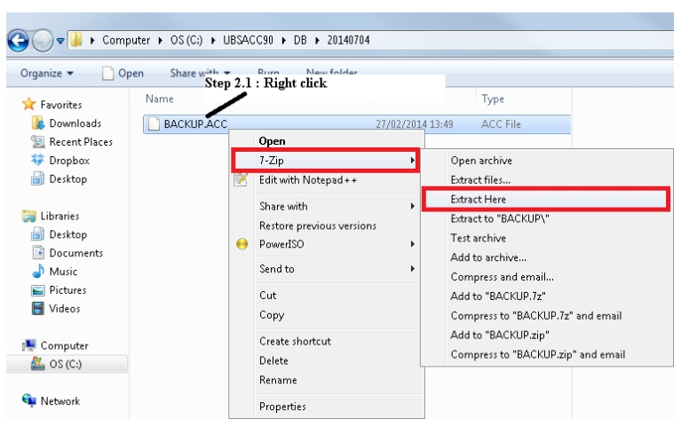

3. Create New Database | Logon to New Company

4. Go to **File** | **Import** | Select **UBS Account** |

   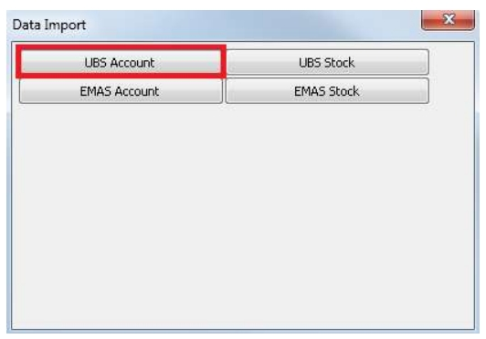

   :::info

   1. Account which mean import COA, Maintain Customer, Maintain Supplier, Agent, Area, Term, Project, Currency and Customer & Supplier Outstanding

   2. Stock which mean import Stock Group, Stock Category, Stock Location, Stock Price Tag, Stock Item, Sales Invoice History, Sales Delivery Order History, Purchase Invoice History.

   :::

   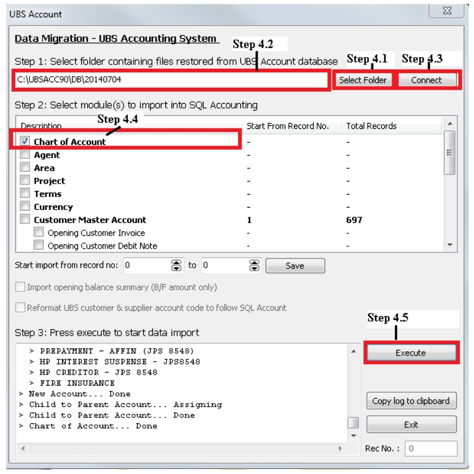

   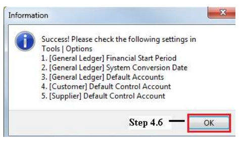

5. Close the Data Import | Go to **Tools** | **Options** | **Customer** | Fill in the Customer Control Account code(Same to Supplier Control Account Code).

   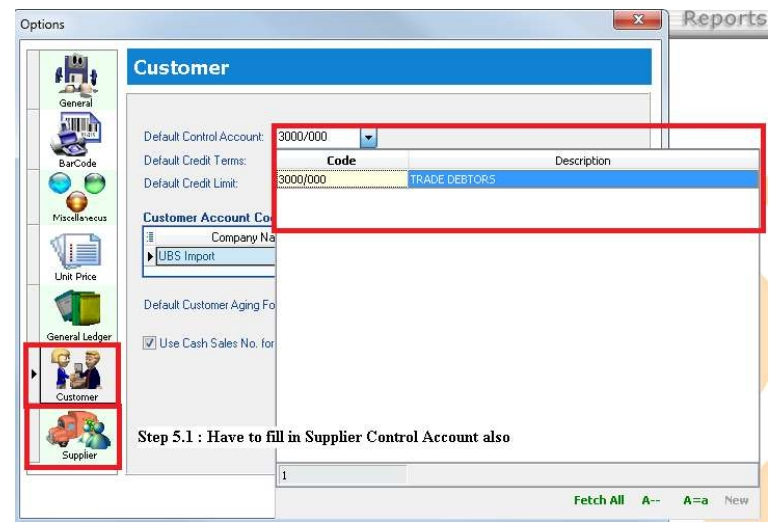

6. Repeat step 4, continue import to system.

   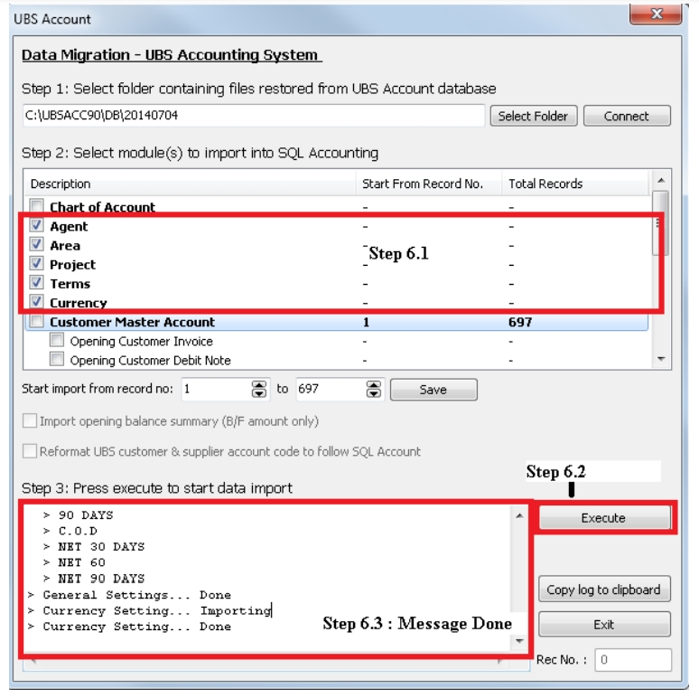

7. Import Customer

   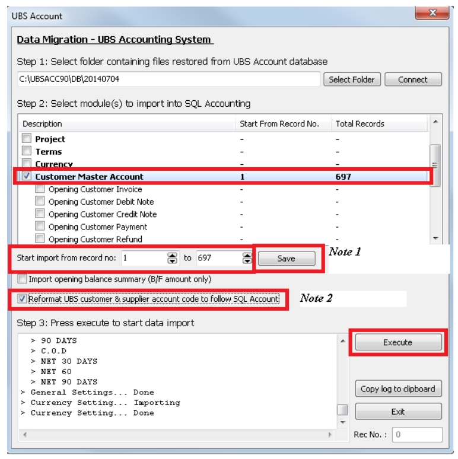

   :::note

   When importing halfway and encountering errors, you can continue by entering the record number, then press the Save button. The system will then continue the import process.

   :::

   :::note

   Tick Reformat Cust & Supplier follow SQL Customer Code. (Eg : Ubs Cust Code is 3000/A01 will become 300-A0001)

   :::

8. Import Customer Opening Balance

   1. The step you have to do before run UBS Year End :

      1. Transaction(4) | Open Item Menu Debtor (6)| Maintain B/F Bills(1) | Press List Button | Exit | Press Generate | Press Yes | Exit

      2. Transaction(4) | Open Item Menu Debtor (6)| Edit B/F or O/I(5) | Click on Mark all for O/I button | Exit

      3. Transaction(4) | Open Item Menu Debtor (6)| Bill Payment Ledger(6) | List Missing Record in ARPost.dcf(3) | Press ok

   2. Do the same step for Supplier Side

   3. Import Opening Balance(Outstanding Invoice by Invoice)

   

   **You may tick all the opening at the same time. (Customer Payment takes longer time to import in).**

9. Import UBS Stock

   1. Go to **File** | **Data Import** | Select **UBS Stock** |

      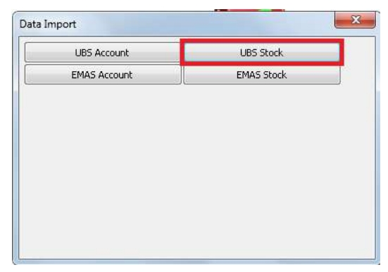

   2. Maintain Stock

      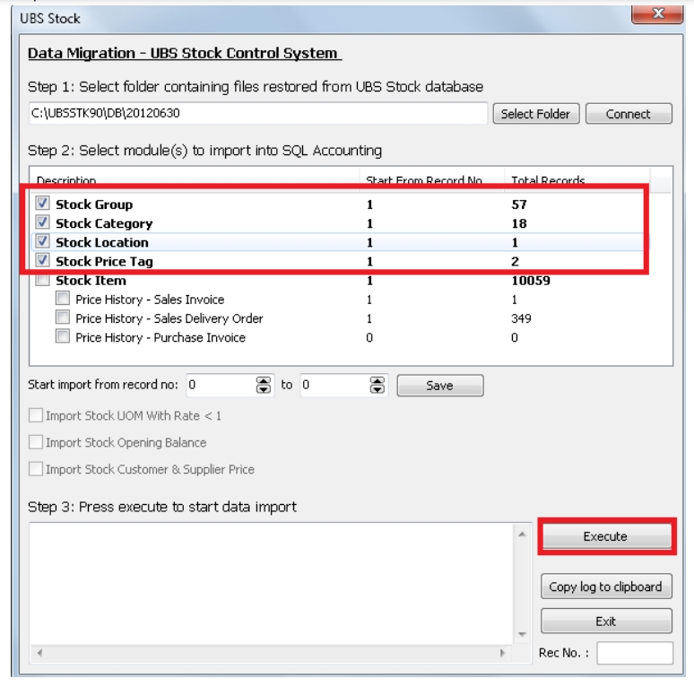

   3. Maintain Stock Item

      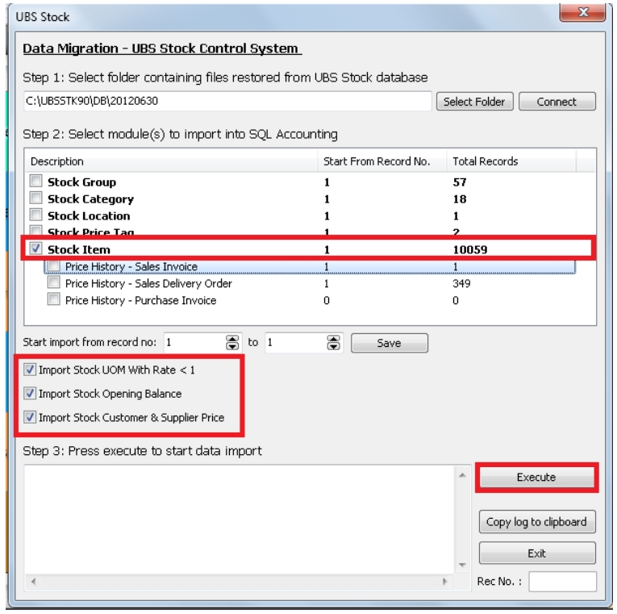

   4. Sales DO / IV and Purchase Price History

      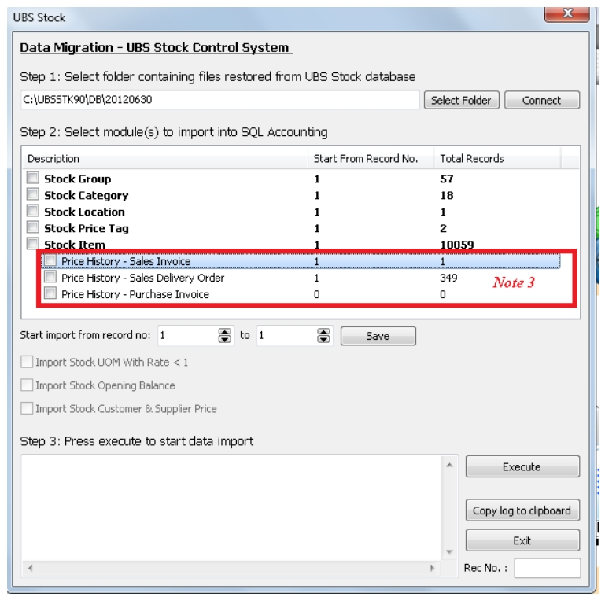

   :::note

   Optional – Tick if you need the info.

   :::
