## Installation

1. Double click setup file to install

   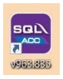

2. Click on

   1. **I accept the agreement**

   2. **Next**

        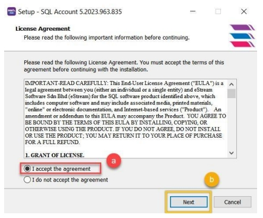

   3. Make sure your path is C:\eStream\SQLAccounting

   4. Click **Next**

        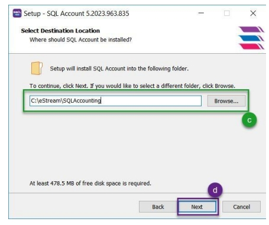

   5. Make sure the folder at C:\eStream\SQLAccounting\bin

   6. Make sure the folder at C:\eStream\SQLAccounting\Share

   7. Make sure the folder at C:\eStream\SQLAccounting\DB

   8. Please do not change the setting if all paths are the same as mentioned above, just click Next

        :::info
        If the path showing in programData is incorrect (wrong), you will need to change it to be the same as e, f, g
        :::

        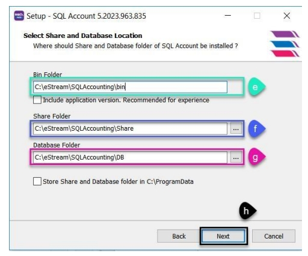

   9. Don’t change any setting , Click **Next**

        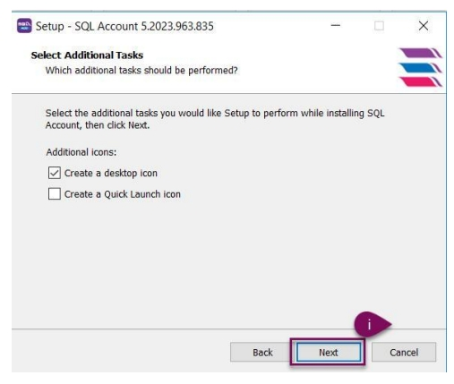

   10. Click **Install**

        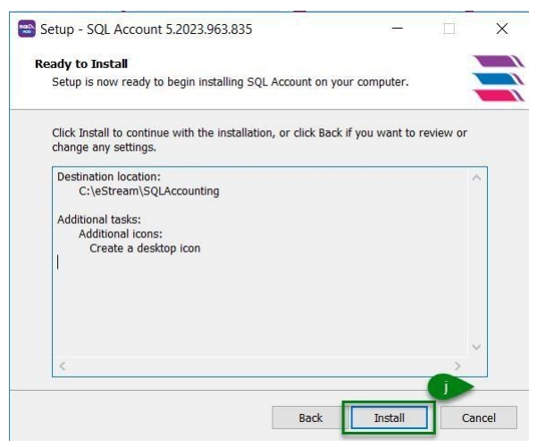

   11. Click **evaluation** (system will auto create a testing company)

        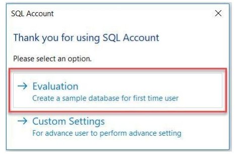

## New Database

1. Click **File**

2. **Logon**

   

3. Click on **Setting**

   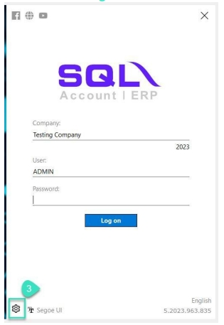

4. Click on **Create New Database**

   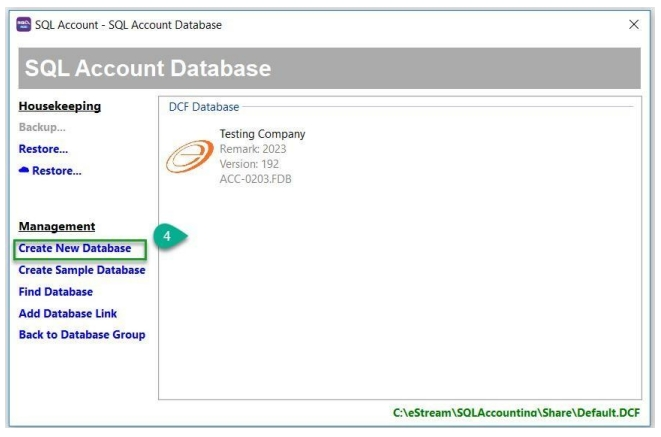

5. Insert Company Name

6. Click **OK**

   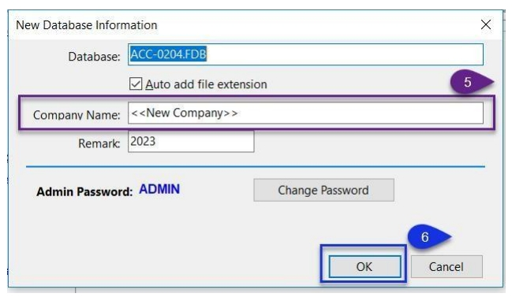

7. New Company Created, Double Click on it to login

   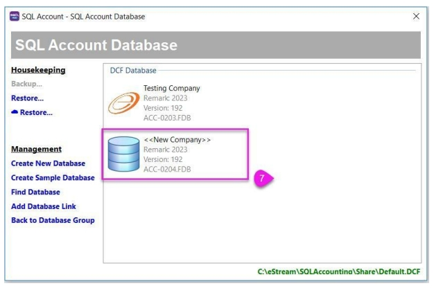

8. User and Password is ADMIN

   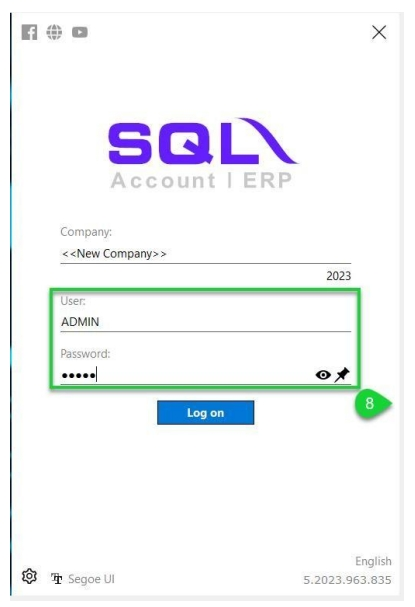

## License Activation

1. In SQL Account, go to **File** -> **Company Profile...**

   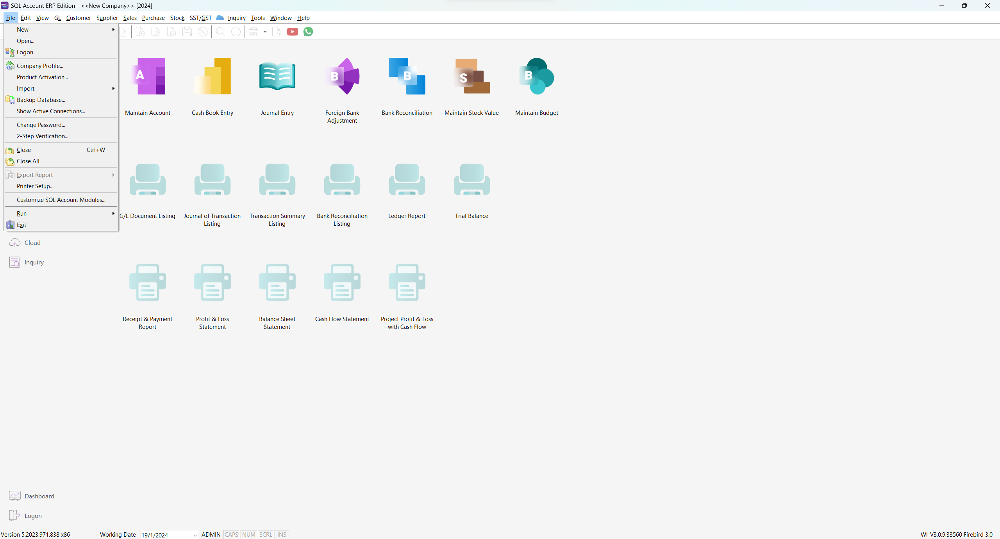

2. Key in your company details (company name, address, etc), and click on the **Diskette icon** to save

   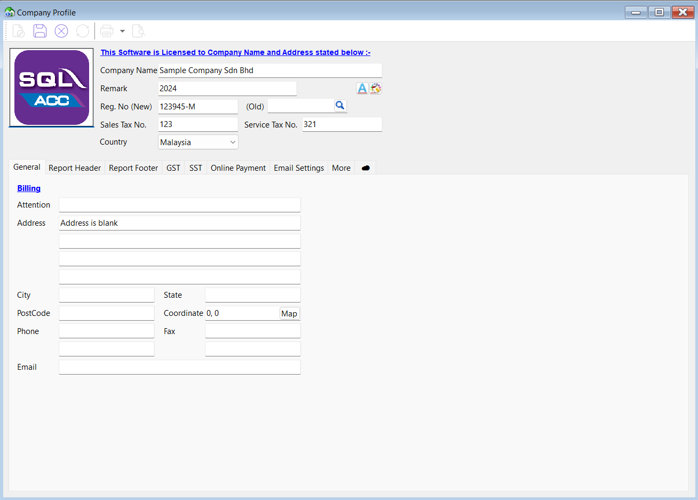

3. Close the previous window, go to **File** -> **Product Activation...**

   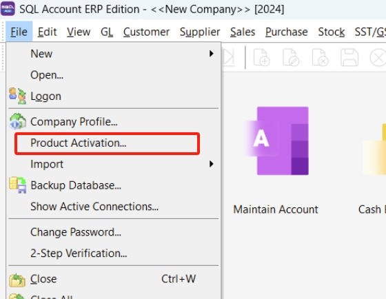

4. For inactivated product, **Product ID** and **Activation Code** will be *blank* here. Check if your **Company Name** and **Address** are input correctly

   :::info[note]

   Activation code is issued according to these info. The accuracy of punctuation such as comma (,) and fullstop (.) are important

   :::

5. Click on **Print Activation Request** to generate a request file

   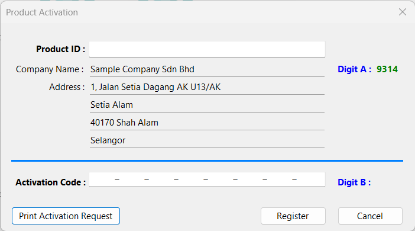

6. Next, export it to a PDF file. To export, click on the  *pointing down arrow* available at the right side of second icon from the left, select **Export to PDF File**

   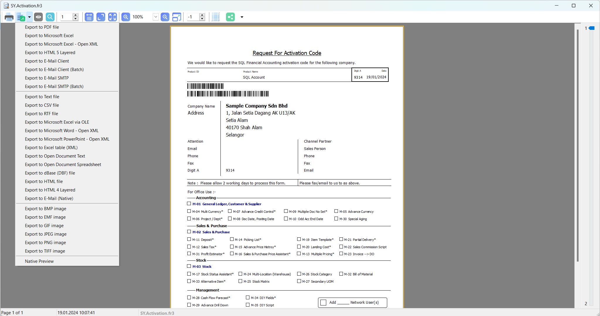

7. Save it to your local PC. You can then write an email with this PDF file attached and send it to local sales agent
   :::info[note]
   Issuance of activation code might takes up to `3 working days`
   :::

8. When you have receive your **Product ID** and **Activation Code**, go to **File** >  **Product Activation**

   

9. Key in your **Product ID** & **Activation Code**, make sure **Digit A** and **Digit B** are the same as received

   

10. Click **Register** and you are now officially registered 🥳

    :::warning
    Activation code is considered private & confidential, do not share it to others!
    :::

### Update Company Address

1. If you want to **update company address** after a license activation, repeat **Step 3 - 7** in [License Activation](#license-activation) but replace the company address in Step 5 with your latest company address.

2. Email your `Activation Request` form to us along with **bank statement / any government statement like bill electricity or water / telephone bill** as the proof for company address update.

3. Once you have **received the activation code** , kindly **repeat Step 8-10** in [License Activation](#license-activation) then update the activation code accordingly.
