To upgrade SQL Account version, you will need to uninstall the existing version first, then only install the latest version.

:::success[INFO]
Your data is stored in a separate database and will not be affected during upgrade
:::

:::warning
If your company has multiple users, upgrade the server first before upgrading individual workstations
:::

## Uninstall Existing Version

1. Right Click on your SQL icon > **Properties**

   

2. Click on **Open File Location**

   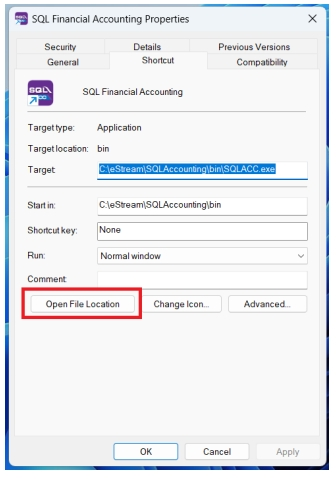

3. Double click on "**Unins000**" ( make sure the file type is Application same as below screen)

   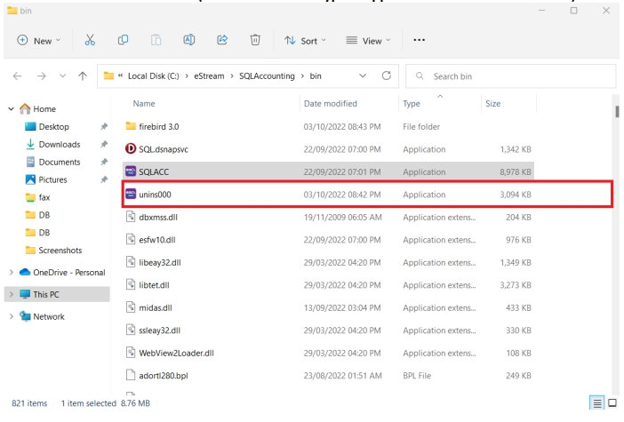

4. Click **Yes**

   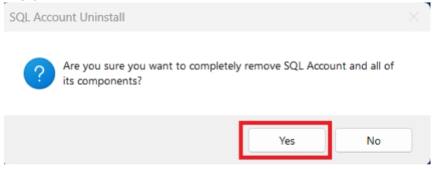

5. System uninstalling

   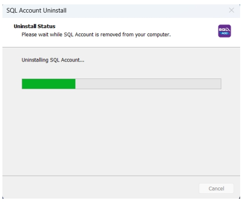

6. Click **OK** , Done uninstall your SQL

   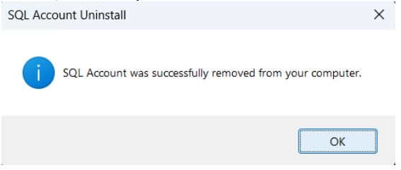

## Install the Latest Version

1. **Download SQL Latest version and save it to desktop , double click the installer**

    :::success[INFO]
    get the latest version installer from your service consultant
    :::

   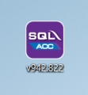

2. Click on **‘I accept the agreement’** > **Next**

   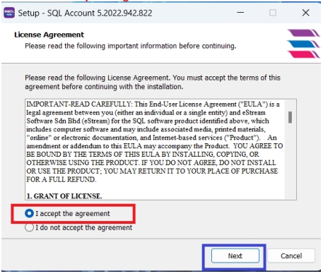

3. **Make sure the path same as above** > Click **Next**

   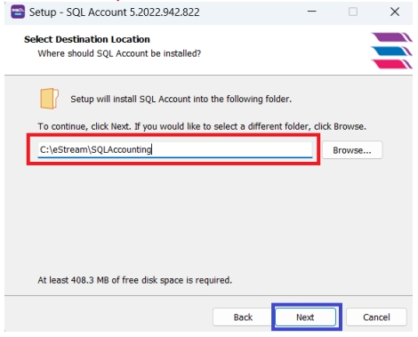

4. Click **Yes**

   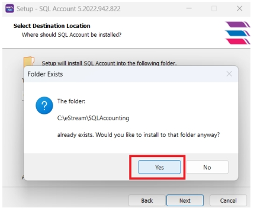

5. Click **Next**

   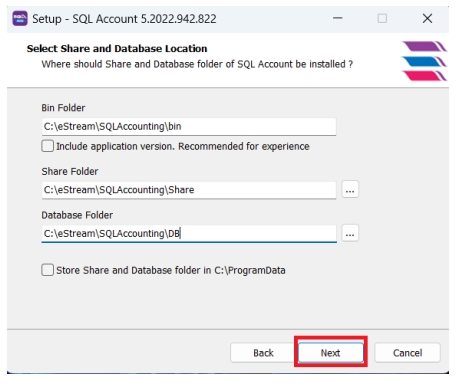

6. Click **Install**

   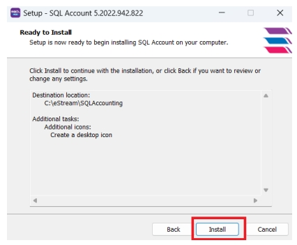

7. Installing SQL

   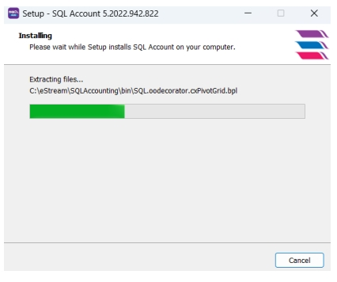

8. Click **Finish**

   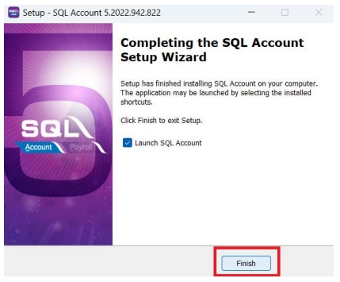

9. Enter Password > Logon (MAKE SURE FIRST TIME LOGIN FROM MAIN PC - SERVER)

   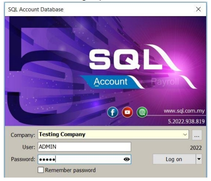

10. Click **Yes** to upgrade your database > Done

   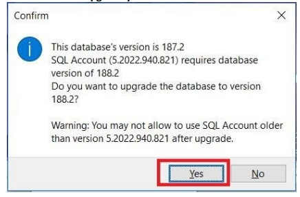
