## Linking Setup

### Create Database in SQL Account

1. Launch SQL Accounting software.

   Existing SQL user - Log on as usual

   New SQL user - Click  to create database.

   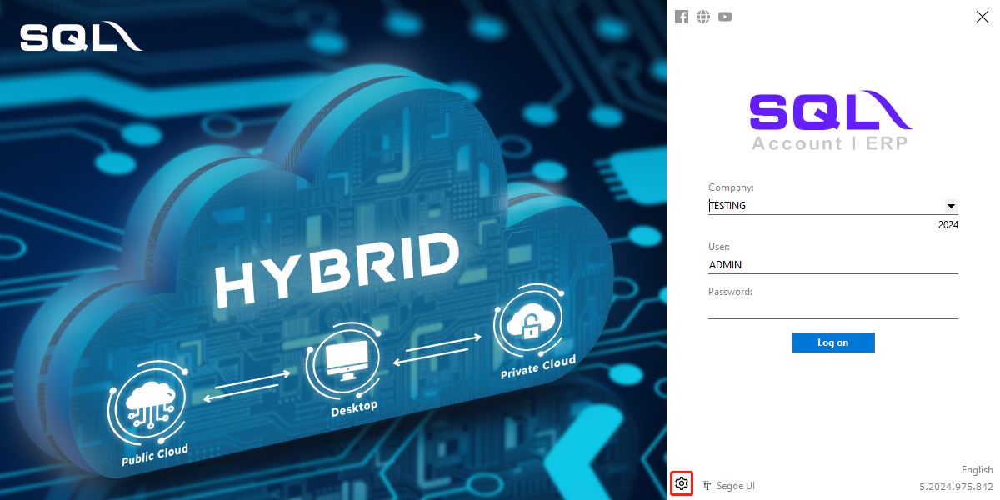

2. Click `Create Sample Database` -> `OK`.

   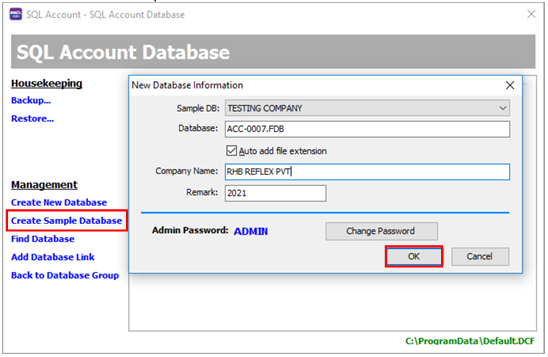

### Maintain Bank Account in SQL

1. Select `GL menu` - > `Maintain Account`

   

2. Select `CASH AT BANK` -> `New`

   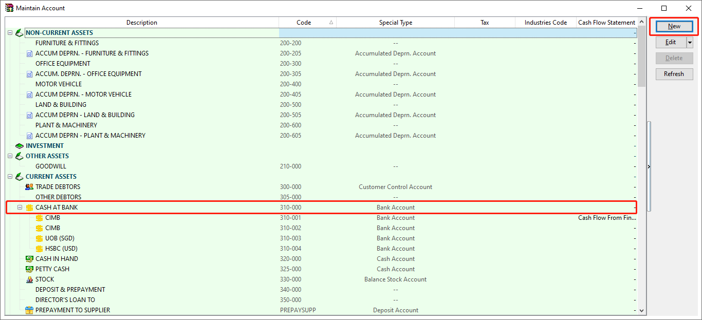

3. Fill in the information and click `OK`.

   - Blue box is the mandatory field.

      

### Link RHB Reflex Account

1. Select `Banking menu` - > `RHB Reflex`

   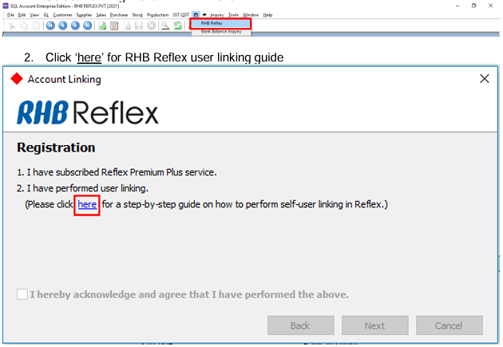

2. Click `here` for RHB Reflex user linking guide

   

3. Tick acknowledgement box - > click `Next`

   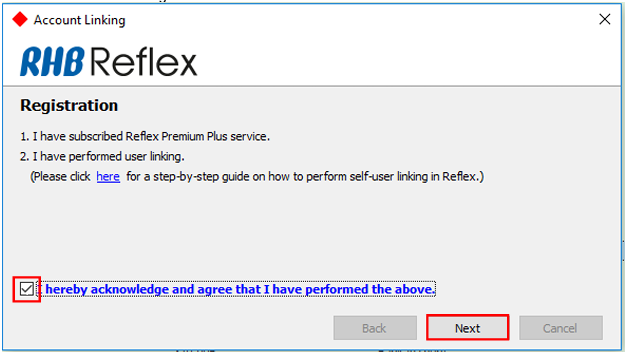

4. Fill in the information

   1. Registered RHB Direct user email address and

   2. Account name/business name.

5. Click `Link`

   

   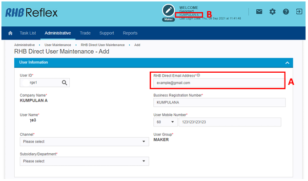

6. Login the registered email to verify the user linking within 10 minutes.

   

7. Click the hyperlink (company subsidiary name) in the email from SQL Account.

   

8. Assign RHB bank account to the desired payment method.

   

9. Click `Finish`

   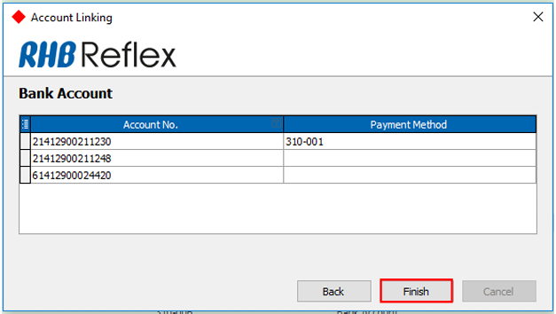

10. Click `OK`, your RHB Reflex bank account have now linked.

    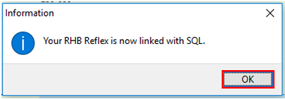

## Unlink RHB Reflex Account

User is required to unlink RHB Reflex account if:

- to change user email address &
- to tag a new RHB Reflex user with different user access.

Steps to unlink:

   1. Select  -> `RHB Reflex`

      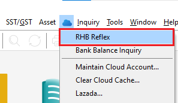

   2. Click "Unlink"

      

      

## Bank Balance Inquiry

1. Select `Banking menu` -> `Bank Balance Inquiry`

   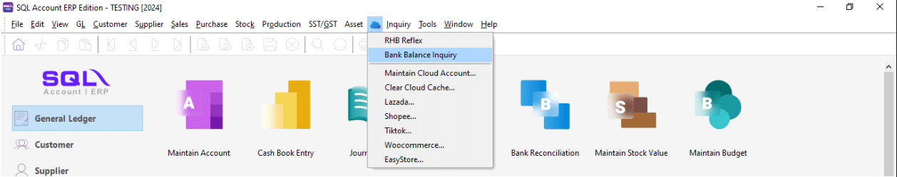

2. Bank balance inquiry details for RHB Reflex bank accounts will be populated.

   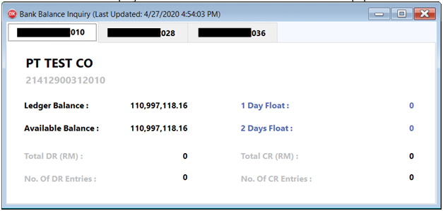

3. Close the window and reopen for real-time updated balance.

## Bank Reconciliation

1. Select `GL menu` - > `Bank Reconciliation` -> click `New`

   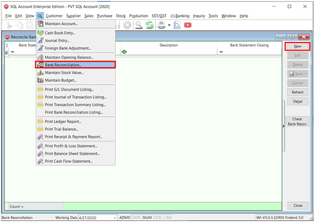

2. Select Bank Statement Date and Display Period

3. Click `Apply`

   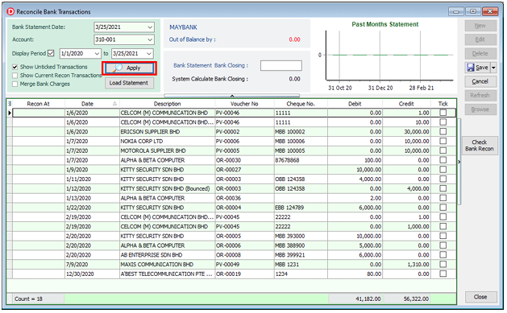

4. Click `Load Statement`, transaction history (T- 1 ) will be populated.

   

5. Click Match to perform reconciliation between SQL and RHB bank statement transaction.

   A. Amount must be same

   B. The reference must be same

   C. Click `Match` when both are matched

   :::note
   - Transaction initiated from SQL is will be matched automatically.
   - RHB bank statement update at 8am daily.
   :::

## Payment

### Maintain Supplier Details

1. Select `Supplier menu` - > `Maintain Supplier`

   

2. Click `New`

   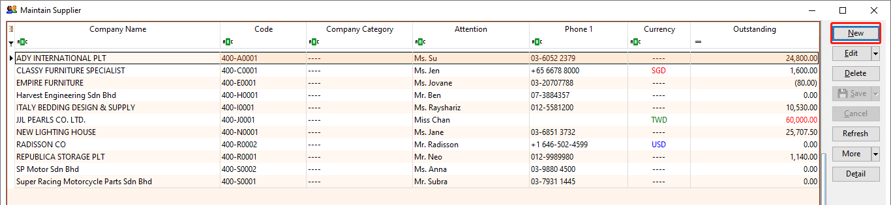

3. Fill in supplier details and click `Save`

   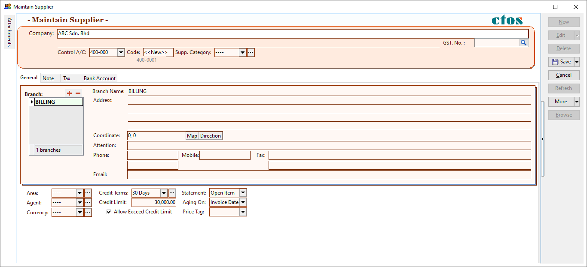

4. Select `Bank Account` - > click `+`

   

   1. Select Bank for RHB 3rd Party Transfer, IBG and Instant Transfer.

      Fill in information below:

      1. Bank account number

      2. Bank account name

      3. ID Type (Business Reg No / New IC / Old IC / Passport / Police ID / Army ID)

      4. ID number

         

   2. Select JomPAY for Bill Payment

      Fill in information below:

      1. JomPAY biller code

      2. JomPAY reference 1

      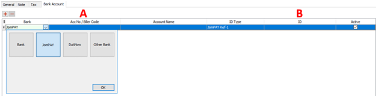

   3. Select DuitNow for DuitNow proxy transfer

      1. Beneficiary name

      2. DuitNow proxy ID type (NRIC/ Passport No./ Army ID/ Mobile No./ Business Reg No.)

      3. ID number2

      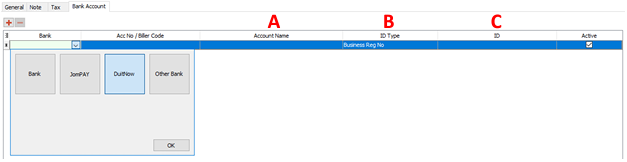

### Payment mode

### RHB 3rd Party Transfer (RHB to RHB)

1. Select `Supplier` -> `Supplier Payment` -> click `New`

   

2. Select Supplier Code : created in Maintain Supplier

3. Select Supplier Bank : RHB crediting bank account

4. Select Payment By : RHB bank account

5. Select Date (Payment date)

   - Future dated payment will be submitted to Reflex if future date is selected.

6. Click `Save`.

7. Reflex Online Banking will be pop-out, click `Submit` to proceed.

   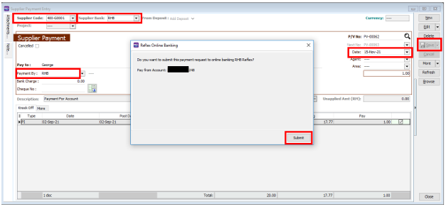

8. Enter SQL password and click `Submit`.

   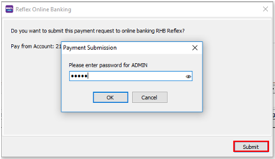

9. Payment status will be populated after submission. Successful payment initiation status is `Pending`, otherwise please
   refer to the error message is shown or refer RHB Reflex for further details.

   

10. Login to RHB Reflex for payment authorization.

    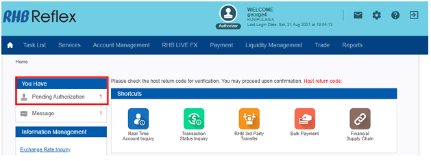

### Payment - IBG

1. Select `Supplier` -> `Supplier Payment` -> click `New`

   

2. Select Supplier Code : created in Maintain Supplier

3. Select Supplier Bank : Non RHB crediting bank account

4. Select Payment By : RHB bank account

5. Select IBG payment mode.

6. Select Date (Payment date)

   - Future dated payment will be submitted to Reflex if future date is selected.

7. Click `Save`.

8. Reflex Online Banking will be pop-out, click `Submit` to proceed.

   

9. Enter SQL password and click `Submit`.

   

10. Payment status will be populated. Successful payment initiation status is `Pending`, otherwise please refer to the error message.

    

11. Login to RHB Reflex for payment authorization.

    

### Payment – Instant Transfer

1. Select `Supplier` -> `Supplier Payment` -> click `New`

   

2. Select Supplier Code : created in Maintain Supplier

3. Select Supplier Bank : Non RHB crediting bank account

4. Select Payment By : RHB bank account

5. Select `Instant Transfer` payment mode.

6. Select Date (Payment date)

   - Future dated payment will be submitted to Reflex if future date is selected.

7. Click `Save`.

8. Reflex Online Banking will be pop-out, click `Submit` to proceed.

   

9. Enter SQL password and click `Submit`.

   

10. Payment status will be populated. Successful payment initiation status is `Pending`,

    otherwise please refer to the error message.

    

11. Login to RHB Reflex for payment authorization.

    

### Payment – DuitNow

DuitNow transfer via proxy is supported includes IC Number, Business Registration Number & Mobile Number.

1. Select `Supplier` -> `Supplier Payment` -> click `New`

   

2. Select Supplier Code : created in Maintain Supplier

3. Select Supplier Bank : DuitNow

4. Select Payment By : RHB bank account

5. Select Date (Payment date)

   - Future dated payment will be submitted to Reflex if future date is selected.

6. Click `Save`.

7. Reflex Online Banking will be pop-out, click `Submit` to proceed.

   

8. Enter SQL password and click `Submit`.

   

9. Payment status will be populated. Successful payment initiation status is `Pending`,

   otherwise please refer to the error message.

   

10. Login to RHB Reflex for payment authorization.

    

### Payment – JomPay

1. Select `Supplier` -> `Supplier Payment` -> click `New`

   

2. Select Supplier Code : created in Maintain Supplier

3. Select Supplier Bank : JomPAY

4. Select Payment By : RHB bank account

5. Select Date (Payment date)

   - Future dated payment will be submitted to Reflex if future date is selected.

6. Click `Save`.

7. Reflex Online Banking will be pop-out, click `Submit` to proceed.

   

8. Enter SQL password and click `Submit`.

   

9. Payment status will be populated. Successful payment initiation status is `Pending`,
   otherwise please refer to the error message.

   

10. Login to RHB Reflex for payment authorization.

    

### Payment Status Update

To perform payment status update, click on the green icon.

1. Success – Payment has successfully processed by the bank

   

2. Unsuccess – Payment has rejected by the bank, please login to RHB Reflex for further details or contact RHB Reflex customer service @ **+603-9206 8118** to speak to Reflex agent.

    

## Support Channel

### RHB Reflex Online Banking Enquiries

1. Call 03-9206 8118

2. Select Language (Only for 1st call.)

3. Press `3` to speak to REFLEX agent directly or email to [reflex.support@rhbgroup.com](mailto:reflex.support@rhbgroup.com).

### SQL Accounting Enquiries

Tel : +603 7890 1299 (Sales)

Tel : +603 7890 1300 (Support)

Fax : +603 5886 9913

### RHB Reflex User Linking User Guide

Please refer the [RHB User Linking user guide](https://www.rhbgroup.com/files/myreflex/premium/topic/all/RHB_SME_e_Solution_User_Reference_Guide_for_CBO.pdf) for further process.
