## Difference between Shopee and Lazada order posting into SQL Account

### Shopee Posting Order

   1. When you post order in Shopee, all transaction fee / shipping fees are finalised when post order to invoice. SQL captures the **escrow amount** as the **Net Total**

      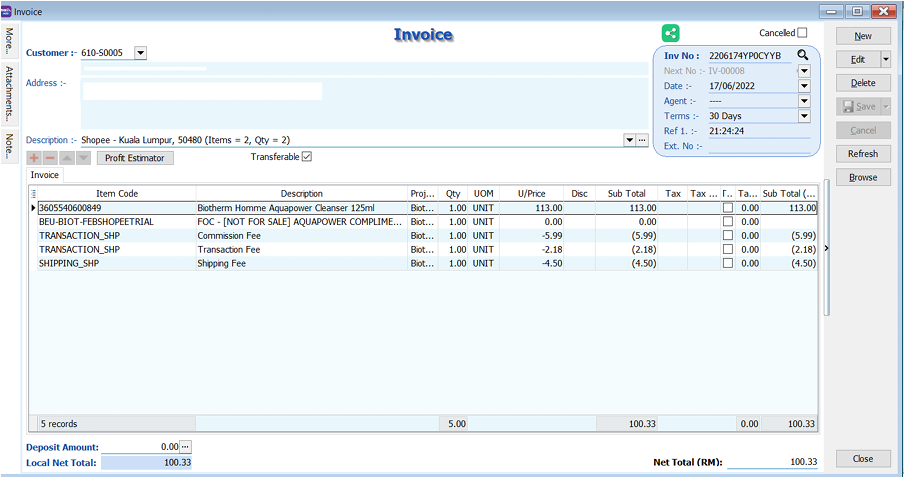

   2. When post payment, the payment amount will tally with the invoice amount. No adjustment
      is made.

      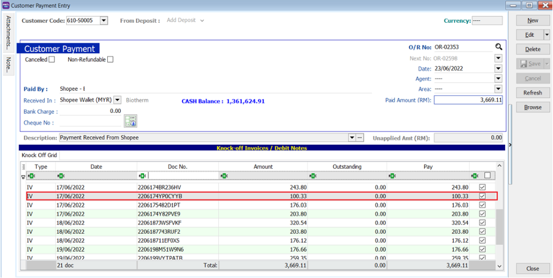

### Shopee Order Returned

   1. When a returned order is posted into SQL, it will be posted into SQL Invoice and will be transferred to Credit Note.

      

      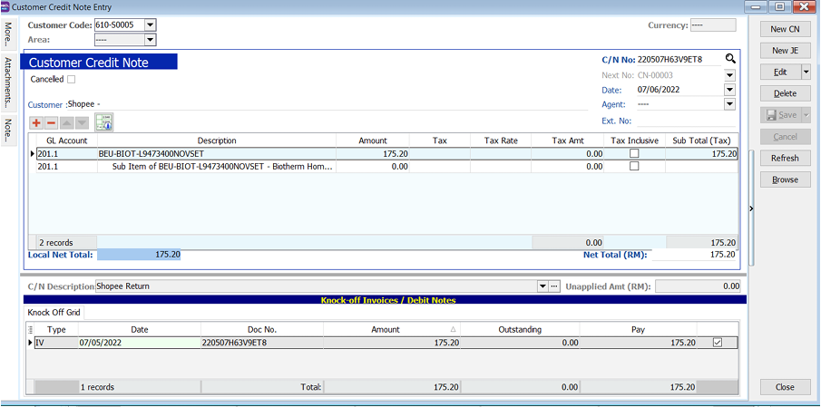

         :::note
         There are small no of cases where the escrow amount and the posted order amount is different. For such cases, SQL system will make the adjustment either editing on invoice or CN when payment is posted to make it tally.
         :::

### Lazada Posting Order

   1. When you post your order, the system has not finalized the transaction, shipping, marketing fees. You will only see the stock item in the invoice.

      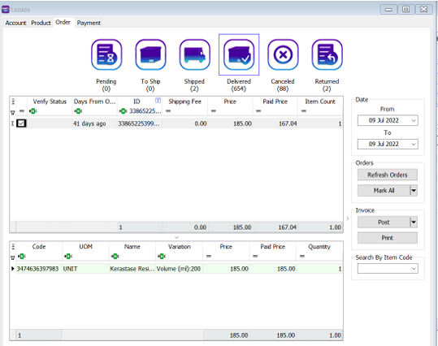

      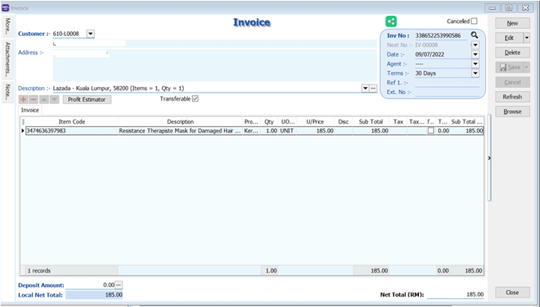

   2. The shipping fees and transaction fees will be added after posting payment.

   3. Load the payment file, and post

      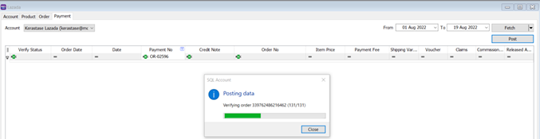

      Payment has been created

      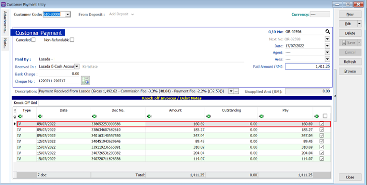

   4. After posting, you will notice that the invoice has been edited and the additional fees has been added. The Delivery Date is the posting date of the transaction entries.

      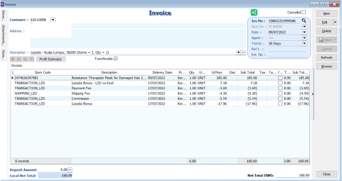

### Lazada Multiple Payment files

   1. For Lazada, 1 order can have multiple payment files. SQL system will adjust the Invoice / CN accordingly based on the amount of payment released by Lazada

      1. If order is a returned, and the first payment file has a **negative payment amount** , the invoice will be deleted.

      2. If order is a returned, and the first payment file has a **positive payment amount** , the returned order will be posted into Invoice first. The invoice **Net Total will be 0** value.

      3. Order and Payment Posting for Lazada:
         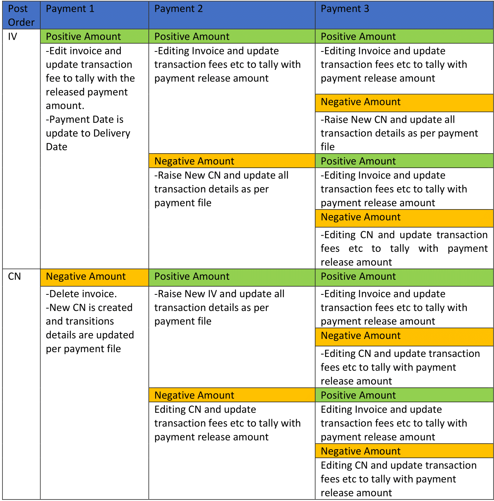

            - Positive Amount / Negative Amount = SUM Total Amount for same Order as per Payment File

   2. Example :

      Order 338719603950977 is posted as invoice :

         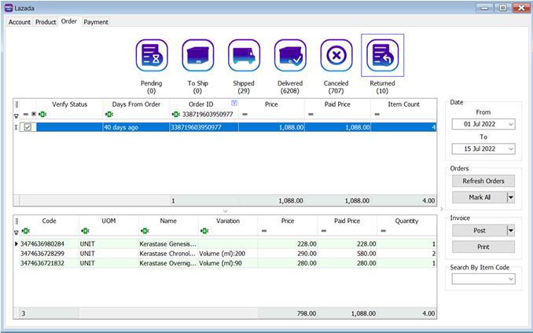

         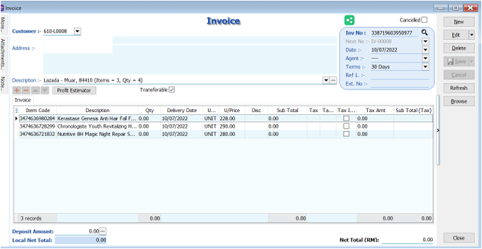

      Payment file 1 (positive amount) :

      :::note

      Payment file must be loaded in sequence according to the payment statement date.

      :::

         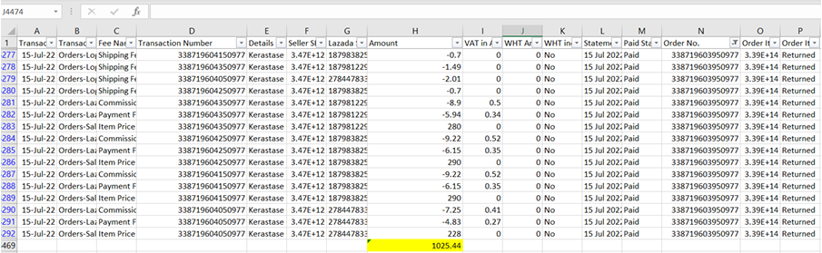

      Payment File 2 (negative amount):

         

      Payment File 3 (negative amount):

         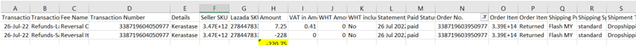

      Invoice :

      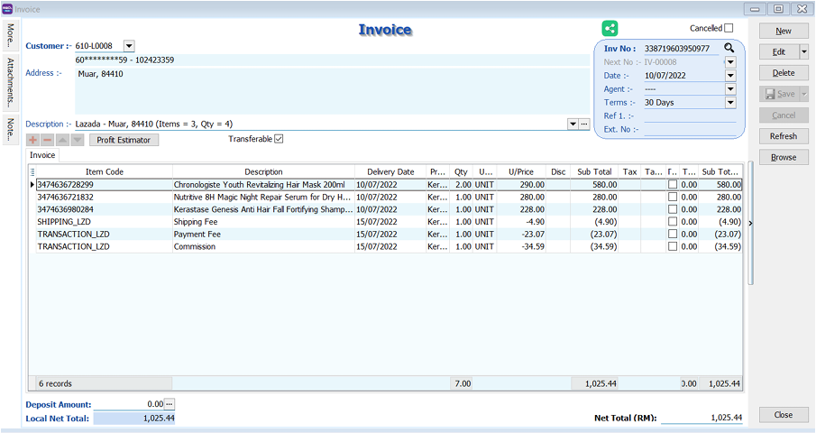

      Payment:

      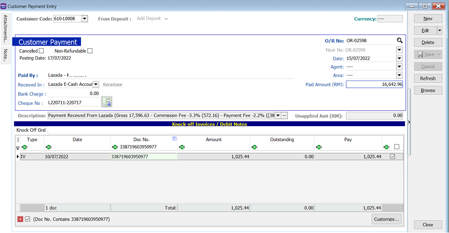

      Credit Note :

      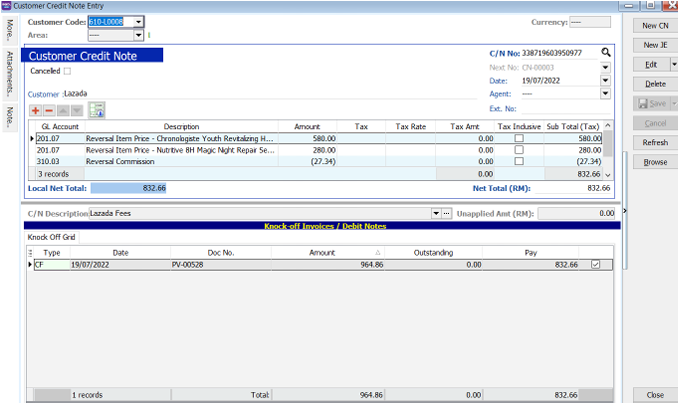

      Customer Refund:

      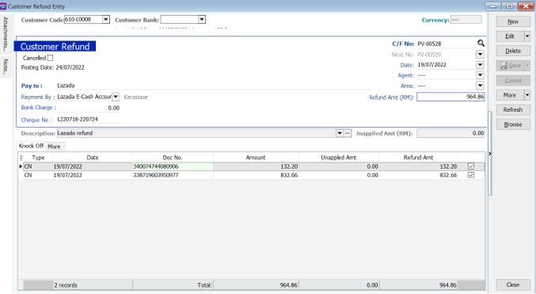
