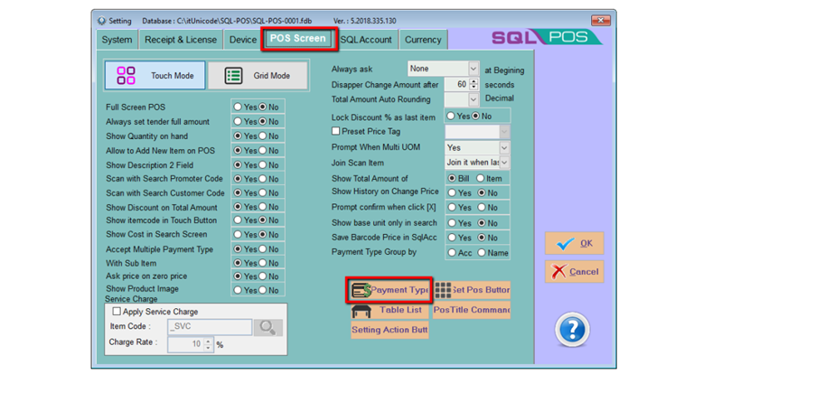
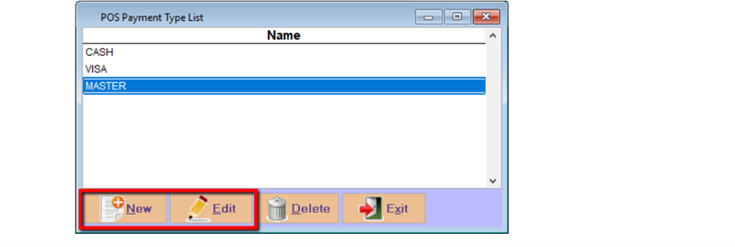
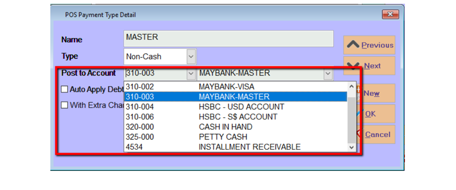
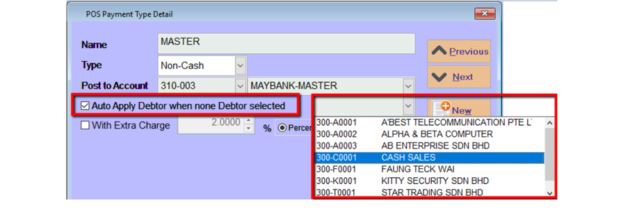
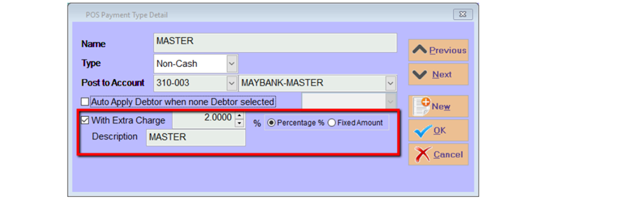

## Steps and Instructions

### Step 1: Click on setting

### Step 2 : go to POS Screen, and click on Payment Type

### Step 3 : Modify Payment Type

- Click New to insert new payment type or click Edit to modify

### Step 4 : Choose Payment Method

- Choose your payment method map to SQL Account bank account

#### Step 4a : Set default debtor code

- You can set a default debtor code for this payment method if the transaction not choosing any debtor code

#### Step 4b: Set the default charges

- You can also set default have 2% or a fixed amount of rm 2 extra charges for this payment method

