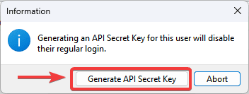
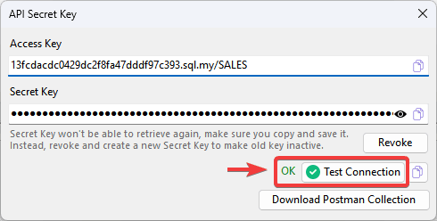
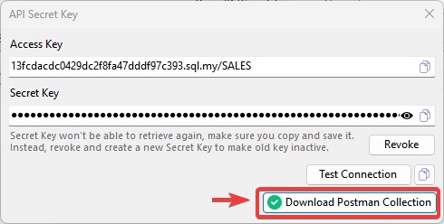
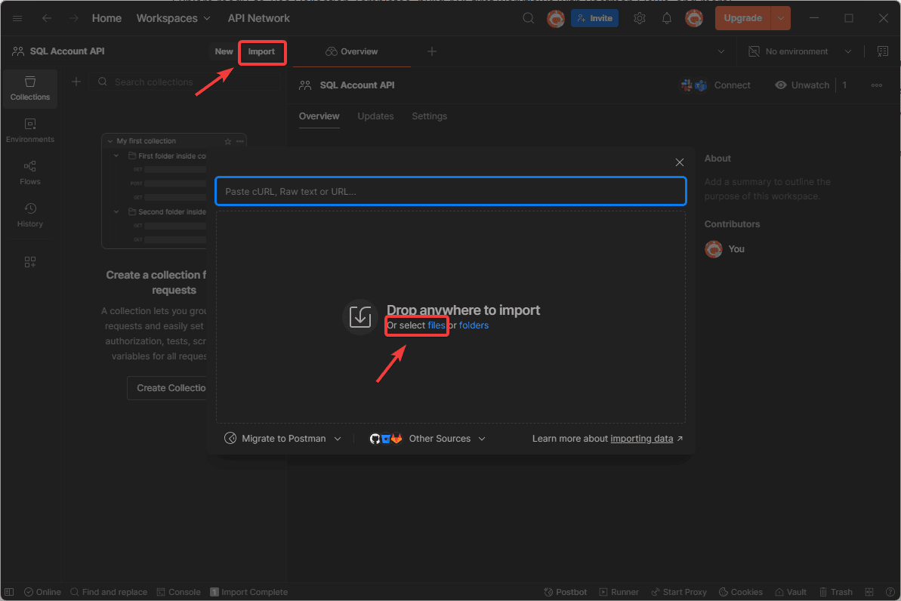
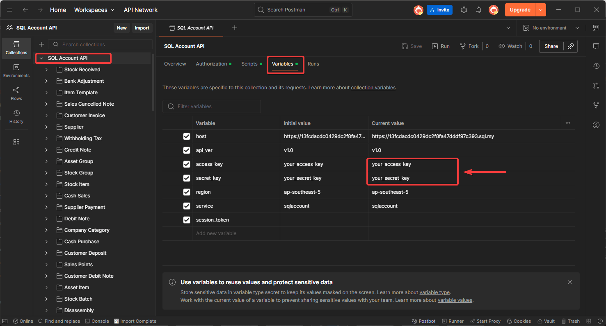
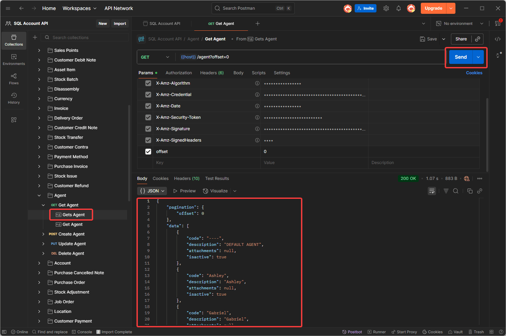

This guide will walk through generating `API Secret Key`, which allow the user to access SQL Account API Services.

## Step to Generate API Secret Key

1. **Navigate to User Detail:**

    Go to `Tools` > `Maintain User...` > `Detail` 

2. **Select API Secret Key Option:**

    **Click** on `More` > `API Secret Key`

       

3. **Generate Secret Key:**
    
    **Click** on `Generate API Secret Key`

    

    :::warning[Important Note]
    Once an `API Secret Key` is generated for a user, that user will no longer be able to login on SQL Account directly. The user only be able to access `SQL Account API Service` with the secret key generated.
    :::

4. **Copy and Save Secret Key**
    
    The API `Access Key` and `Secret Key` will displayed. Make sure to copy and save it immediately in a secure location.

    

    :::info[Tip]
    **API Secret Key** can only be retrieved at the time of generated. If you lose it, you can `revoke` and `generate` a new API Secret Key.
    :::

## Test AWSv4 Signature with API Secret Key

`SQL Account API Service` uses [AWS Signature Version 4](https://docs.aws.amazon.com/AmazonS3/latest/API/sigv4-auth-using-authorization-header.html) for authenticating requests. You can **click** on `Test Connection` to test on the request with AWSv4 authorization header.

:::info[Hints]
For a sample cURL request with AWSv4 authorization header, **click** on `Copy`.
:::

## Download and Import SQL Account API Postman Collection

1. **Download Postman Collection:**

    **Click** on `Download Postman Collection` to save `postman_collection.json` file.

    

2. **Import the API specification into your Postman application:**

    **Click** on `Import`, then select `postman_collection.json` file you downloaded to import.

        

3. **Update Access Key and Secret Key:**

    After postman collection imported, **navigate** to `Variables` tab. Then, **replace** the `your_access_key` and `your_secret Key` with the Access Key and Secret Key generated earlier.

     

4. **Test on API Endpoint**

    **Select** on `Agent` endpoint. Then, **click** on `Send` to try retrieve agent data from `SQL Account API Service` and the `Agent` json data list will show on response body.

     
