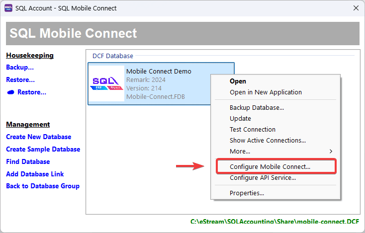
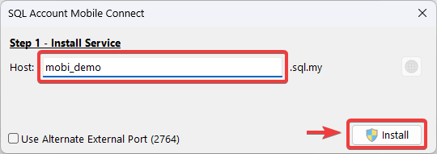
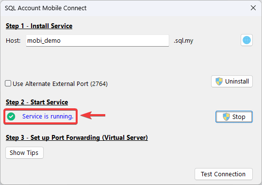
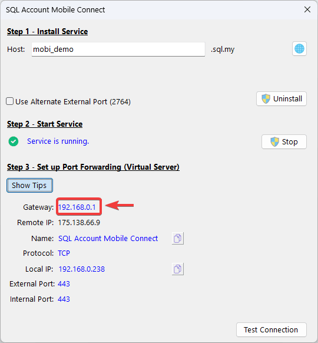
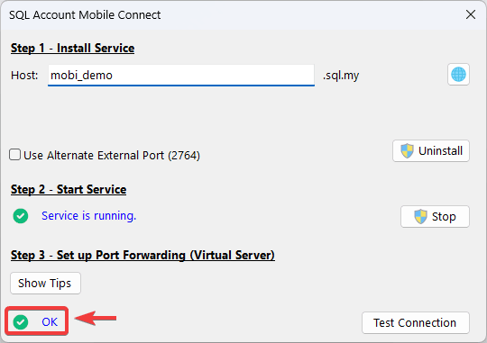
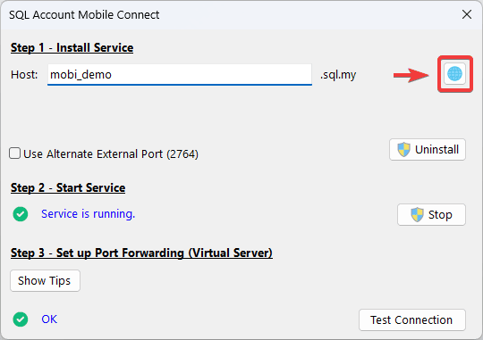

## Prerequisites

- `SQL Account` **version 5.2025.1027.869** or above
- Fix server IP address (either DHCP Reservation or Static)
- [Public IP Address](#public-ip-address)
- [Port Forwarding](#step-3---port-forwarding)

## Public IP Address

Make sure to have a **dedicated public IP Address**.

:::info[Check Public IP Address]
You can using [SQL Connect Detector](https://connect.sql.com.my/document/private-cloud/requirements/sql-connect-detector#download) to check whether public IP is enabled by your ISP.

Make sure the last requirement **Port Forward?** is in <text style={{color: "#43a047"}}>**Green**</text>
:::

:::tip[Hints]
If the result is <text style={{color:"#f44336"}}>**Red**</text>, kindly call your internet service provider and request for dedicated Public IP.

If the provider requests a reason, you can explain that you intend to host a server and therefore need to set up port forwarding.
:::

## Setup

### Step 1 - Install Service

1. On `Logon Screen` > **Click** `⚙️`

   

2. **Right-Click** on company database > **Select** `Configure Mobile Connect...`

   

3. **Click** on `Install` to install mobile connect service

   :::success[Host Name]
   A default host name will be filled in. However, if you would like to use a custom host name, you may edit the default. Note that changing hostname is only available during the initial setup. (Host name should have **at least 8 characters**)
   :::

   

### Step 2 - Start Service

After the installation, start the service. Once successful, `Service is running` status will show on screen.

### Step 3 - Port Forwarding

Next, we will need to do `Port Forwarding`.

:::info[Port Forwarding Information]
You can **Click** on `Show Tips` to find all the information for port forwarding configuration.

:::

1. **Access Router Setting**: Login to the router's administration interface on web browser.

   You can **Click** on `Show Tips` > `Gateway IP Address`, to access login page of the router.

    :::warning
   If you are using a firewall or serving the router's web administration interface via a different IP address, this might not work.
    :::

   

2. **Navigate to Port Forwarding Section**: Find `Port Forwarding`, `Virtual Service` or similar section in the router's setting.

3. **Add New Rule**: Create a new port forwarding rule. (All information can get from [Port Forwarding Information](#step-3---port-forwarding))

   - `Service Name`: Enter a description name (**SQL Account Mobile Connect**)
   - `External/Public Port`: Specify the port number to use for external access (**443**)
   - `Internal IP Address`: Enter the IP address of the device to forward to (**E.g. 192.168.0.238**)
   - `Internal/Private Port`: Specify the port number the service is listening on within the internal network (**443**)

4. **Save the Rule**: Save the new port forwarding rule.

5. **Verify**: **Click** on `Test Connection` to test `SQL Mobile Connect` access status. When `✅ OK` status is shown, it means the service is setup successfully.

   

#### Examples of Port Forward

#### C1200

1. Navigate to `Advanced` > `NAT Forwarding` > `Virtual Servers`, click `Add` to create a new entry.

   

2. Fill in the details following the [Port Forwarding Information](#step-3---port-forwarding):

    |Router Fields|Port Forward Information|
    |--|--|
    |Service Type|Name|
    |External Port|External Port|
    |Internal IP|Local IP|
    |Internal Port|Internal Port|
    |Protocol|Protocol|

   

3. Click `OK`.

#### AX3000

1. Navigate to `Advanced` > `NAT Forwarding` > `Port Forwarding`, click `Add` to create a new entry.

   

2. Fill in the details following the [Port Forwarding Information](#step-3---port-forwarding):

    |Router Fields|Port Forward Information|
    |--|--|
    |Service Name|Name|
    |Device IP Address|Local IP|
    |External Port (Individual Port)|External Port|
    |Internal Port|Internal Port|
    |Protocol|Protocol|

   

3. Click `Save`.

#### HG8145X6

1. Navigate to `⚙️` > `Forward Rules` > `IPv4 Port Mapping`, click `New` to create a new entry.

   

2. Fill in the details following the [Port Forwarding Information](#step-3---port-forwarding):

    |Router Fields|Port Forward Information|
    |--|--|
    |Mapping Name|Name|
    |Internal Host|Local IP|
    |External port number|External Port|
    |Internal port number|Internal Port|
    |Protocol|Protocol|

   

3. Click `Apply`.

#### SR1041F

1. Navigate to `Basic Setup` > `NAT` > `Port Forwarding`, click `Add Port Forwarding` to create a new entry.

   

2. Fill in the details following the [Port Forwarding Information](#step-3---port-forwarding):

    |Router Fields|Port Forward Information|
    |--|--|
    |Protocol|Protocol|
    |Local IP Address|Local IP|
    |Local Port Range|Internal Port|
    |Remote Port Range|External Port|

   

3. Click `Confirm`.

#### SR120-A

1. Navigate to `Basic Setup` > `NAT` > `Port Forwarding`, click `Add` to create a new entry.

   

2. Fill in the details following the [Port Forwarding Information](#step-3---port-forwarding):

    |Router Fields|Port Forward Information|
    |--|--|
    |Local IP Address|Local IP|
    |Local Port Range|Internal Port|
    |Protocol|Protocol|
    |Remote Port Range|External Port|
    |Comment|Name|

   

3. Click `Confirm`.

### Step 4 - Access SQL Mobile Connect

:::info[Important]
Before access to the service, do remember to setup your users. To learn more, follow [SQL Mobile Connect - User Setup](user-setup).
:::

1. You can now access `SQL Mobile Connect` by **Clicking** on the globe `🌐`

   

2. We offer two options for users to access the service:

   - **Click** on `Copy` (top left) to retrieve the link
   - **Scan** the `QR Code` with your phone

   

3. You should see the login page.

   

## Alternative External Port (2764)

If your router does not allow traffic on `port 443`, you can **tick** on `Use Alternative External Port (2764)` to configure mobile connect service to use `port 2764`

After `Install` and `✅ Service is running` on port 2764. Now you can configure port forwarding on your router with `external port 2764`

