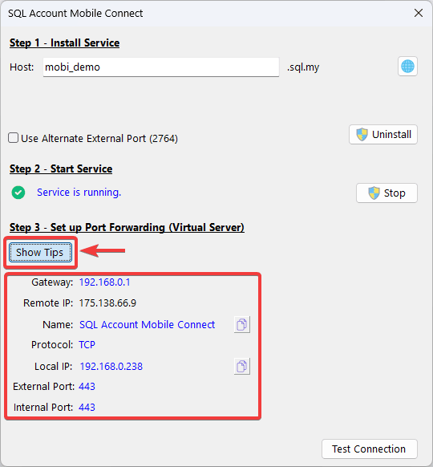
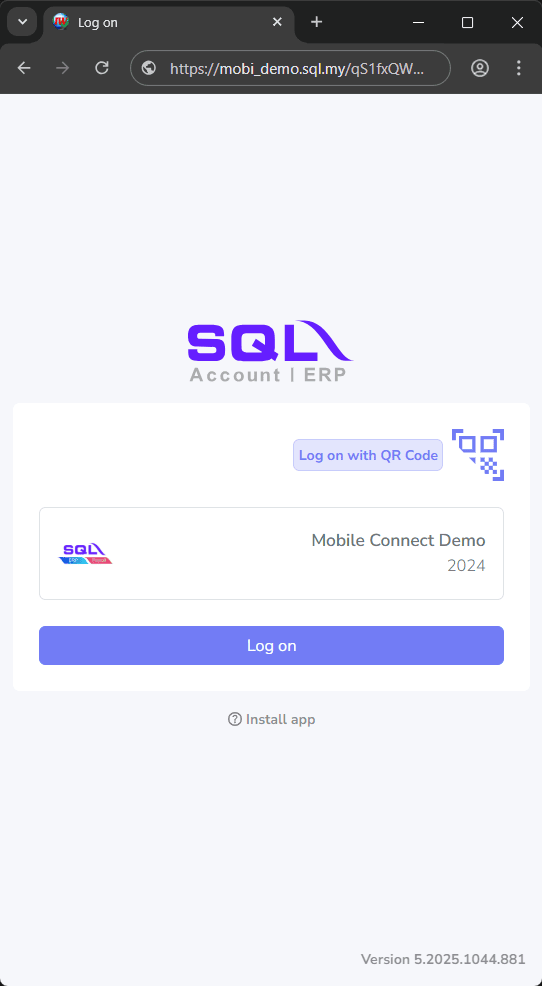

## Prerequisite

- `SQL Account` **version 5.2025.1027.869** or above
- [Public IP Address](#public-ip-address)
- [Port Forwarding](#step-3---port-forwarding)

## Public IP Address

Make sure public IP Address is enabled by your ISP (Internet Service Provider)

:::info[Check Public IP Address]
You can using [SQL Connect Detector](https://connect.sql.com.my/document/private-cloud/requirements/sql-connect-detector#download) to check whether public IP is enabled by your ISP.

Make sure the last requirement **Port Forward?** is `Green`
:::

## SQL Mobile Connect (On Premise) Setup

### Step 1 - Install Service

1. On `Logon Screen` > **Click** `⚙️`

    

2. **Right-Click** on company `database` > **Select** `Configure Mobile Connect...`

    

3. **Click** on `Install` to install mobile connect service

    

    :::success[Host Name]
    A default company's `Host` name will suggested, but you can change to any host name you like for first time setup. (Min host name length is **at least 8 characters**)
    :::

### Step 2 - Start Service

After **SQL Mobile Connect** service is installed and running. `Service is running` status will show on screen.

### Step 3 - Port Forwarding

Next, `Port Forwarding` required to configure on your router for public access.

:::info[Port Forwarding Information]
You can **Click** on `Show Tips`, to show the information for port forwarding configuration.

:::

#### Port Forward Configuration Example

1. **Access Router Setting**: Login to the router's administration interface on web browser.

    :::success[Router Login Page]
    You can **Click** on `Show Tips` > `Gateway IP Address`, to access login page of the router

    
    :::

2. **Navigate to Port Forwarding Section**: Find `Port Forwarding`, `Virtual Service` or similar section within router's setting.

3. **Add New Rule**: Create a new port forwarding rule. (All information can get from [Port Forwarding Information](#step-3---port-forwarding))
    - `Service Name`: Enter a description name (**SQL Account Mobile Connect**)
    - `External/Public Port`: Specify the port number to use for external access (**443**)
    - `Internal IP Address`: Enter the IP address of the device to forward to (**E.g. 192.168.0.238**)
    - `Internal/Private Port`: Specify the port number the service is listening on within the internal network (**443**)

4. **Save the Rule**: Save the new port forwarding rule. 

5. **Verify**: **Click** on `Test Connection` to test `SQL Mobile Connect` access status. When `✅ OK` status is shown, mean the service is setup successfully.

    

### Step 4 - Access SQL Mobile Connect

1. Now, You can access `SQL Mobile Connect` by **Click** on `🌐`

    

2. Then **Click** on `Copy` or **Scan** on `QR Code` to get `SQL Mobile Connect` link and open on web browser to access your company on SQL Mobile Connect

    

    

## Reference

Your can refer to [SQL Mobile Connect - User Setup](./user-setup) for user setup to login on SQL Mobile Connect
