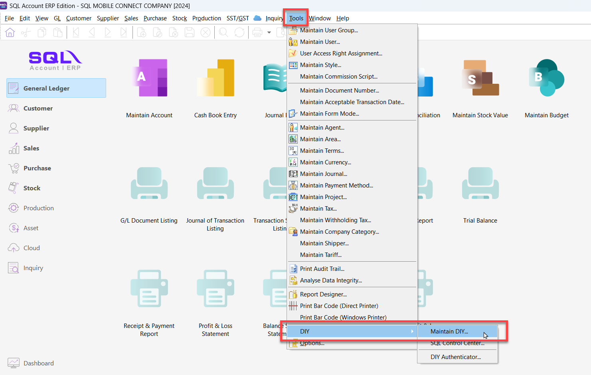
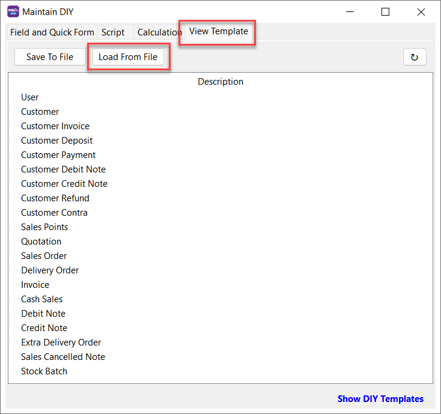
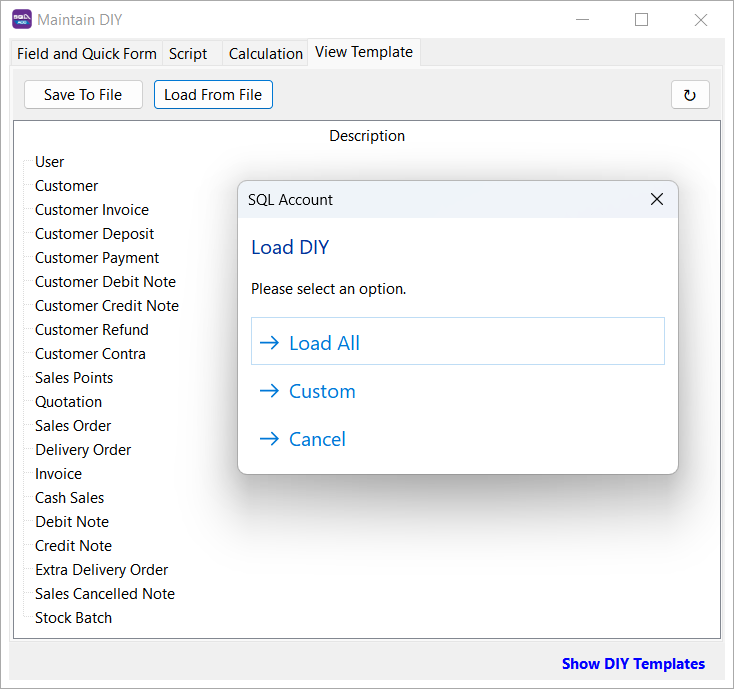
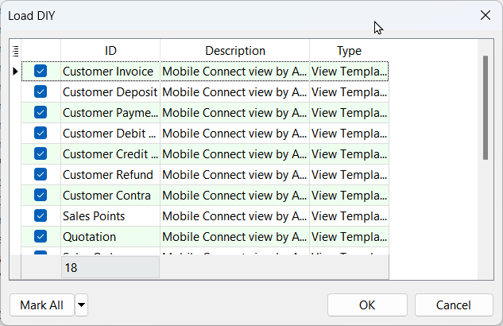
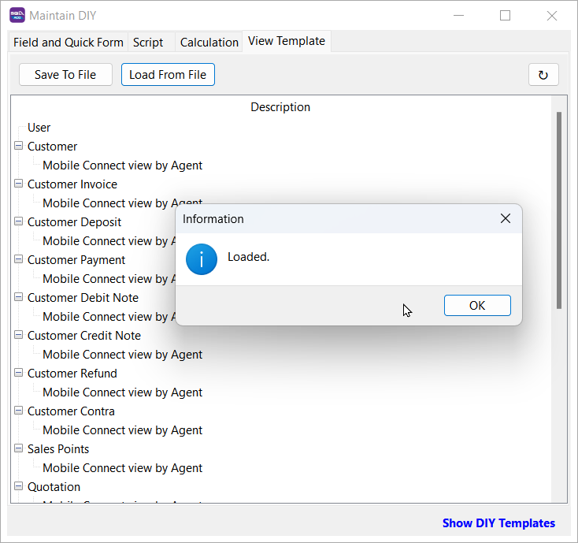
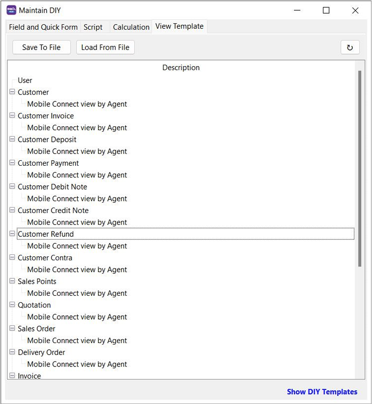
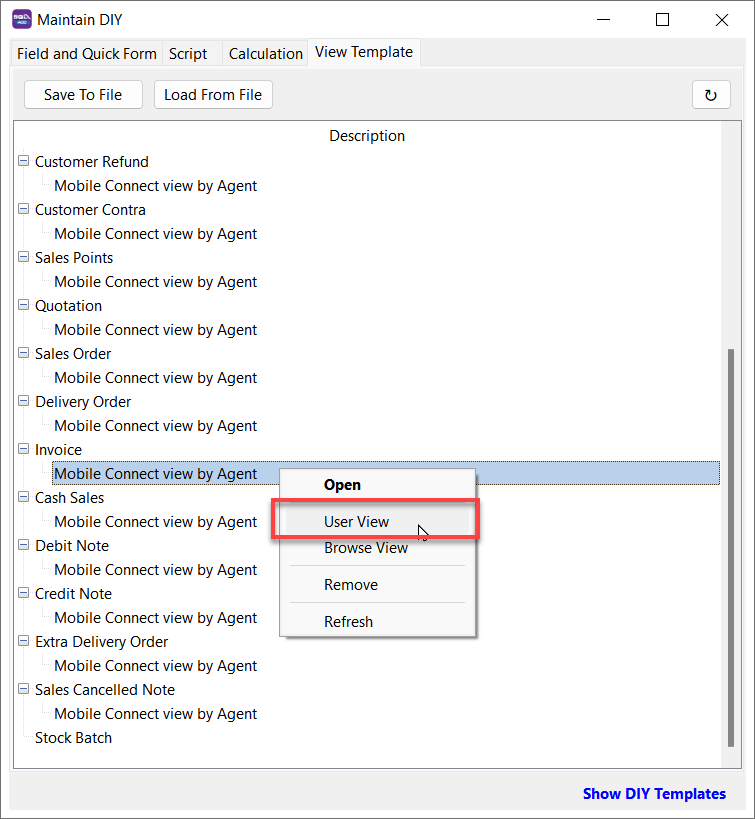
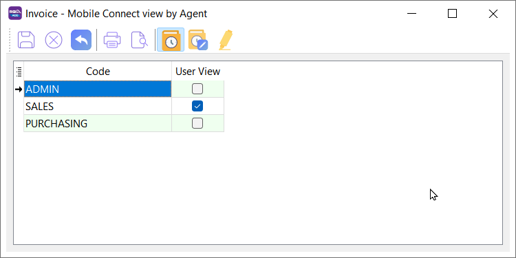
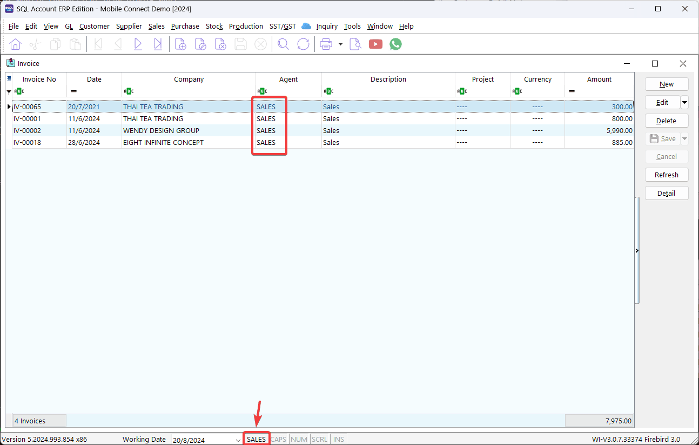
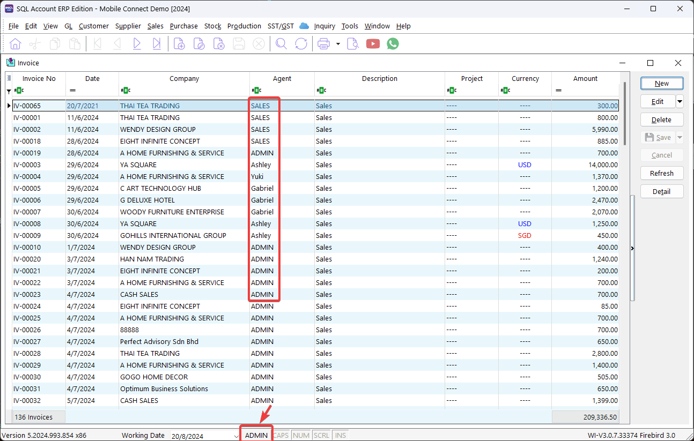

## 1.0 How to Set User View

**Step 1**: Go to **Tools** | **DIY** | **Maintain DIY**

**Step 2**: Switch to **View Template** tab, then click on **Load From File** to select `View Template` to load

:::info[Download]
You can download this **[View Template - View by Agent (Current User)](https://cdn.sql.com.my/wp-content/uploads/2024/08/View-Template-View-by-Agent-Current-User.zip)** and **load** to SQL Account.

This `View Template` will filter document by `Agent`, where `Agent` is match to current login user `Code`.
:::

**Step 3**: After select a `View Template` file to load, you can select **Load All** or **Custom**

- **Load All**: All the template will load.
- **Custom**: Can select all or some template to load.
    

Once completed, `Loaded` message will prompt and all `View Template` loaded will show.

**Step 4**: **Right-click** on View Template and click on **User View**.

**Step 5**: A list of `User` will shown, then **tick** on `User View` column for the `User` that want to apply this View Template and click **Save**.

Based on the scenario above, `Invoice view by Agent - Current User` View Template is applied to `SALES` user. When `SALES` user login to SQL Account, the user only can view those `Invoice` with `Agent` code equal to `SALES`

- Login by **SALES**

    

- Login by **ADMIN**

    