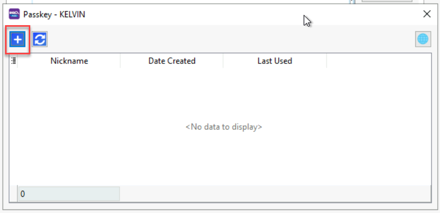
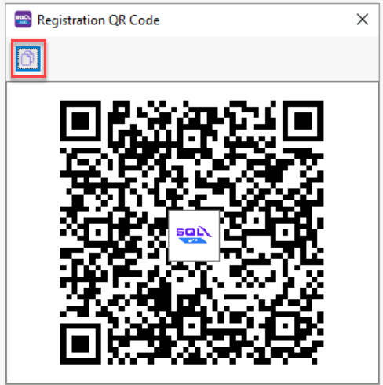
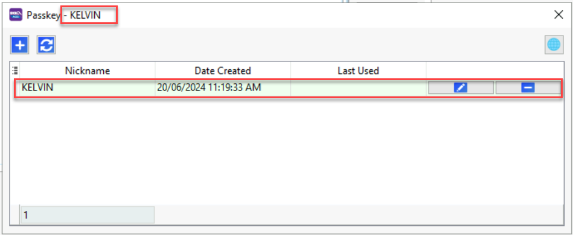
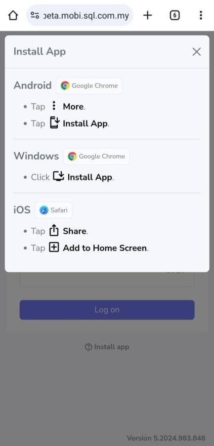
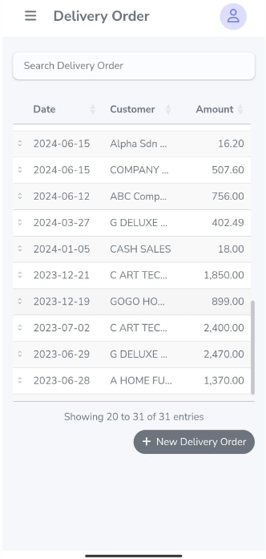

## 1.0 SQL ACCOUNT SETUP

### 1.1  HOW TO CREATE SQL MOBILE CONNECT USER

Step 1: Tools | Maintain Agent… | Create New Agent | Save

Step 2: Select **‘Create WebApp User’** , then will show one dialog **User is created**. | Press OK.

Step 3: Select **+ Button** under Passkey windows

Step 4: Can press the Copy link **(Red Box)** or QR code shown

Send to Salesman for register passkey on their device

After done registration of passkey on your device, it will show screen

Step 5: Rename the Nickname for this passkey | Press OK

## 2.0 SQL MOBILE CONNECT SETUP

Step 1: Press the link or scan the QR code provided

Step 2: After press the link or scan the QR code, will show screen as above for you to register passkey. Then, select **‘Continue’** to proceed.

Step 3: After registered passkey successfully, will show the screen below.

You need to install the App on your device

- Android > click More > Install App
- Windows > click Install App
- IOS > Share > Add to Home Screen

The installed app will appear on your home screen as shown above.

Alternatively, you can copy the link or scan the QR code by pressing the red box to access SQL Mobile Connect on your device.

Now you can start using and exploring the SQL Mobile Connect app.

Thank You
