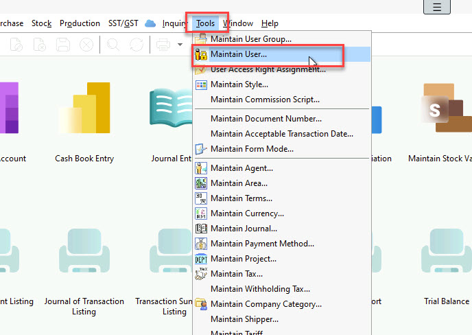
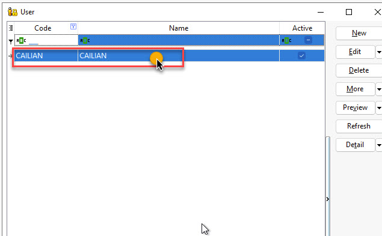
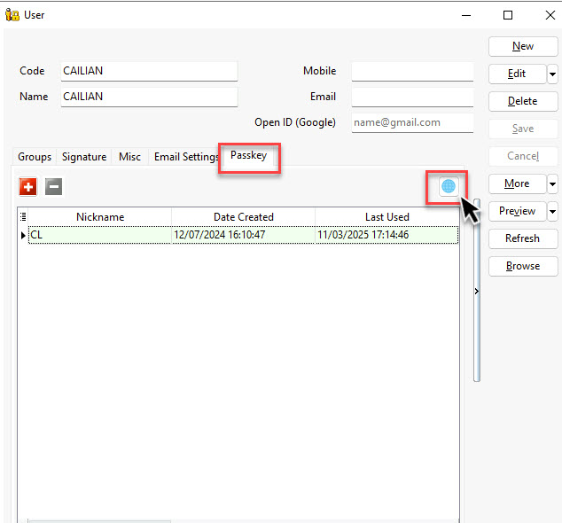
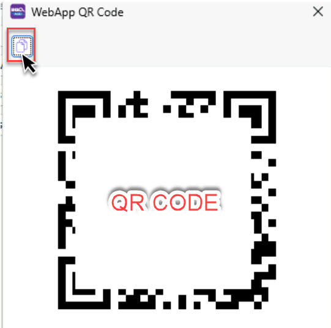
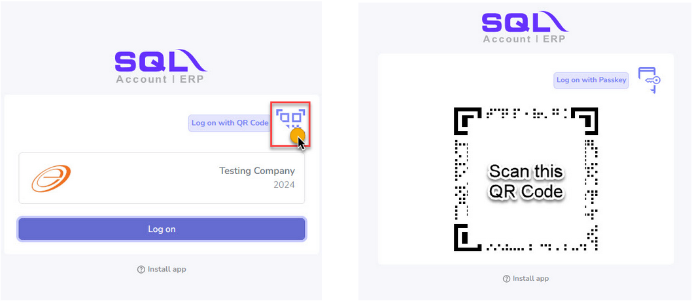
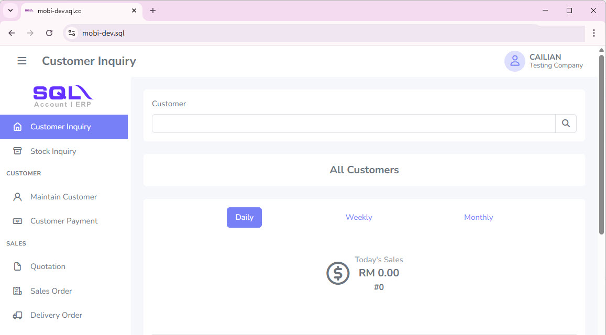

1. Go to **Tools | Maintain User…**

    

2. Select the desired **User** under **Maintain User**.

    :::info REQUIRED
    Make sure the user has registered the **passkey** before proceeding to the next step
    ::: 

    

    Then, select the `Passkey` and click on the global icon

     

3. Click this icon to copy the link and paste it into your browser.

    

4. Click `Log on with QR Code`, then scan the QR code.

     

    :::info REQUIRED
    Make sure to use the device that registered the passkey for this user to scan the QR code.
    :::

5. Proceed by opening it in the browser on your device. Next, select `Authenticate` and approve the access.

     

6. You can now use Mobile Connect in Web View. 

    