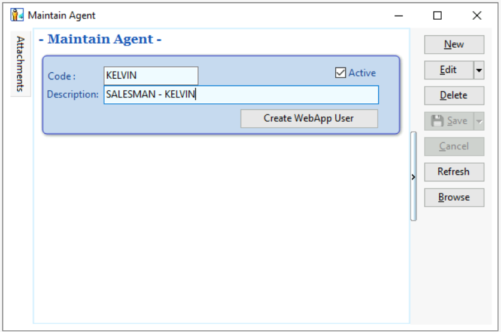
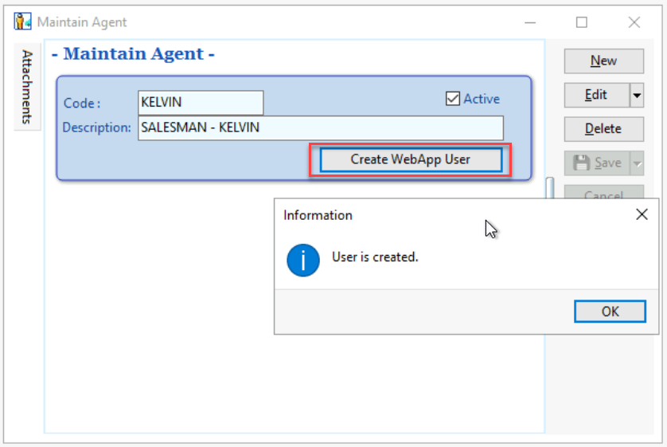
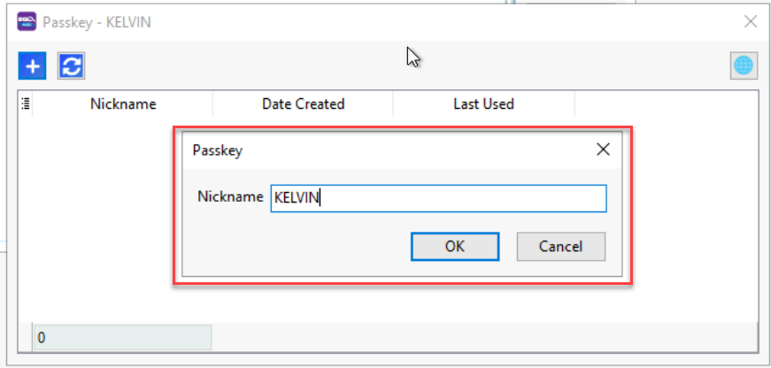
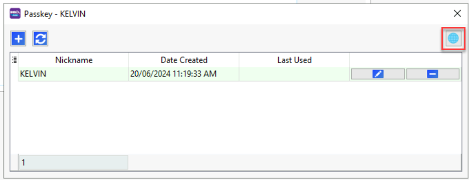

This guide walks you through the complete process of setting up SQL Mobile Connect users and configuring the mobile application on user devices.

## Overview

The setup process consists of two main parts:

1. **Administrator Setup** - Creating users and passkeys in SQL Account
2. **User Setup** - Registering passkeys and installing the mobile app

---

## Part 1: Administrator Setup (SQL Account)

### Step 1: Create a New Agent

1. Navigate to **Tools** → **Maintain Agent...**
2. Click **Create New Agent**
3. Fill in the agent details and click **Save**

   

### Step 2: Create WebApp User

1. Select **Create WebApp User** from the agent options
2. A dialog box will appear showing **"User is created"**
3. Click **OK** to confirm

   

### Step 3: Generate Passkey Registration

1. Click the **+ Button** under the Passkey window

   

2. A registration screen will appear with:
   - **Copy Link** button (highlighted in red box)
   - **QR Code** for mobile scanning

   

3. Share either the link or QR code with the user for device registration

### Step 4: Configure Passkey Nickname

1. Enter a descriptive **Nickname** for this passkey
2. Click **OK** to save

   

### Step 5: Verify Setup Completion

The new passkey will now appear under your agent, confirming successful setup.

---

## Part 2: User Setup (Mobile Device)

### Step 1: Access Registration Link

Users can access the registration in two ways:

- Click the provided link
- Scan the QR code with their mobile device

### Step 2: Register Passkey

1. The registration screen will appear on the user's device
2. Click **Continue** to proceed with passkey registration
3. Follow the device-specific authentication prompts (fingerprint, face ID, etc.)

### Step 3: Install Mobile Application

After successful passkey registration, users will see the installation screen:

#### Installation Instructions by Platform

- **Android**: Click **More** → **Install App**
- **Windows**: Click **Install App**
- **iOS**: Click **Share** → **Add to Home Screen**

### Step 4: Access the Application

Once installed, the SQL Mobile Connect app will appear on the device's home screen.

#### Alternative Access Methods

Users can also access the application by:

- Copying the provided link (red box)
- Scanning the QR code for quick access

### Step 5: Start Using SQL Mobile Connect

The setup is now complete! Users can begin exploring and using the SQL Mobile Connect application.

---

## Next Steps

After successful setup, users can:

- Access real-time business data
- Generate reports on mobile devices
- Sync with SQL Account system
