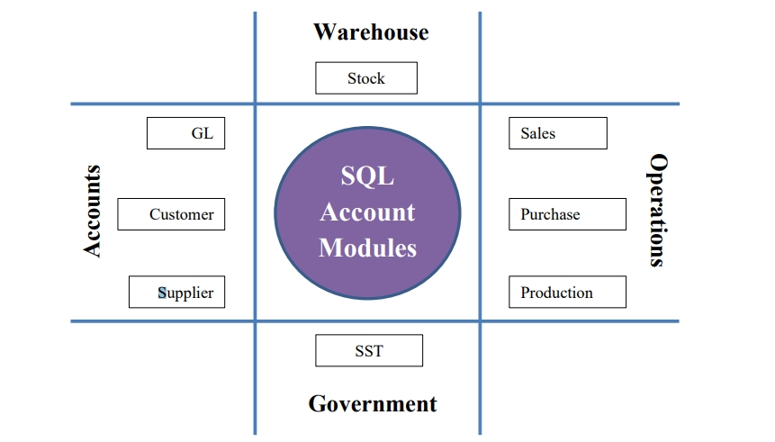

# Introduction

## What is SQL Account?

SQL Account is a centralize system to assist the business (or departments) to record and process daily documents from sales, purchase, stock, and bank. It is also a tool for SST reporting.

1. **General Ledger**, a general ledger accounting where records all transactions posted from various journal (eg. general, sales, purchase, bank), an entry for general journal and expenses payment (eg. sales person claims, water and electricity expenses). Bank reconciliation, cash flow statement and financial reports are available in this module.

2. **Customer**, a sales ledger accounting where monitor the outstanding and payment received from the customers. Customer report such as reminder letter, customer aging and analysis reports are available here.

3. **Supplier**, a purchase ledger accounting where monitor the outstanding and payment received from the customers. Customer report such as reminder letter, customer aging and analysis reports are available here.

4. **Sales**, a module to handle all the sales activities from quotation, sales order, delivery order, tax invoice, debit note and credit note. Advance sales reports in help business to identity the top sales of the products.

5. **Purchase**, a module to records all the purchase activities from purchase request, purchase order, goods receive, purchase invoice, purchase debit note, and purchase returns.

6. **Production**, a manufacturing data process. It helps to identify the materials required and planned based on the customer orders.

7. **Stock**, an inventory control, stock take adjustment and for monitor the stock movement from one location to another location. Stock aging to identify out the obsolete stock.

8. **SST**, a Tax compliance accounting system. Readiness to process and submit the SST and others SST reports.

Learn more about [SQL Account](https://sql.com.my).
