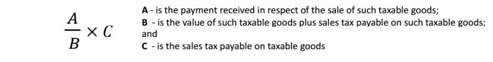
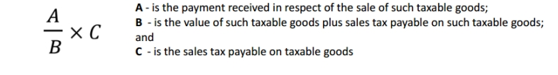

Bad debt refers to outstanding amount of sales tax from a person who is insolvent, and is irrecoverable from the person.

Insolvent person is:

- For individual, adjudged bankrupt.

- For company, ordered by the court to be wound up and a receiver is appointed.

Payment deemed to be irrecoverable whole or parts of the payment has been provided in the account as:

- Doubtful debt, or

- Written off in the person’s account as bad debt.

1. Bad Debt Claim

   Refund of sales tax in relations to Bad Debts:

   1. Can be claimed by a registered manufacturer or a person who ceased to be registered manufacturer.

   2. Shall claim within 6 years from the date the taxable goods is sold.

   3. Subject to conditions & satisfaction of the Direct General (DG).

   4. May claim according to the formula below.

      

2. Bad Debts Recovery

   Repayment of sales tax in relation to Bad Debts refunded:

   1. Has claimed and received the sales tax refund.

   2. Payment received from the debtor after bad debts claimed.

   3. Repay to DG in his return.

   4. Repay according to the formula below.

      
