## History of GST

Historical changes in GST Accounting Guideline.

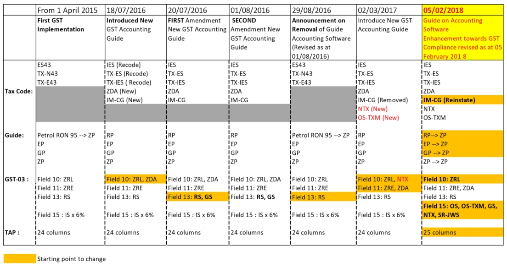

## GST Audit File (GAF)

1. GAF is constructed from 5 records elements.

   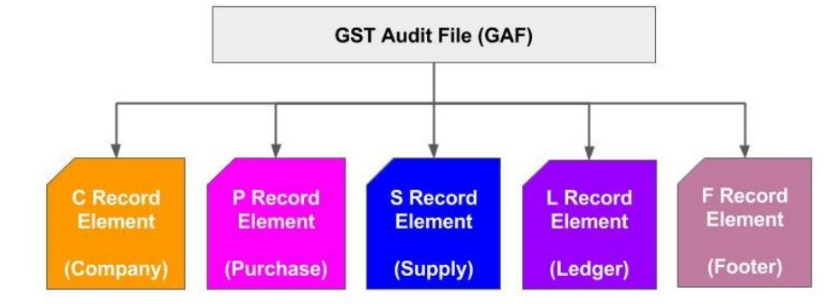

2. GAF – Record Elements (P, S).

   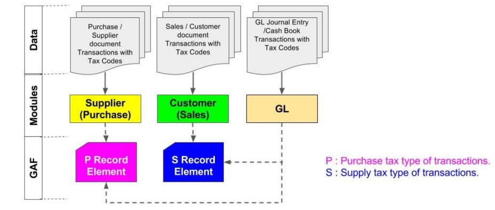

3. GAF – Record Elements (L).

   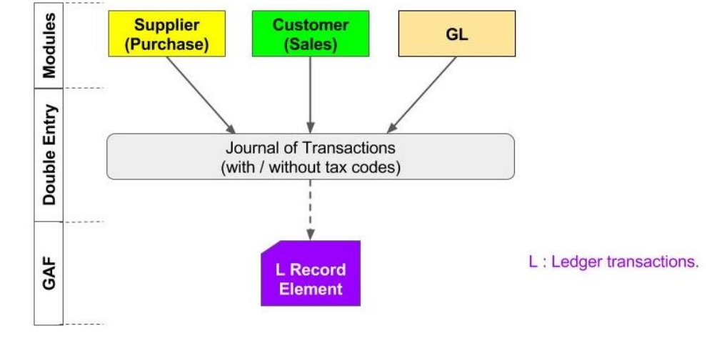

4. GAF – Record Elements (F).

   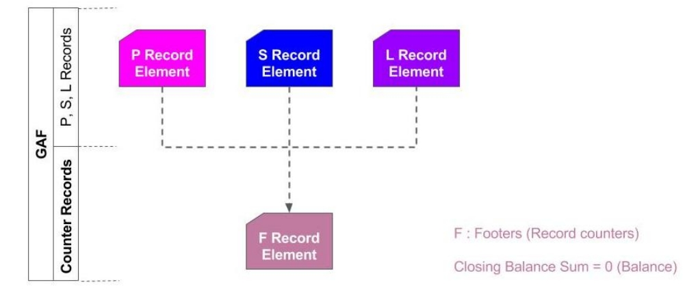

## Generate GAF

:::info

Watch tutorial video here: [Youtube](https://www.youtube.com/watch?v=EoyLOMs5pQg&feature=youtu.be)

:::

GAF = GST Audit File.

The purpose of a GAF is for Customs to audit the accuracy of your GST Return but GAF submission is only required upon request. It is not required to be submitted with GST-03.

1. Click on **GST** | **Open GST Return**.

   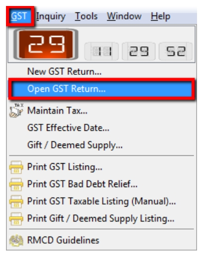

2. Select the cycle for the GAF that you want to generate. Then click on the **arrow down button** and select **Generate GST Audit File(GAF)**.

   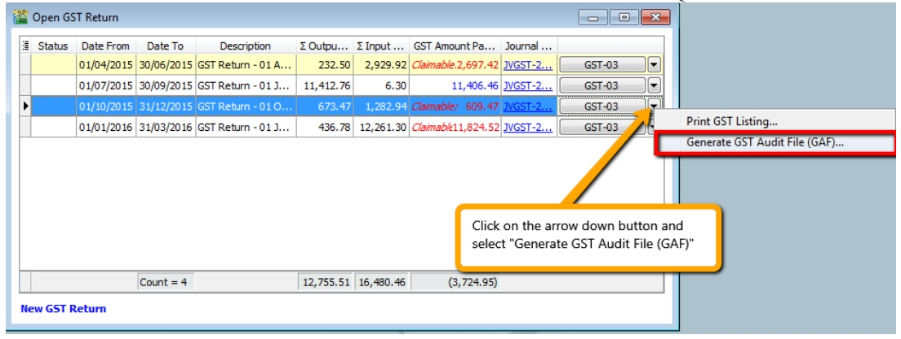

3. The result is generated based on **General, Sales & Purchase Ledger** for you to check your transactions before submitting to Customs for auditing purposes.

   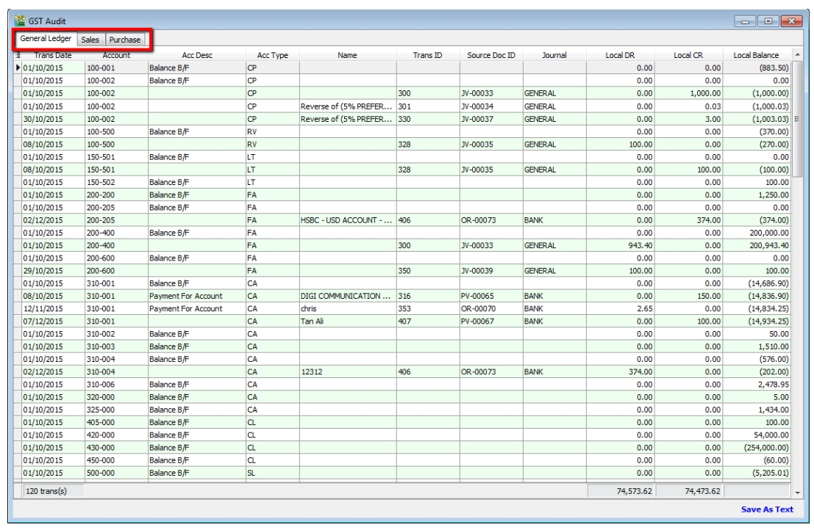

4. You may check the report.

5. Click on **Save as Text**.

   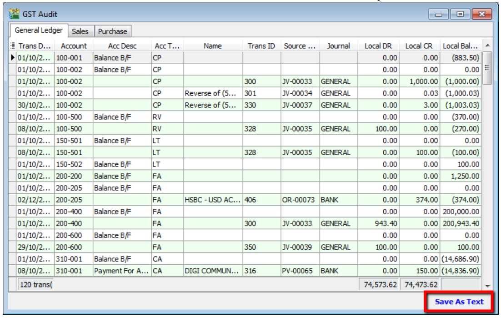

6. Save your GAF text file to desktop.

   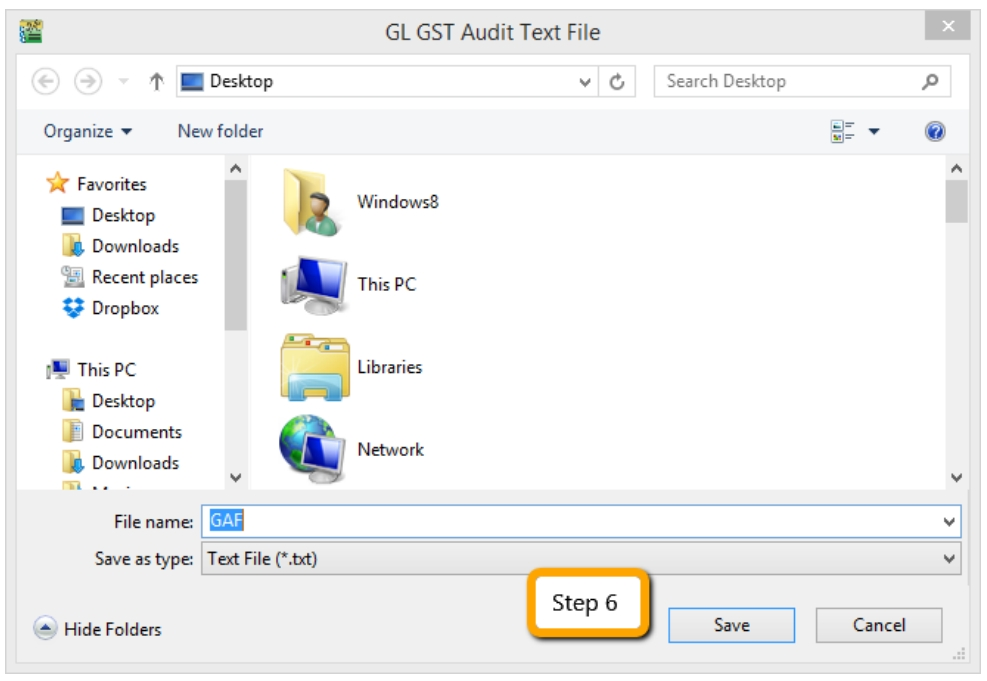

7. After saving, the message “File generated successfully” will automatically pop-up, just click **OK**.

   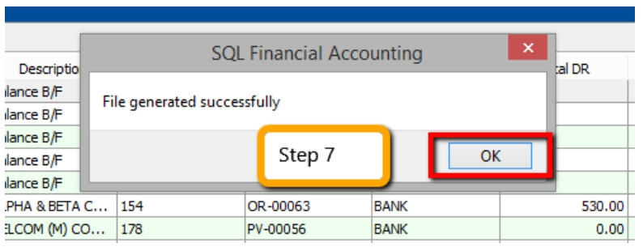

8. Go to desktop to select the GAF.txt file. The output will be similar to the image below:

   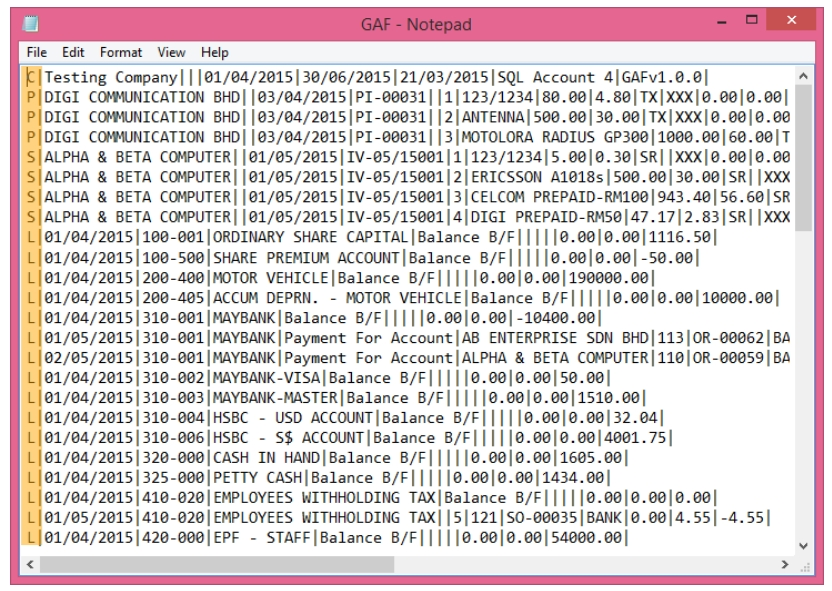

The above is the exported file that has fulfilled all requirements by Customs, you may submit to [Customs Department](https://gst.customs.gov.my/TAP)

:::note

C= Company Name

P = Purchase Transaction

S = Sales Transaction

L = General Ledger transaction

You have to submit GAF File upon request by Customs.

:::

## GST Listing Report

This report is to analyse the detail of GST transactions grouped by tax type. It can be used to check against GST-03.

1. **GST** | **Print GST Listing**.

2. Filter the date range that you want to apply or you can filter by GST Process, tax code.

3. Click **Apply**.

   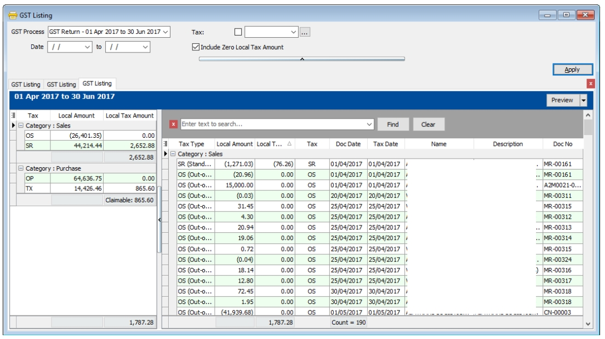

   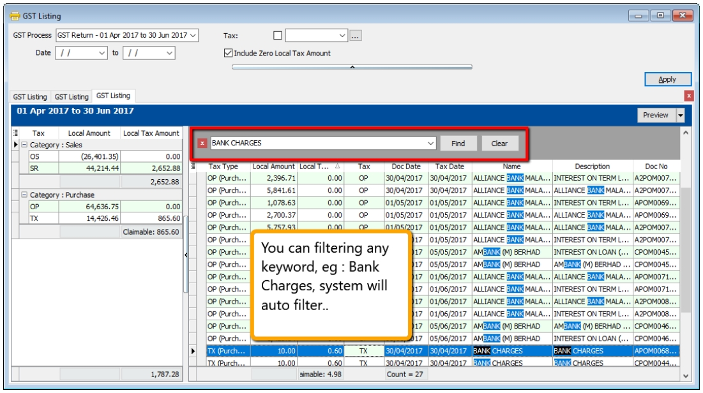
