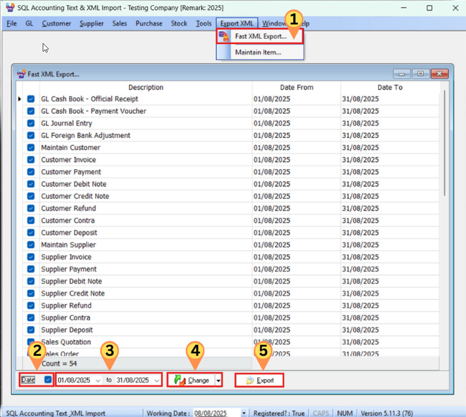
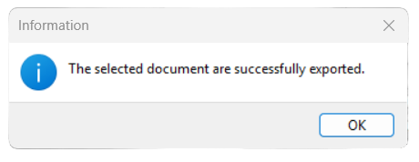
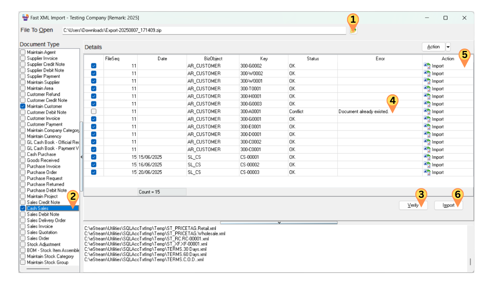
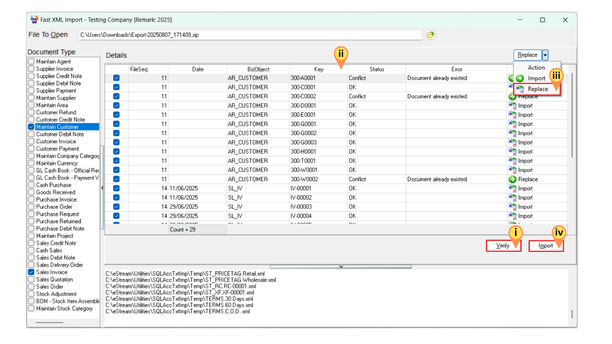

import '@src/css/sidebar.css';
import { YtLayout } from '@src/components/yt-layout';

It is an external program that allows you to import and export master files and transactions to SQL Account in XML format.

:::info[Download]
Click [here](https://download.sql.com.my/customer/Fairy/SQLAccTxtXMLImp-setup.exe) to download the import/export utility program.
:::

## Video Guide

<YtLayout
    videoId="V7eLIA7L0qY"
/>

:::info
For more details & updates, please click [here](https://wiki.sql.com.my/wiki/SQL_XML_Import).
:::

## Export

1. Log on to the company from which you want to export data. (Make sure to have only a single instance of SQL Account open.)
2. Launch `SQL Financial Accounting Text & XML Import Module V5`

   

   1. Click on `Fast XML Export` on the toolbar
   2. Check the Date option
   3. Select the Date Period
   4. Click Change
   5. Click Export > Select the location where you want to export > Enter the Export File Name > Press Save > Export the Data
   6. Done

   

## Import

### Import Sequence

The import sequence must always be followed to ensure data integrity:

1. **Master Data** (Import first)
2. **Transactions** (Import after master data; the system will process automatically)

:::warning[Avoid Duplicate Stock Movements]

- Importing both Sales DO and Sales IV will cause double stock deduction

- Importing both Purchase GRN and Purchase IV will cause double stock addition

:::

### Examples

**Master Data** (Import first):

- Maintain Customer, Supplier, Stock Item, Stock Group
- Maintain Agent, Area, Project, Currency
- And more...

**Transactions** (Import after master data):

- Sales documents (DN, IV, DO, SO, QT, CN)
- Cash Sales, Customer IV/DN/Payment/CN/Refund
- Customer Contra, Supplier Contra, GL Official Receipt
- And more...

### Import Steps

1. Click `Tools` > `Fast XML Import`.

   

   1. Click the Folder Icon button to select the ZIP file containing the XML file.
   2. Select the document type to import.
   3. Click the `Verify` button to check for conflicts.
   4. Any errors or conflicts will be displayed here.
   5. In this section, you can change the option to either `Import` or `Replace`.
   6. Click the `Import` button.

   :::info[Import vs Replace]

   | Description | Properties |
   |-------------|------------|
   | Import | Insert new record into SQL Account |
   | Replace | Edit and update existing record |
   | Action Button | Allow user to update the action in batch |

   :::

## Common Issues and Solutions

### Replacing Existing Transactions

If a transaction already exists in the target database, you can choose to replace it by following these steps:

   

   1. Click `Verify`
   2. To select a range of transactions: Click the first transaction, hold `Shift`, and click the last transaction.
      To select specific individual transactions: Hold `Ctrl` and click each desired transaction.
   3. Click the dropdown arrow beside `Action` > Select `Replace`. The Action column will now show `Replace`.
   4. Click the `Import` button

### Error: Invalid Callee

**Solution:**

1. Open SQL Account and log on to the old database
2. Click `Tools` > `Options` > `General` > `Register`
3. Exit SQL Account and log on again
4. Retry your import/export

### Error: Field Currency Rate

This error occurs when replacing an invoice (IV) that has already been knocked off. You will need to resolve this manually.

### Error: Attempt to Import EX 15 Failed

If you encounter this error message:
`Access violation at address 0043B65F in module 'Import.exe'. Read of address 0000000.`

**Solution:**
Check if you have any DIY Fields in the source database and ensure the destination database has the same DIY Fields configured.
