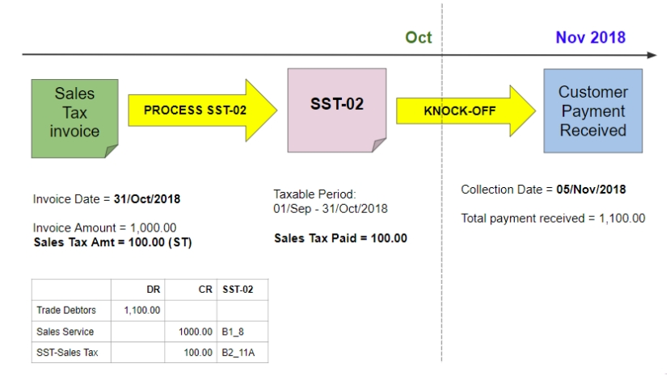
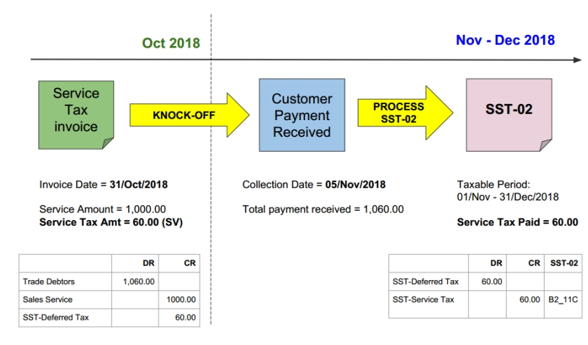
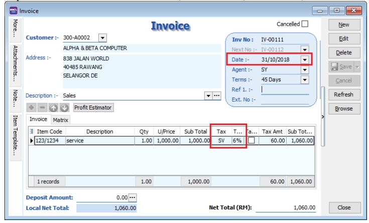
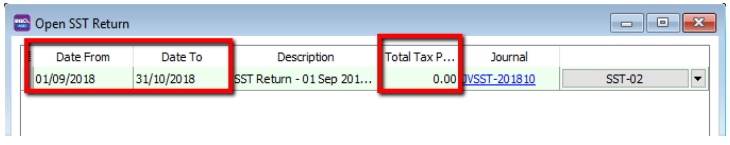
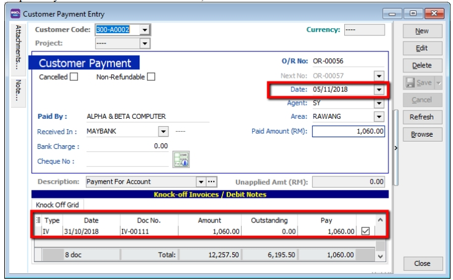
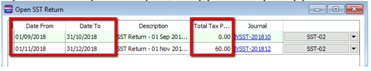
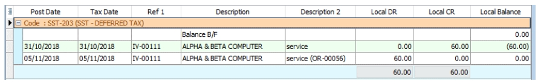
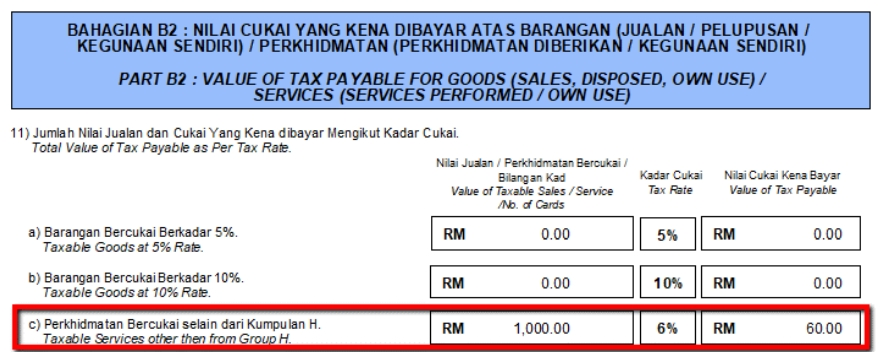

## Posting

1. Sales Tax (Accrual Basis)

   

2. Service Tax (Payment Basis)

   In SST 2.0, the service tax is due and payable when payment is received for any taxable service.

      

   1. Issue sales invoice with service tax 6%, date 31/10/2018, Amount RM 1,000.00 & Tax Amount RM 60.00.

      

   2. Process SST Return from 01/09/2018 to 31/10/2018. Total Tax Payable is RM 0. Due to no payment is receive for the invoices issued.

      

   3. Payment is received on 05/11/2018, knocked-off on IV-00111.

      

   4. Process second cycle of taxable period, the tax payable will be capture as payment is received.

      

   5. SQL Account will auto Credit to SST- Deferred Tax account during invoice issue but no payment. Once payment is received, a Debit will be auto reversed at SST-Deferred Tax Account.

      

   6. the taxable amount of RM 1,000.00 and Tax Amount of RM 60.00 will also capture in SST-02 Part B2, number 11c.

      
