## Tax code and SST-02 mapping

SST tax code structures and mapping to SST-02:

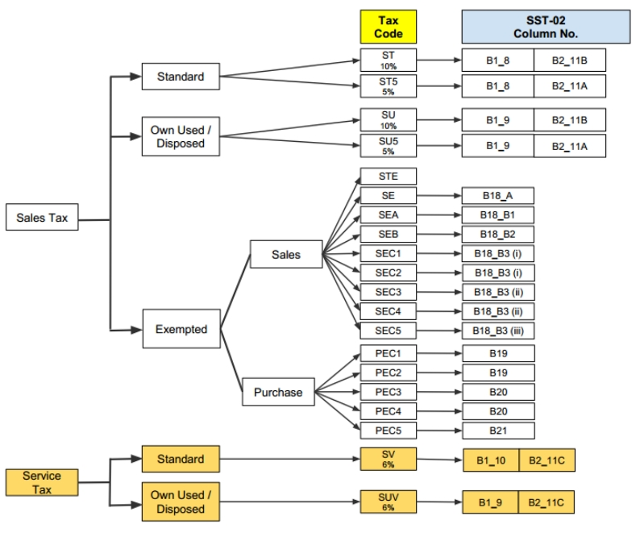

## Example of SST-02

:::info
SQL Account process SST02 step : [Youtube](https://youtu.be/laLjRJWh2j8)
:::

1. Process SST Return from SST | New SST Return

   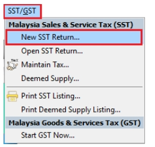

2. Enter your taxable period

3. Key in declaration, this declaration will appear in SST02 form part F, this is required to key in 1 time only, in the following return will automatic show out.

4. click on Process

   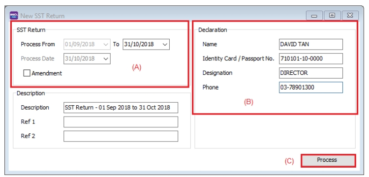

5. click on SST-02

   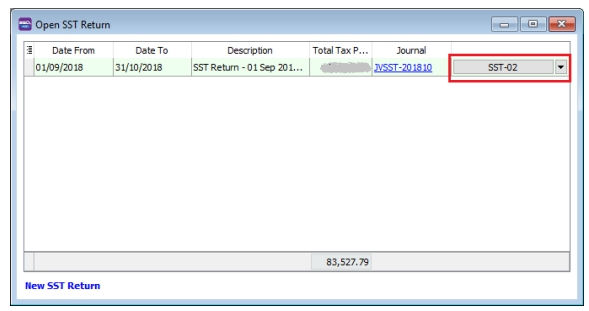

   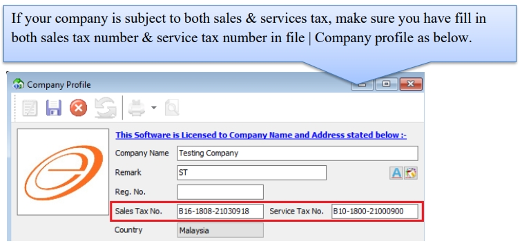

   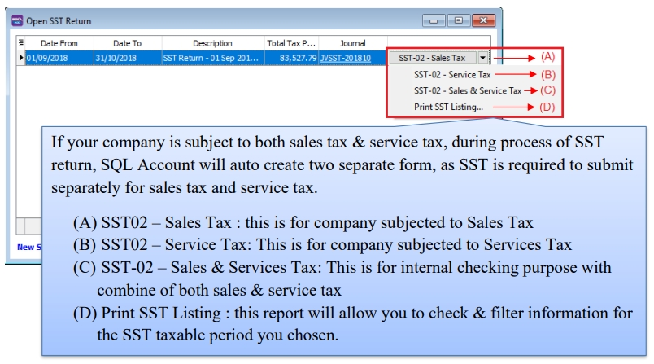

:::info
Understand SST02 27 Column : [Video](https://www.facebook.com/SQLEstream/videos/2216806511940307/)
:::

---

1. Part A

   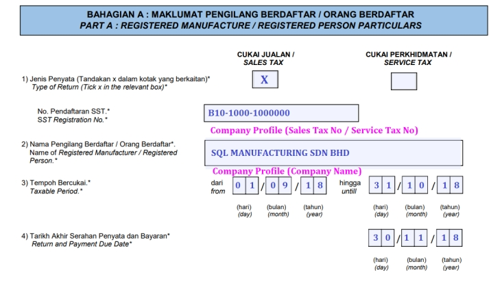

2. Part B1

   

3. Part B2

   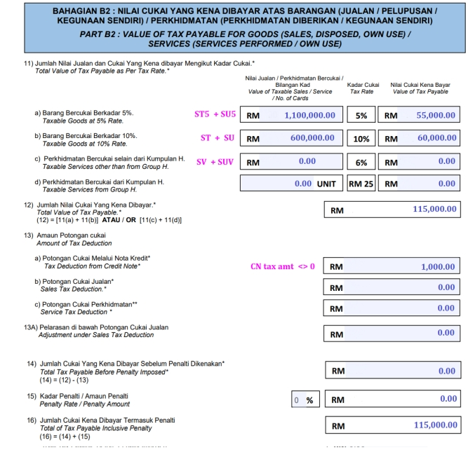

4. Part C

   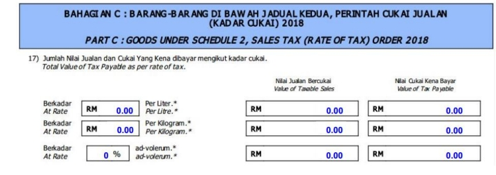

5. Part D

   

6. Part E

   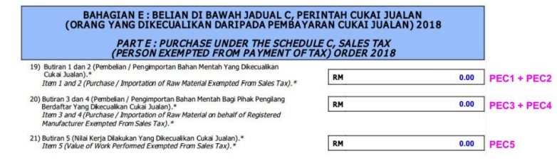

7. Part F

   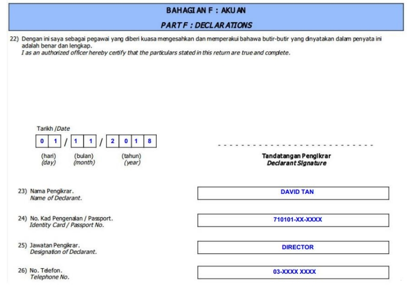

8. Part G

   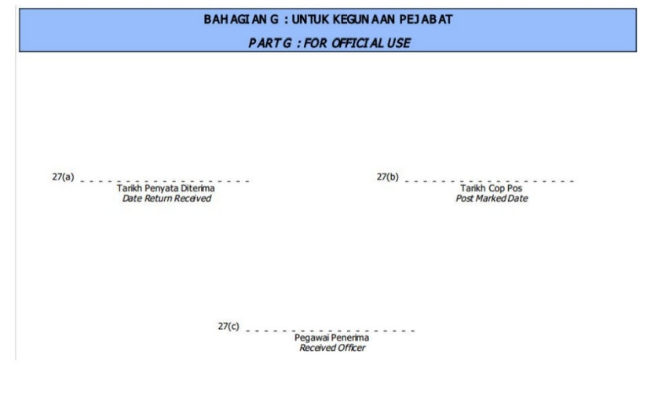
