## Sales Tax Legislation

### Act

   1. Sales Tax 2018

### Regulations

   1. Sales Tax Regulations 2018

   2. Sales Tax (Customs Ruling) Regulations 2018

   3. Sales Tax (Determination of Sale Value of Taxable Goods) Regulations 2018

   4. Sales Tax (Compounding of Offences) Regulations 2018

### Order

   1. Appointment of Date of Coming into Operation

   2. Sales Tax (Person Exempted From Payment Of Tax) Order 2018

   3. Sales Tax (Imposition Of Tax In Respect Of Designated Area) Order 2018

   4. Sales Tax (Imposition Of Tax In Respect Of Special Area) Order 2018

   5. Sales Tax (Exemption From Registration) Order 2018

   6. Sales Tax (Goods Exempted From Tax) Order 2018

   7. Sales Tax (Rates Of Tax) Order 2018

   8. Sales Tax (Total Sale Value Of Taxable Goods) Orders 2018

## Scope and Charge

Sales Tax is a tax charged and levied -

- on taxable goods manufactured in Malaysia by a taxable person and sold, used or disposed by him;

- on taxable goods imported into Malaysia

**Definition of:**

◆ Goods means all kind of movable property.

◆ Taxable goods means goods of a class or kind not exempted from sales tax; i.e goods which are not listed in Sales Tax (Goods Exempted From Sales Tax) Order 2018).

◆ Sales includes barter, disposal of goods with a right of purchase or on terms providing that the seller retains an interest in the goods, and delivery of goods under any conditions as to future payment.

Sales Tax is not charged on-

- Goods listed under Sales Tax (Goods Exempted From Sales Tax) Order 2018;

- Certain manufacturing activities are exempted by Minister of Finance through Sales Tax (Exemption from Registration) Order 2018.

:::note
Malaysia excludes designated area (DA) and special area (SA).
:::

## Sales Tax Mechanism

Overview of Sales Tax flow chart:-

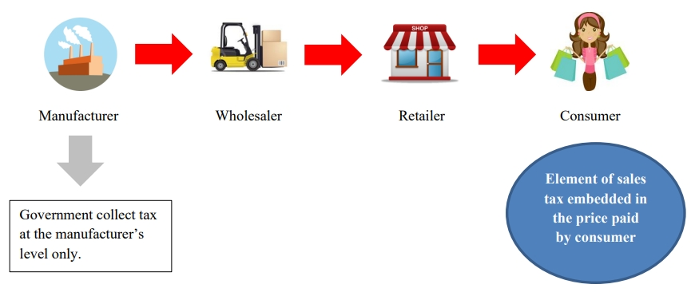

## Meaning of Manufacture

Manufacture defines as **a conversion of materials** by manual or mechanical means into a new product by changing the following:

1. size

2. shape

3. composition

4. nature

5. quality

of such materials and includes the assembly of parts into a piece of machinery or other products.

However, manufacture does not include the installation of machinery or equipment for the purpose of construction.

In relation to petroleum, any process of:-

1. separation

2. purification

3. conversion

4. refining

5. Blending

For goods other than petroleum

1. By conversion

   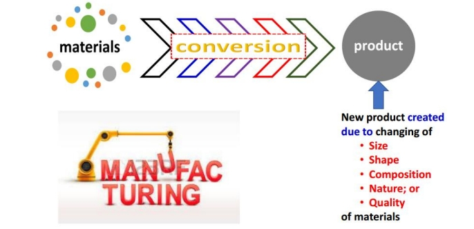

2. The assembly

   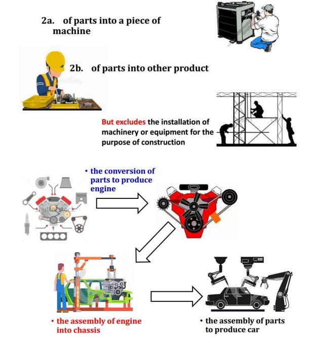

3. For petroleum

   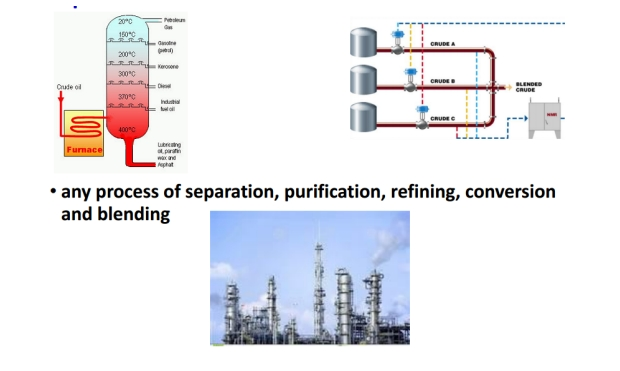

## Meaning of Taxable Person

Taxable person is a person who manufacturing taxable goods and is:

1. Liable to be registered

   - Reached sales threshold

      - Manufacturer - RM 500,000.00

      - Sub-contractor - RM 500,000.00

2. Registered under Sales Tax Legislation

   - Mandatorily registered

   - Voluntarily registered

## Sales Tax Registration

### Liability To Register

Taxable goods manufacturers are required / liable to be registered when SALES VALUE OF TAXABLE GOODS has exceeded RM 500,000 for 12 months period.

Manufacturers who carry out sub-contract work on taxable goods where the VALUE of work performed exceeds RM500,000 for 12 months period.

Taxable goods belong to:

- Registered manufacturer;

- Non-registered manufacturer

- Manufacturer in special area (FIZ and LMW)

:::note
Registered Person will known as Registered Manufacturers.
:::

### Voluntary Registration

Conditions are:

- Sales value of taxable goods below threshold (ie. < RM 500,000).
- Person who are exempted from registration

### Determination of Turnover

Manufacturers should calculate the sales value of taxable goods for a period of 12 months using the following methods:

1. Historical Method

    The total value of taxable goods in that month and the 11 months immediately preceding the month;

2. Future Method

    The total value of taxable goods in that month and the 11 months immediately succeeding the month.

### Exemption from Registration

- Manufacturer of non taxable goods. (Not eligible for voluntary registration).

- Manufacturer below threshold (ie. < RM 500,000).

- Sub-contractor manufacturer below threshold.

- Manufacturing activities that have been exempted from registration. E.g :

  - Tailoring

  - Installation incorporation of goods into building

### Transitional Registration

   Manufacturer who is liable to be registered is required to register before 1 September 2018. Registration commencement date will be on 1 September 2018.

   1. Automatic Registration

      - Manufacturers who are GST Registered Persons which have been identified and fulfilled the required criteria will be registered automatically as Registered Manufacturer under Sales Tax.

      - Registered Manufacturer need to charge tax beginning 1 September 2018.

   2. Person Not Registered Automatically

      - GST registered person who fulfilled the required criteria to be registered but were not registered by 1 September 2018 need to apply for registration within 30 days from the commencement date.

## Taxable vs Exempted Goods

### Taxable Goods

Taxable goods means goods of a class or kind of **not exempted** from sales tax.

In another words, goods which are not listed in **Sales Tax (Goods Exempted From Sales Tax) Order 2018.**

Example of taxable goods are:

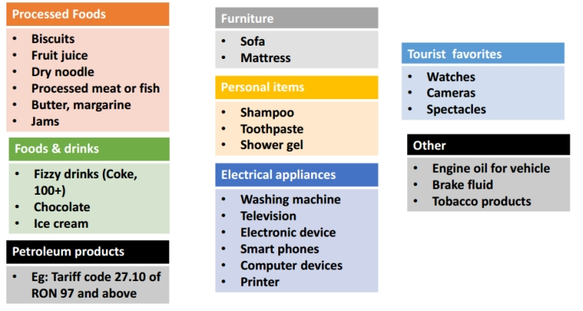

It is chargeable with a tax rate of

- 10% - standard sales tax rate

- 5% - reduced sales tax rate

  - First Schedule in the Sales Tax (Rate of Tax) Order 2018

- Specific rate - for petroleum product (eg. RM0.30 per litre)

  - Second Schedule in the Sales Tax (Rate of Tax) Order 2018

How to determine the rate of sales tax for goods?

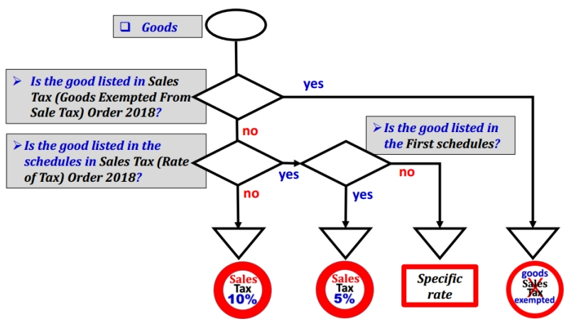

### Exempted Goods

   **Exempted goods** means goods of a class or kind of exempted from sales tax which are listed in **Sales Tax (Goods Exempted From Sales Tax) Order 2018**.

   Example of exempted goods are:

   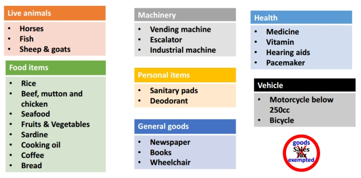

## Value of Taxable Goods

Refer to **Sales Tax (Rules of Valuation) Regulation 2018**, value of taxable goods that:

- sold by taxable person

- manufactured and used by the manufacturer for other purpose than as materials in manufacturing; or

- disposed by manufacturer.

For goods belongs to another manufacturer is known as sub-contract work.

- Sale value of the goods = Amount of the work performed and charged by **sub-contractor**.

The sale value of the goods shall be determined on the basis of the **transactions value of the goods** as the primary basis of valuation.

Transaction value of the goods,

- The **actual price** the goods are sold, without any conditions or restrictions imposed to purchaser.

- Purchaser is not required to give parts of proceed on subsequent sale to the manufacturer.

- Purchaser and manufacturer are not related or if related the relationship did not influence the price.

## Responsibility of Registered Manufacturer

   

## Exemption and Facilities

### Goods Exemption from Sales Tax

**Goods** refer to Sales Tax (Goods Exempted From Sales Tax) Order 2018.

- E.g. live animals, unprocessed food, vegetables, medicines, machinery, chemicals, etc.

### Person Exempted from Sales Tax

Person refer to Sales Tax (Person Exempted From Sales Tax) Order 2018.

- Schedule A: Class of person, e.g. Ruler of States, Federal or State Government Department, Local Authority, Inland Clearance Depot, Duty Free Shop.

- Schedule B: Manufacturer of specific non-taxable goods, e.g. any manufacturer of

    1. Controlled goods under Control of Supplies Act 1961

    2. Pharmaceuticals products

    3. Solely manufacture milk products

    4. Solely manufacture of exempted goods for export to import/purchase raw materials, components and packaging materials.

       - Schedule C: Registered Manufacturer, exemption of tax on the acquisition of raw materials, components, packaging to be used in manufacturing of taxable goods (previously known as CJ5, CJ5A, CJ5B).

### Field Exempted from Sales Tax

   Manufacturing activities exempted from registration regardless of turnover.

- E.g. tailor, jeweller, optician, engraving, vanishing table top, etc.

## Special Rules

### Treatment in Designated Area (DA)

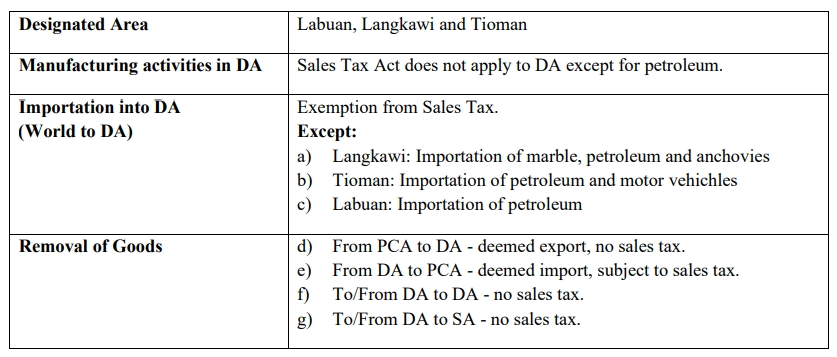

:::note
SA = Special Area, e.g. Free Zone (FZ), Licensed Warehouse, Licensed Manufacturing Warehouse (LMW) and Joint Development Area (JDA).

PCA = Principal Customs Area
:::

### Treatment in Special Area (SA)

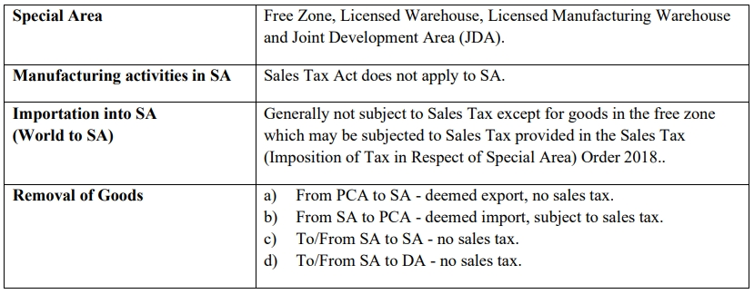

## Accounting of Tax

### Invoices

Issuance of Invoice:

- Mandatory for registered manufacturer who sell taxable goods.

- Hard copy or electronically.

- Containing prescribed particulars.

- Bahasa Melayu or English.

   **Prescribed particulars** are:

   1. The invoice serial number;

   2. The date of the invoice;

   3. The name, address and identification number of the registered manufacturer (Sales Tax Number);

   4. The name and address of the person to whom the taxable goods is sold;

   5. Description and quantity of the goods;

   6. Any discount offered;

   7. For each description, distinguish the type of goods, quantity and amount payable excluding tax;

   8. The total amount payable excluding tax, the rate of tax and the total tax chargeable shown as a separate amount or total amount payable inclusive of total of tax chargeable;

   9. Any amount expressed in a currency other than ringgit shall also be expressed in ringgit at the selling rate of exchange prevailing in Malaysia at the time of sale.

## Credit Note & Debit Note

A credit note is allowed to issue by registered manufacturer under the situation where the goods are returned by the purchaser due to :

- Wrong quantity, poor or defective quality or uncontracted goods, provided that the goods have not been subsequently sold or disposed of by the purchaser.

- Discount given in respect of goods sold and which are freely available to all who are willing to conduct business.

A debit note is allowed to issue by registered manufacturer under the situation where there is an additional of sales tax to be paid for any price adjustment.

Both credit note and debit note shall contains the following particulars:

- The word “credit note” or “debit note” in a prominent place.

- The serial number and date of issue.

- The name, address and Sales Tax identification number of the supplier.

- The name and address of the customer.

- The **reason** for issuance.

- Description which identifies the description of goods, the quantity and amount for which CN or DN is given.

- The total amount excluding tax.

- The rate and amount of tax.

- The number and date of the original invoice.

If changes related to amount of tax payable:

- Adjustment in the return for the taxable period in which the credit note or debit note is issued.

- Adjustment in the return for the last taxable for person who has ceased to be a taxable person.

If deduction for taxable period exceeds the amount of sales tax payable, the balance is to be carried forward to the next taxable period. Refund is not allowed on balance carried forward if taxable person has ceased to carry on business.

## Accounting Basis and Taxable Period

### Accounting Basis

Sales Tax is based on accrual basis and it is required to be accounted at the time when the goods are sold, disposed or first used.

### Taxable Period

Regular interval period where a taxable person accounts and remits sales tax to Government. Default taxable period for the registered manufacturer to be **bimonthly (2 months)** period.

Registered manufacturer may apply for taxable period other than the default taxable period.

In summary,

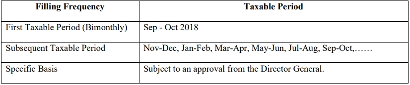

## Furnishing Sales Tax (SST-02) Return & Payment of Tax

Registered manufacturer has to declare SST return every 2 months according to the taxable period.

- Sales tax return has to be submitted not later than the last day of the following month after the taxable period ended.

- Sales tax return has to be submitted regardless of whether there is any tax to be paid or not.

- Sales tax return has to be submitted electronically or by cheque, bank draft and posted to SST Processing Centre.

Payment for tax due and payable declared in SST-02. Failure to submit return is an offence.

## Miscellaneous (Remission, Refund of Overpaid Tax, Drawback. Penalty)

### Remission

Minister may remit the whole or any part of sale tax due and payable.

Director General may remit the whole or any part of:

- Surcharge

- Penalty

- Fee

- Other money payable under the Act

### Refund of overpaid tax

Any person who has overpaid or erroneously paid of sales tax, penalty, surcharge, fee; or If any person who has paid sales tax and then exemption or remission of sales tax has granted by Minister.

Claim to be made in form JKDM No. 2 within one year from the date of over payment or erroneously payment; or entitlement of refund.

### Drawback

Director General may allow drawback of the full amount of sales tax paid by a person in respect of taxable goods which are subsequently exported. This is not applicable to petroleum.

Conditions:

- Goods must be exported within six months from Sales Tax paid on import or date of invoice issued.

- Application made within three months from the date of export in JKDM Form no. 2

- Other conditions with regards to documentation and declaration.

Submission to sales tax office at applicants’ place of business.

Illustration:

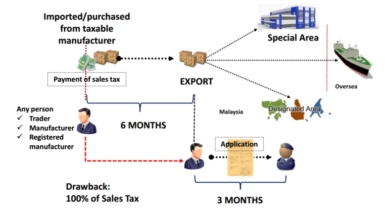

### Penalty for late payment of tax

Late payment penalty on the amount of sales tax not paid as shown in the table below.

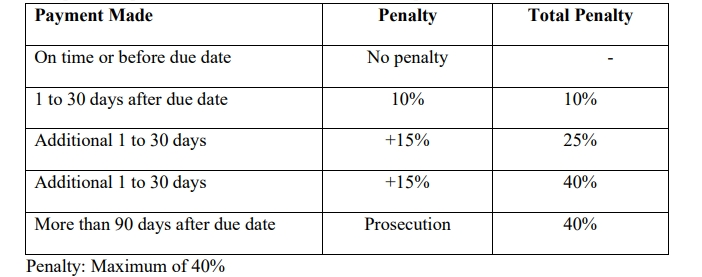

### Other penalty for offences

Evasion of sales tax:

- 1st offence - either or both

  - Fine

    - Minimum 10x Sales Tax Amount

    - Maximum 20x Sales Tax Amount

  - Imprisonment not exceeding 5 years

- 2nd offence - either or both

  - Fine

    - Minimum 20x Sales Tax Amount

    - Maximum 40x Sales Tax Amount

  - Imprisonment not exceeding 7 years
