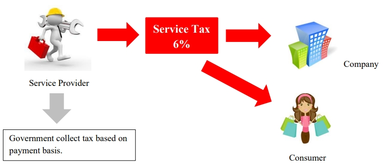
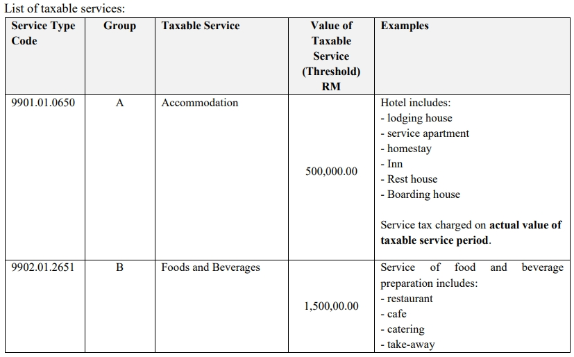
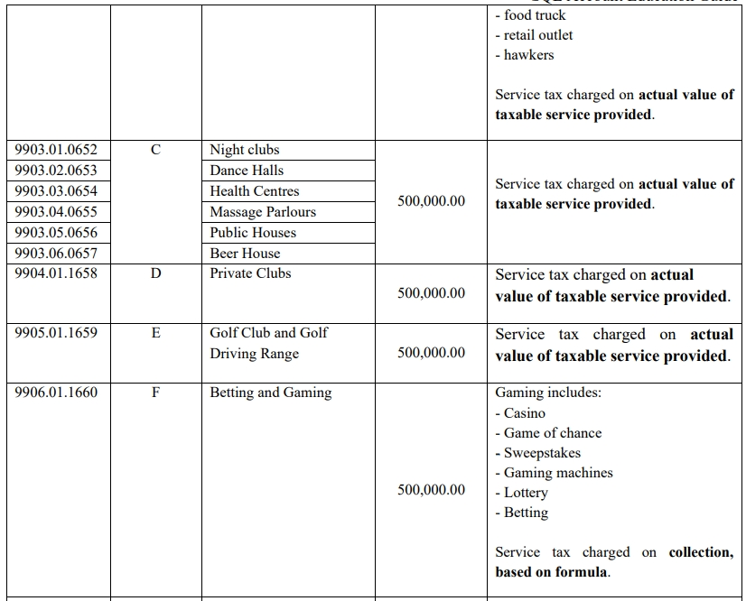
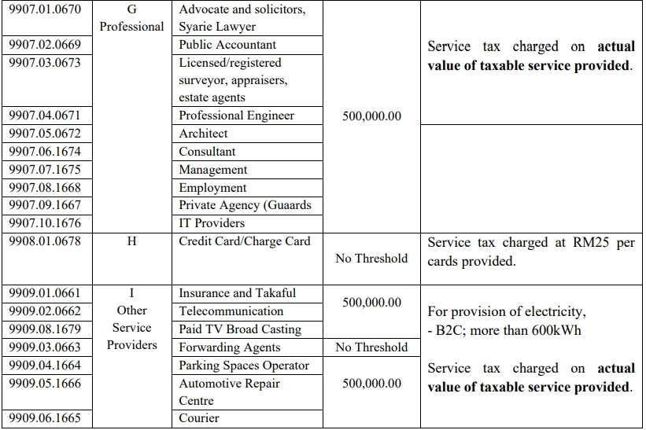
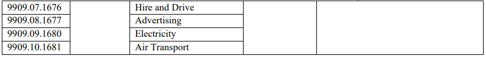
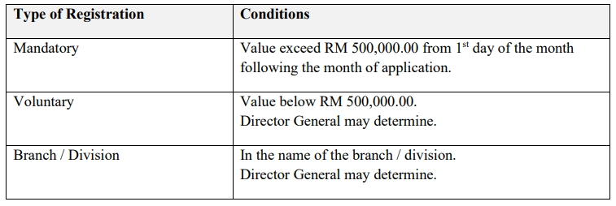
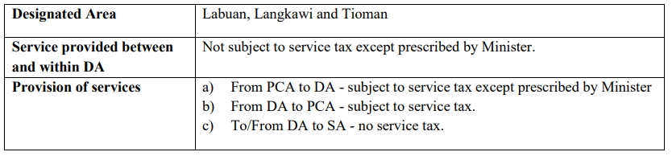
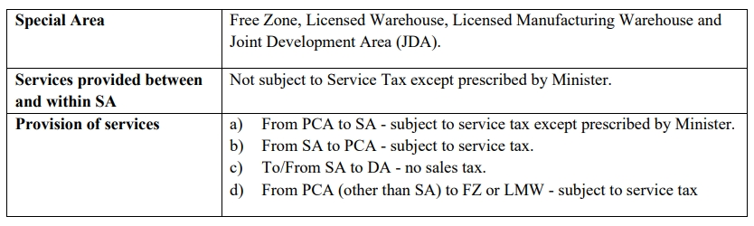
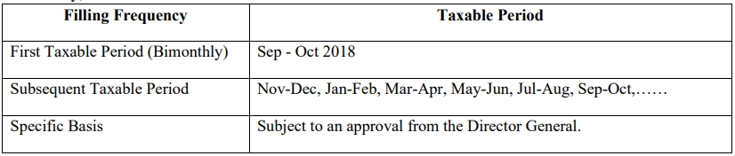

## Service Tax Legislation

### Act

   1. Service Tax 2018

### Regulations

   1. Service Tax Regulations 2018

   2. Service Tax (Customs Ruling) Regulatons 2018

   3. Service Tax (Compounding of Offences) Regulations 2018

### Order

   1. Appointment of Date of Coming into Operation

   2. Appointment of Effective Date for Charging and Levying of Service Tax

   3. Service Tax (Imposition Of Tax For Taxable Service in Respect of Designated Areas and Special Areas) Order 2018

   4. Service Tax (Rates Of Tax) Order 2018

## Scope and Charge

Service tax is charged on:

- any provision of taxable services;

- made in the course or furtherance of any business;

- by a taxable person; and

- In Malaysia

Service tax is not chargeable on:

- Imported services

- Exported services

## Service Tax Mechanism

Overview of Service Tax flow chart:-

## Meaning of Taxable Person

A service provider who is liable to be registered or registered under the Service Tax Act 2018. The service provider provides taxable services in the course or furtherance of business in Malaysia.

## Taxable Service

Value of taxable service provided by a service provider for a period of 12 months that exceed a threshold of RM 500,000 is liable to be registered. Except the following taxable service group:

- Food and Beverages (exceed RM 1,500,000)

- Credit card / charge card (no threshold)

## Rate of Services

All taxable services are fixed charged at a rate of 6%, except the provision of credit card/charge card services are charged at a specific rate of tax of RM25 is imposed upo issuance of principal or supplementary card and every subsequent year or part thereof.

## Service Tax Registration

### Types of Registration list

### Determination of Taxable Turnover

Service provider should calculate the value of taxable services provided for a period of 12 months using the following method:

1. Historical Method

    The total value of taxable supplies in that month and the 11 months immediately preceding the month.

2. Future Method

    The total value of taxable supplies in that month and the 11 months immediately succeeding the month.

### Transitional Registration

   Any person who liable to register are required to register before 1 September 2018 and registration commencement date will be on 1 September 2018.

   1. Automatic Registration

      - Service provider who is a GST Registrant which have been identified and fulfilled the required criteria will be registered automatically as a registered person.

   2. Person Not Registered Automatically

      - Service provider who is a GST Registered person that fulfilled the required criteria to be registered but was not registered by 1 September 2018 need to apply for registration within 30 days from the commencement date.

## Contra System Facility

Registered person is allowed to deduct service tax in his return for any cancellation and termination of services or any other reasons such as reducing premiums or discounts.

## Special rules for specific areas

### Treatment in Designated Area (DA)

:::note

1. SA = Special Area, e.g. Free Zone (FZ), Licensed Warehouse, Licensed Manufacturing Warehouse (LMW) and Joint Development Area (JDA).

2. PCA = Principal Customs Area

:::

### Treatment in Special Area (SA)

## Accounting

### Issuance of Invoice

- Mandatory for registered person who provides any taxable services..

- Hard copy or electronically.

- Containing prescribed particulars.

- Bahasa Melayu or English.

    **Prescribed particulars** are:

    1. The invoice serial number;

    2. The date of the invoice;

    3. The name, address and identification number of the registered person (Service Tax Number);

    4. The name and address of the person to whom the taxable service is provided;

    5. Description of service provided;

    6. Any discount offered;

    7. For each description, distinguish the type of service and amount payable excluding tax;

    8. The total amount payable excluding tax, the rate of tax and the total tax chargeable shown as a separate amount or total amount payable inclusive of total of tax chargeable;

    9. Any amount expressed in a currency other than ringgit shall also be expressed in ringgit at the selling rate of exchange prevailing in Malaysia at the time of sale.

### Credit Note & Debit Note

   Both credit note and debit note are allowed to issue by registered person. It shall contained the prescribed particular and make an adjustment in his SST-02 return.

## Accounting Basis and Taxable Period

### Accounting Basis

Service Tax is based on payment basis and it is required to be accounted at the time when the payment has received. On the day following period of twelve months when any whole or part of the payment is not received from the date of the invoice for the taxable service provided.

### Taxable Period

Regular interval period where a taxable person accounts and remits service tax to Government. Default taxable period for the registered person to be bimonthly (2 months) period.

Registered person may apply for taxable period other than the default taxable period.

In summary,

## Furnishing Service Tax (SST-02) Return & Payment of Tax

Registered person has to declare service tax return every 2 months according to the taxable period.

- Service Tax return has to be submitted not later than the last day of the following month after the taxable period ended.

- Service Tax return has to be submitted regardless of whether there is any tax to be paid or not.

- Service Tax return has to be submitted electronically or by cheque, bank draft and posted to SST Processing Centre.

Payment for tax due and payable declared in SST-02. Failure to submit return is an offence.
