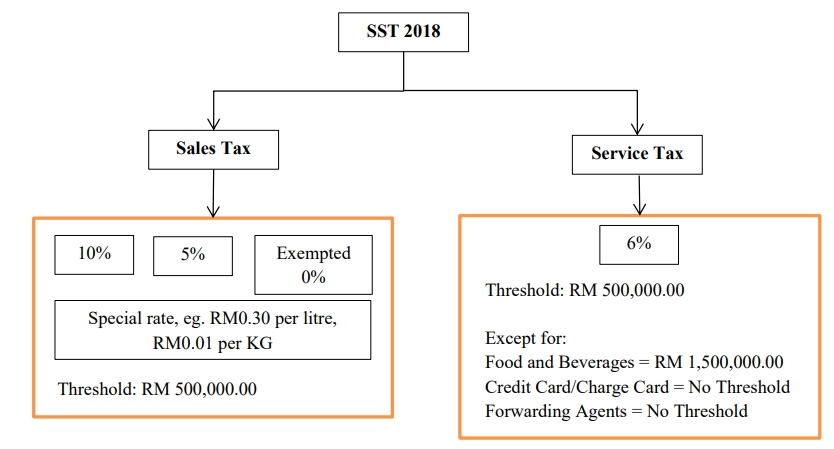

Introduced in September 2018, SST replaced the former 6% Goods and Services Tax (GST) system. SST comprises two parts: Sales tax and Service tax. Sales tax is a single-stage tax levied on all taxable goods manufactured in and imported into Malaysia; whereas Service tax is a single-stage tax charged on any taxable services provided in Malaysia by a registered person in conducting the business. Malaysia has a few special designated areas that are exempted from service tax, namely Langkawi Island, Tioman Island and Federal Territory of Labuan.

## Sales and Service Tax 2018 Model and Scope

Sales and Service Tax model are structured as below:

