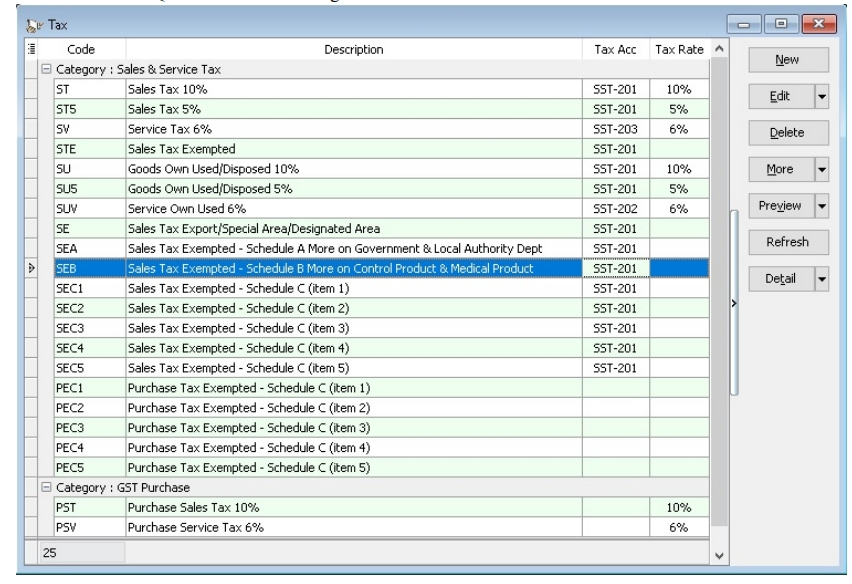

Access list of Tax Codes in SQL Account by browsing **Tools > Maintain Tax**.

### Default SST Account

|GL Account|Description|Explanation|
|---|---|---|
|SST-201|SST - SALES TAX| Account for sales tax. (Accrual basis)|
|SST-202|SST - SERVICE TAX| Account for service tax after payment. (Payment basis)|
|SST-203|SST - DEFERRED TAX| Account for pending payment for service tax.|
|SST-KASTAM|SST - PAYABLE (KASTAM)| Account for outstanding of tax payable to Kastam.|
