Whatsapp Scan feature enables users to manage transactions more efficiently by uploading invoices, bills, or receipts through WhatsApp. Images, documents, text and audio files are supported. Users can easily organize and attach these files to various document types within SQL Account.

## Pre-requisite

1. [Setup Default Customer and Supplier Account](#setup-default-customer-and-supplier-account)
2. [Setup User Mobile Number](#setup-user-mobile-number)
3. [Registration](#registration)

### Setup Default Customer and Supplier Account

:::info[INFO]
New documents with attached files will be automatically assigned to the default customer or supplier account.
:::

1. Go to **Menu Bar** > **Tools** > **Options...**.

    

2. In **Options**, go to **Customer** and choose customer **Default Account**.

    

3. In **Options**, go to **Supplier** and choose supplier **Default Account**.

    

### Setup User Mobile Number

1. Go to **Menu Bar** > **Tools** > **Maintain User...**.

    

2. Create **New** or select the user.

    

3. Enter mobile number registered with WhatsApp and click **Save**.

    

### Registration

1. Go to **Menu Bar** > ☁️ > **Whatsapp Scan**.

    

2. Click **Register** at the top right corner.

    

3. Select the user that request for register > Click **OK**.

    

4. Click **Copy Link to Clipboard** or **Share** and share URL to the user.

    

5. Wait for the user to register.

    

6. After the user received the link, the user is required to:

    1. Click the link.

        

    2. Send the pre-filled message with the mobile number registered.

        

    3. Whatsapp replied **You have successfully linked with Testing Company** indicates registration completed.

        

7. Dialog show **Registered Successful** indicates the user complete the registration.

    

## Usage

1. [Upload File to Whatsapp Scan](#upload-file-to-whatsapp-scan)
2. [Group Files (Optional)](#group-files-optional)
3. [Assign Doc Type and Doc Date to File](#assign-doc-type-and-doc-date-to-file)
4. [Attach File or Folder to New Invoice](#attach-file-or-folder-to-new-invoice)
5. [Attach Files or Folders to Multiple New Document](#attach-files-or-folders-to-multiple-new-document)
6. [Attach File(s) or Folder(s) to Existing Document](#attach-files-or-folders-to-existing-document)
7. [Import Text to Document](#import-text-to-document)
8. [Drag and Drop](#drag-and-drop)

### Upload File to Whatsapp Scan

1. **Snap** a photo or **Choose** the following file type to upload the file.

    

2. A ✅ emoji will be react on file if the upload is successful.

    

3. Click **Refresh** button to review the file uploaded.

    

### Group Files (Optional)

:::info[INFO]
Grouping related files allows them to be attached into a same document.
:::

1. To **Group**, select multiple files (Ctrl + Left Click) then either:

    1. Click **Folder** button on the panel.

        

    2. Right Click > **Group Files...**.

        

2. Click **Left** and **Right** button to preview files in group.

    

3. To **Ungroup**, Select grouped attachment then either:

    1. Click **Unfolder** button on the panel.

        

    2. Right Click > **Ungroup Files...**.

        

### Assign Doc Type and Doc Date to File

:::info[INFO]
Based on **Doc Type** and **Doc Date**, the following document type will be created using default customer or supplier account with the pre-selected date.
:::

1. Select the file > Click ▼ button > Choose **Doc Type**.

    

2. Select the file > Click ▼ button > Choose **Doc Date**.

    

### Attach File or Folder to New Invoice

1. Select file or folder > Right Click > **Create New Document**.

    

2. System will pop out a message to show how many document are created > Click **OK**.

    

3. Navigate to following **Doc Type** to review created document.

    

### Attach Files or Folders to Multiple New Document

1. Select multiple files or folders (Ctrl + Left Click) > Right Click > **Create New Document**.

    

2. System will pop out a message to show how many documents are created > Click **OK**.

    

3. Navigate to following **Doc Type** to review created documents.

    

### Attach File(s) or Folder(s) to Existing Document

1. Select file(s) or folder(s) > Right Click > **Attach to Existing Document**.

    

2. Select the document > Click **OK**.

    

3. System will navigate to the attached document, review the attached file(s) in the **Attachments**.

    

### Import Text to Document

:::info[INFO]
This feature only available in text style with correct format.
:::

1. Use the template below, copy and paste into WhatsApp, then insert the correct details:

    ```
    Code:
    DocDate:
    Description:
    Phone1:
    Address1:
    Address2:
    Address3:
    Address4:
    IDType:
    IDNo:
    TIN:

    ItemCode:
    Description:
    Description2:
    Qty:
    UnitPrice:
    Disc:
    Amount:
    ```

2. Below is a sample with the correct details filled in:

    ```
    Code:300-A0001
    DocDate:16/7/2025
    Description:Sales Invoice of A Home Furnishing and Service
    Phone1:03-34858657
    Address1:1,
    Address2:Jalan Setia Dagang AK U13/AK,
    Address3:Setia Alam, 40170,
    Address4:Shah Alam, Malaysia.
    IDType:0
    IDNo:961218-08-8092
    TIN:E1234567

    ItemCode:BOM-01/Black
    Description:Premium PU Leather Ultimate Gaming Chair
    Description2:Black
    Qty:5
    UnitPrice:700
    Disc:10
    Amount:3490
    ```

3. If there is more than one item, feel free to add another section under **ItemCode**, as shown below:

    ```
    Code:300-A0001
    DocDate:16/7/2025
    Description:Sales Invoice of A Home Furnishing and Service
    Phone1:03-34858657
    Address1:1,
    Address2:Jalan Setia Dagang AK U13/AK,
    Address3:Setia Alam, 40170,
    Address4:Shah Alam, Malaysia.
    IDType:0
    IDNo:961218-08-8092
    TIN:E1234567

    ItemCode:BOM-01/Black
    Description:Premium PU Leather Ultimate Gaming Chair
    Description2:Black
    Qty:5
    UnitPrice:700
    Disc:10
    Amount:3490

    ItemCode:BOM-02/Red
    Description:Red Premium PU Leather Ultimate Gaming Chair
    Description2:Furniture
    Qty:10
    UnitPrice:700
    Disc:0
    Amount:7000

    ItemCode:MF-Bolster
    Description:Microfiber Soft Bolster with 100% cotton fabric
    Description2:Bedding Accessories
    Qty:20
    UnitPrice:199
    Disc:5
    Amount:3975
    ```

4. You may also remove any unused labels and keep only the ones you need, as shown below:

    ```
    Code:300-A0001
    DocDate:16/7/2025
    Description:Sales Invoice of A Home Furnishing and Service
    Address1:1,
    Address2:Jalan Setia Dagang AK U13/AK,
    Address3:Setia Alam, 40170,
    Address4:Shah Alam, Malaysia.

    ItemCode:BOM-01/Black
    Description:Premium PU Leather Ultimate Gaming Chair
    Description2:Black
    Qty:5
    UnitPrice:700
    Disc:10
    Amount:3490

    ItemCode:BOM-02/Red
    Description:Red Premium PU Leather Ultimate Gaming Chair
    Qty:10
    UnitPrice:700
    Amount:7000

    ItemCode:MF-Bolster
    Qty:20
    Disc:5
    ```

5. Send the text in WhatsApp.

    

6. Select file(s) > Assign **Doc Type** > Right Click > **Import Text To Document**.

    

7. System will pop out a message to show how many documents is created > Click **OK**.

    

8. The following details will be automatically filled in to the document.

    

### Drag and Drop

1. Select the invoice > Click **Edit**.

    

2. Pin the **Attachments** panel.

    

3. Go to **Menu Bar** > ☁️ > **Whatsapp Scan**.

    

4. Go to **Menu Bar** > **Window** > **Tile Vertical**.

    

5. **Drag** the selected file(s) from Whatsapp Scan and **Drop** it on the **Attachments** panel.

    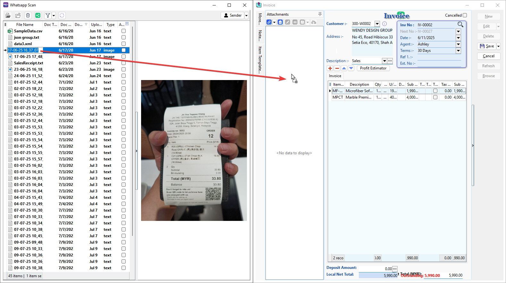

6. Click **Save**.

    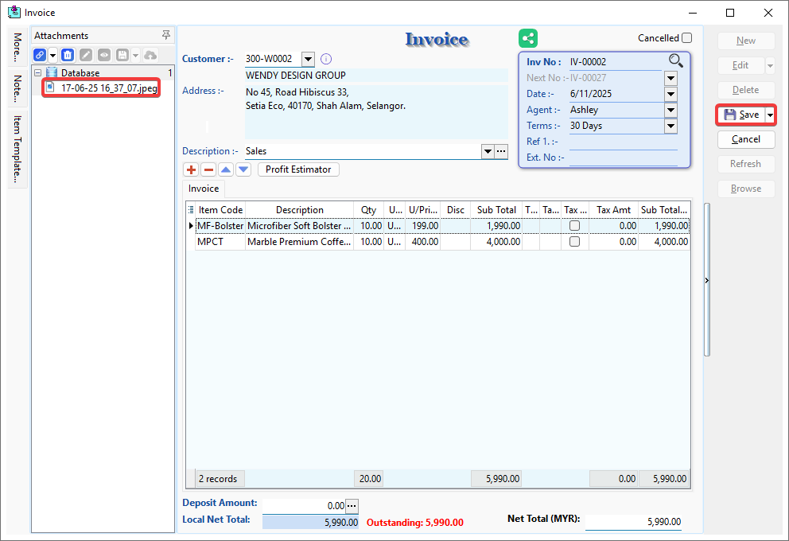

## Additional Information

1. [Batch Edit Doc Type and Doc Date](#batch-edit-doc-type-and-doc-date)
2. [Check Attached File or Folder](#check-attached-file-or-folder)
3. [Share File](#share-file)

### Batch Edit Doc Type and Doc Date

1. Select multiple files or folders (Ctrl + Left Click) > Right Click > **Batch Edit Value**.

    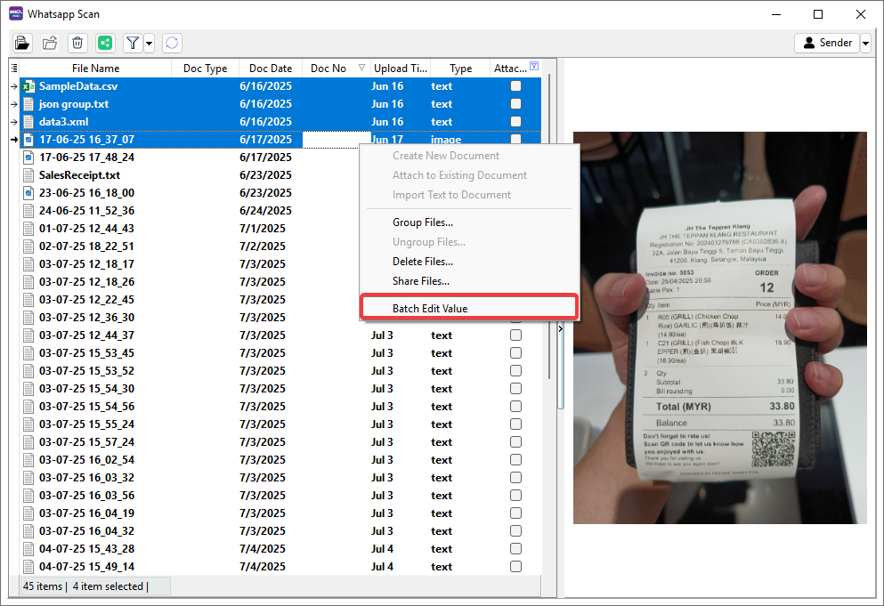

2. Select the value you want to change > **Tick** the checkbox to allow the changes to be applied.

    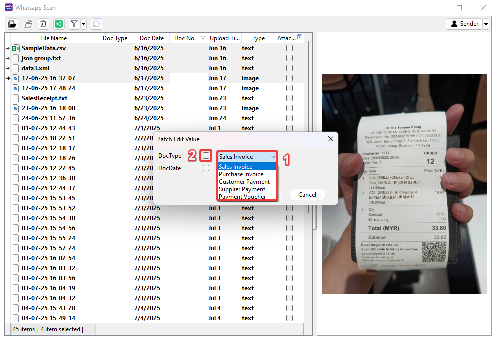

3. Make sure all the values you want to change are ticked in the checkboxes > Click **OK**.

    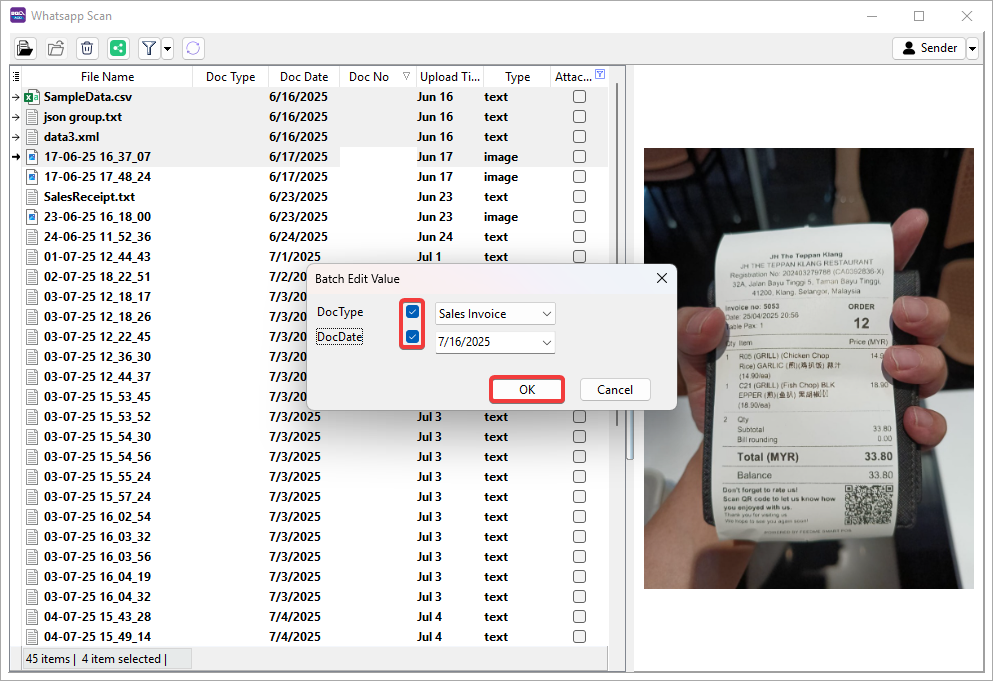

4. System will pop out a message to show how many records will change > Click **OK**.

    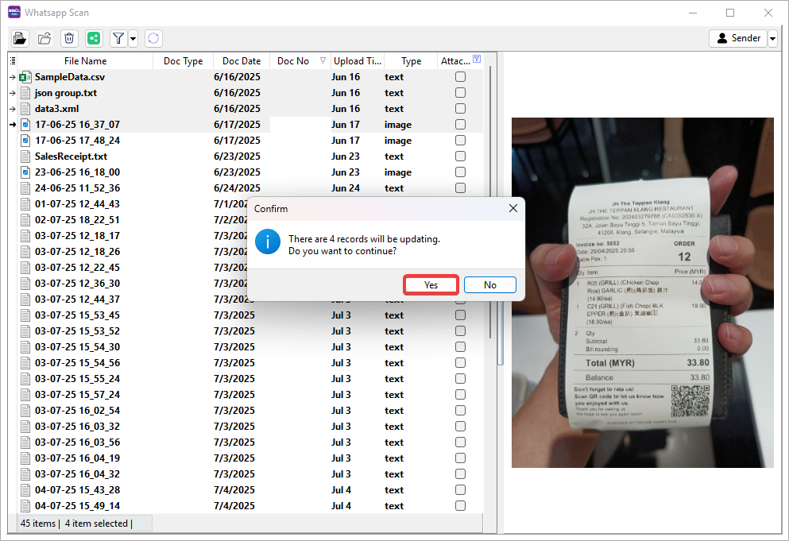

5. Click **OK** to continue.

    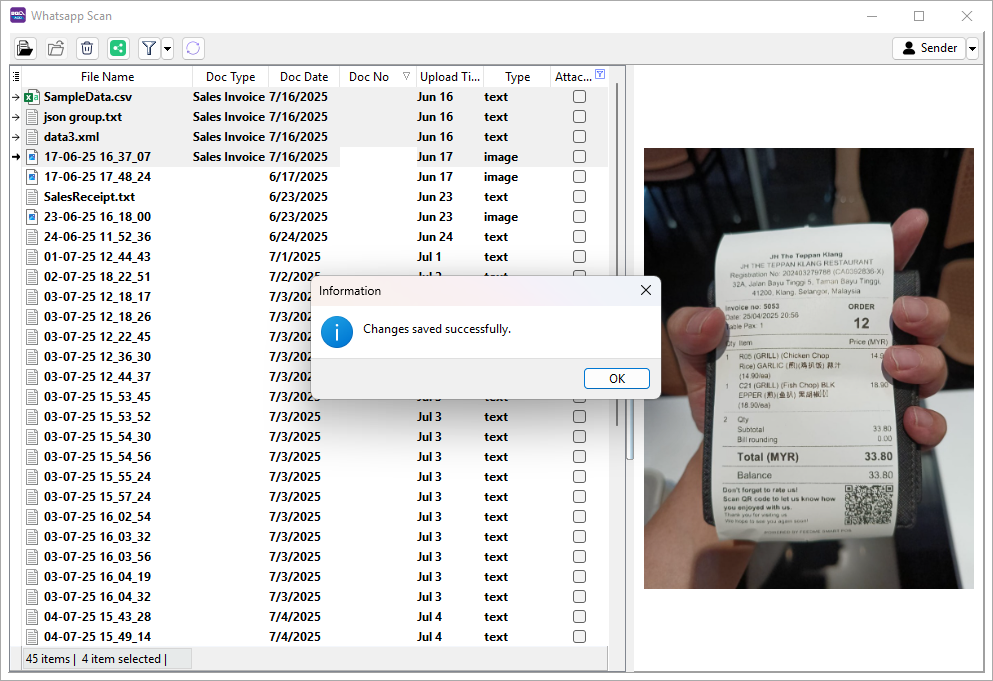

6. The following values for the selected records will be changed.

    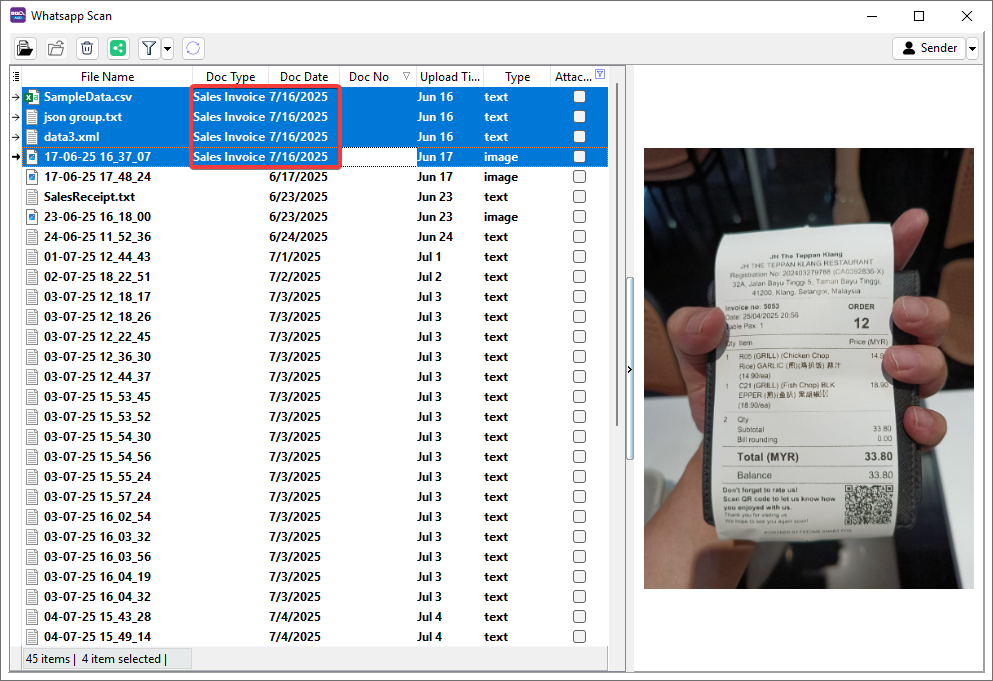

### Check Attached File or Folder

1. Turn on or off in **Filter** button based on your needs.

    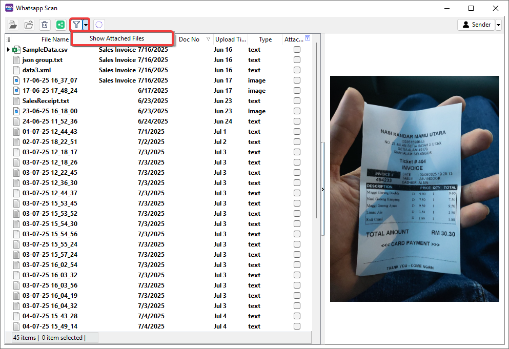

2. Attached file or folder will be ticked in the checkbox, and the attached Document ID will be displayed under **Doc No**.

    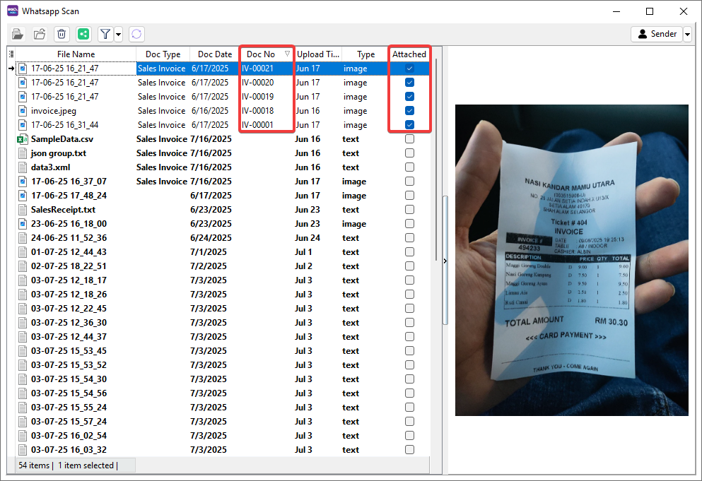

### Share File

1. Select file(s) or folder(s) > Click **Share** button to share the file to other user.

    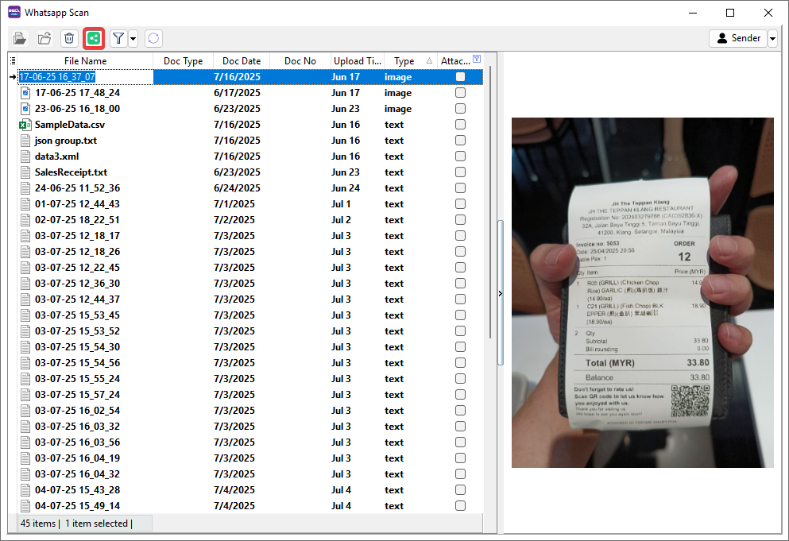

2. Choose the following channel to share the file.

    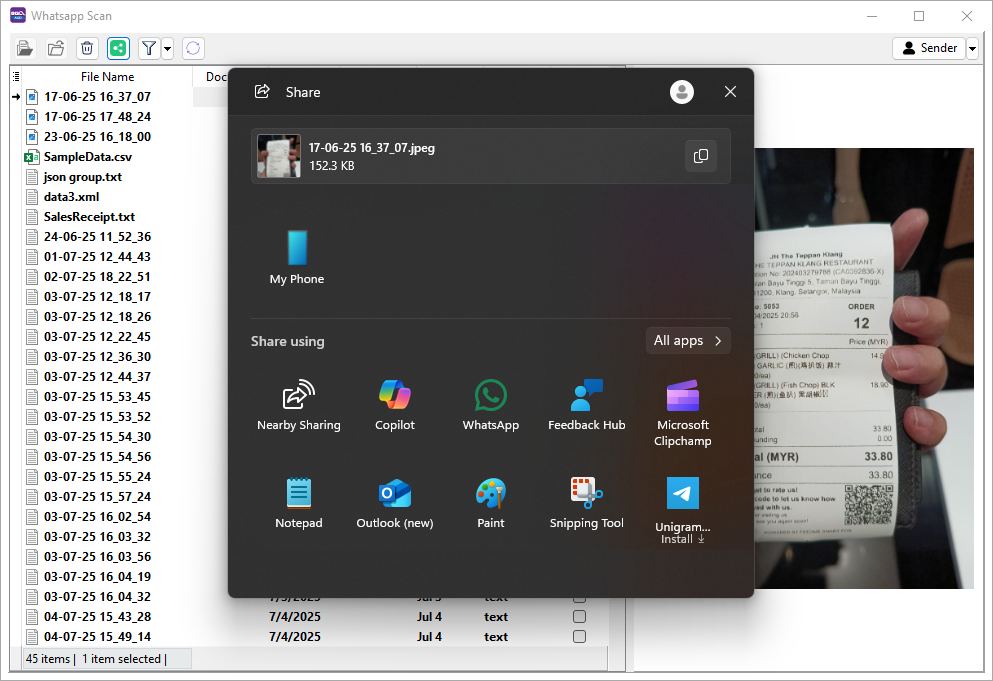