## Activation of InvoiceNow GST Submission

To activate InvoiceNow GST submission for GST-registered Businesses, navigate to **File** > **Company Profile** > **Peppol** and perform the actions below:

### Activate

To initiate InvoiceNow GST activation for specified participants and organizations. Activation requires signing with Corppass.

1. Click on **InvoiceNow GST** > **Activate**

    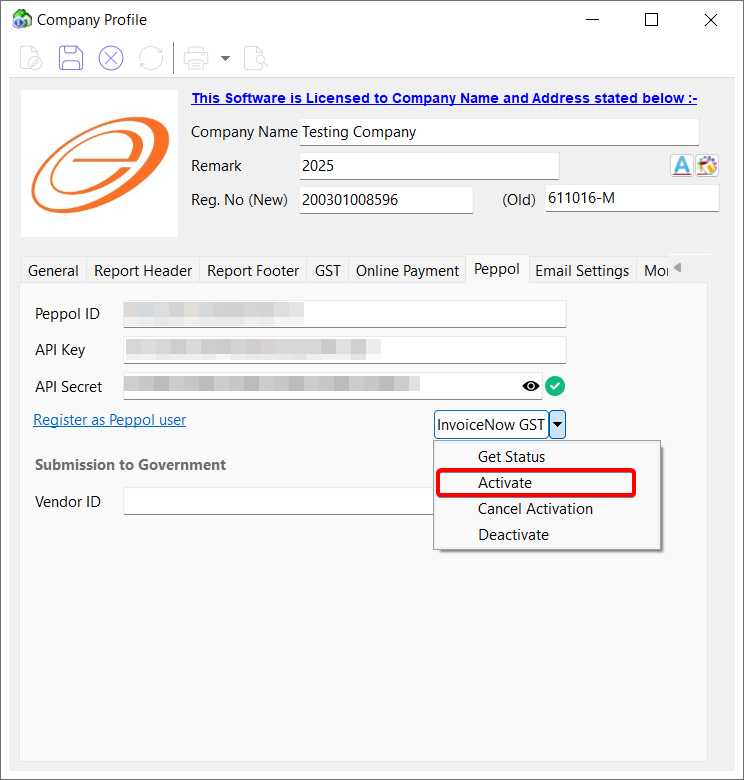

### Get Status

To check the InvoiceNow GST activation status for a specific participant and organization.

1. Click on **InvoiceNow GST** > **Get status**

    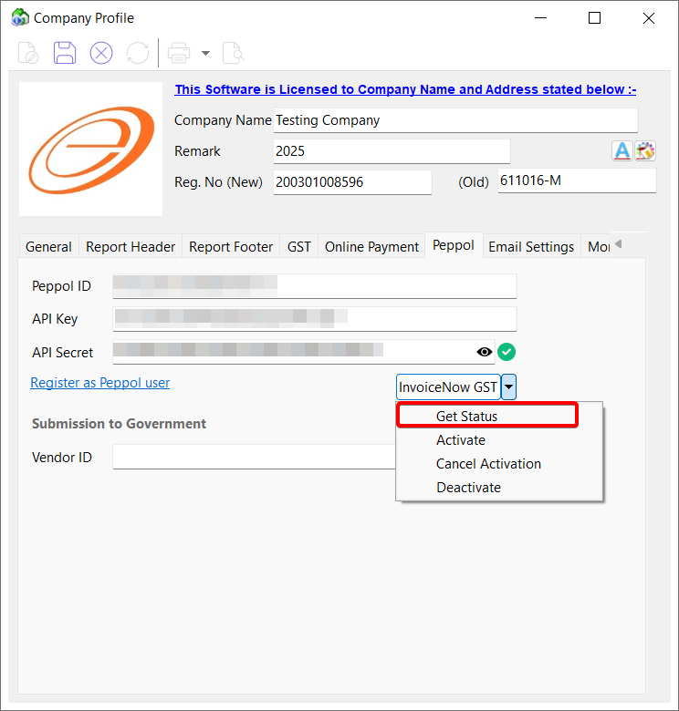

### Cancel Activation

To cancel an initiated InvoiceNow GST activation, a KYC pending InvoiceNow GST activation or a InvoiceNow GST deactivation.

1. Click on **InvoiceNow GST** > **Cancel Activation**

    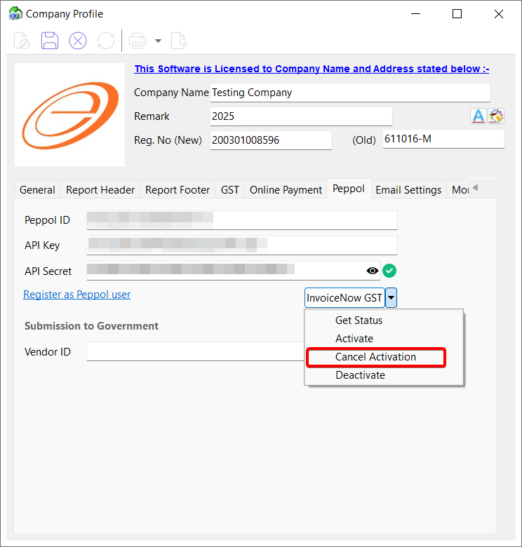

### Deactivate

To deactivate an existing InvoiceNow GST activation. Deactivation requires signing with Corppass.

1. Click on **InvoiceNow GST** > **Deactivate**

    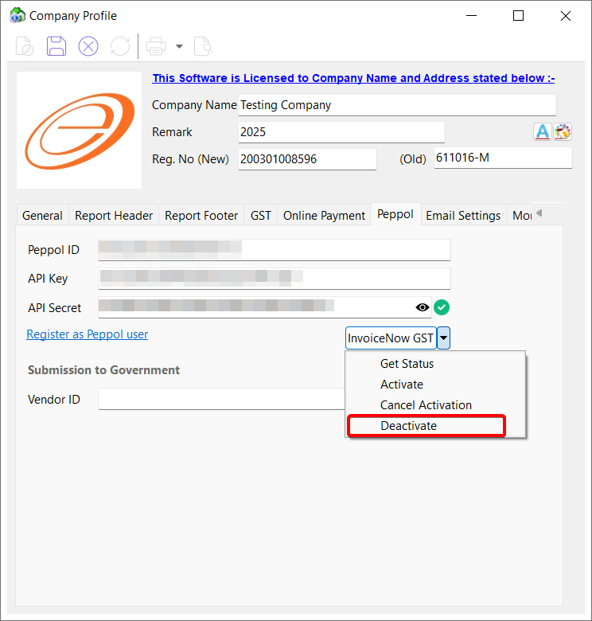

## Extraction and Packaging of Invoice Data

### Type 1A (Peppol)

This type will submits documents to the Peppol network and automatically forwards them to IRAS. You may use this type when the customer is on Peppol.

:::info[NOTE]

- Supported format: PINT (Default), BIS
- Supported document types: Sales Invoice, Credit Notes

:::

1. Click on **Peppol** > **Peppol (PINT)** or **Peppol (BIS)**

    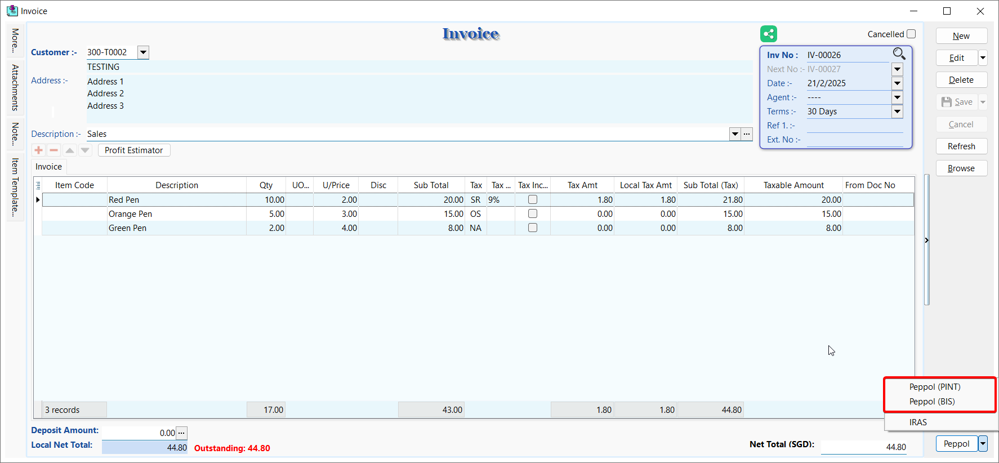

### Type 2A (Non Peppol)

This type will submits documents directly to IRAS.

:::info[NOTE]

- Supported format: PINT
- Supported document types: Sales Invoice, Credit Notes

:::

1. Click on **Peppol** > **IRAS**

    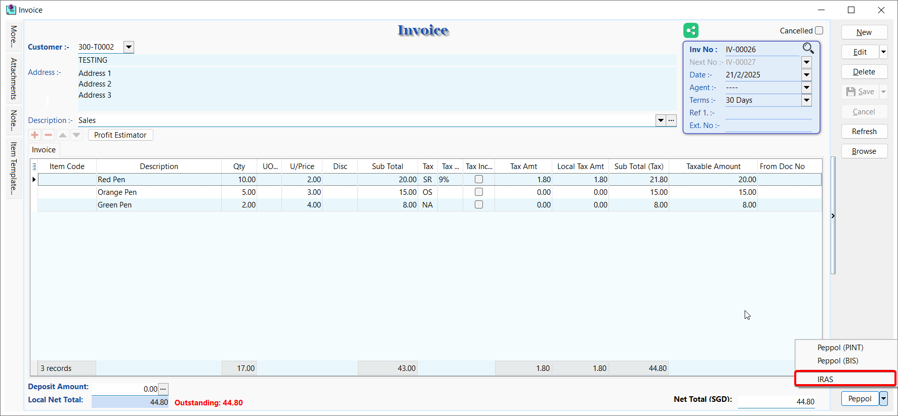

### Type 2B (POS or STI)

This type will groups items by tax code and submits documents to IRAS. You may use this type for cash register sales or sales made via point-of-sale systems (POS) or simplified tax invoices issued (STI).

:::info[NOTE]

- Supported format: PINT
- Supported document types: Cash Sales

:::

1. Click on **Peppol** > **IRAS**

    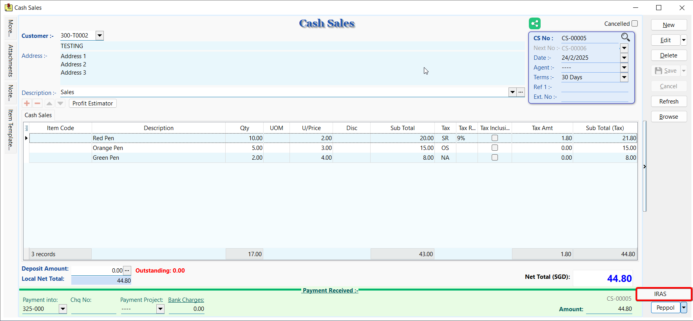

### Type 1B (Peppol Received)

This type will submits received documents via the Peppol network and forwards them to IRAS. You may use this type for documents imported using Peppol.

:::info[NOTE]

- Supported format: PINT (Default), BIS
- Supported document types: Purchase Invoice, Purchase Returned

:::

1. Click on **Peppol** > **Peppol (PINT)** or **Peppol (BIS)**

    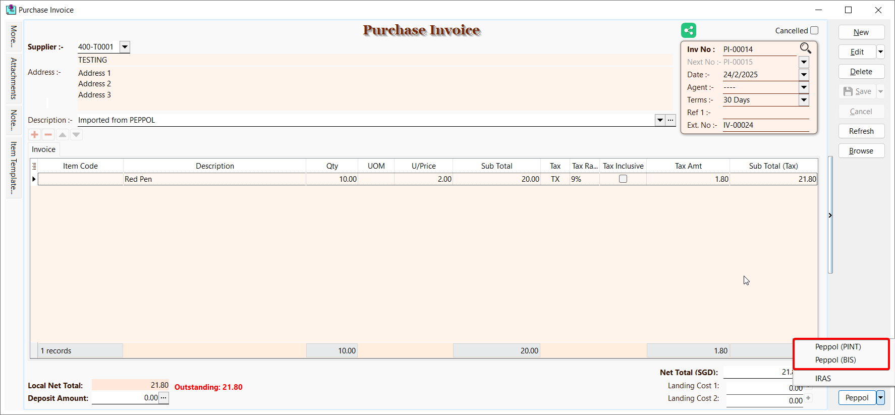

### Type 3A (Non Peppol Received)

This type will submits received documents directly to IRAS.

:::info[NOTE]

- Supported format: PINT
- Supported document types: Purchase Invoice, Purchase Returned

:::

1. Click on **Peppol** > **IRAS**

    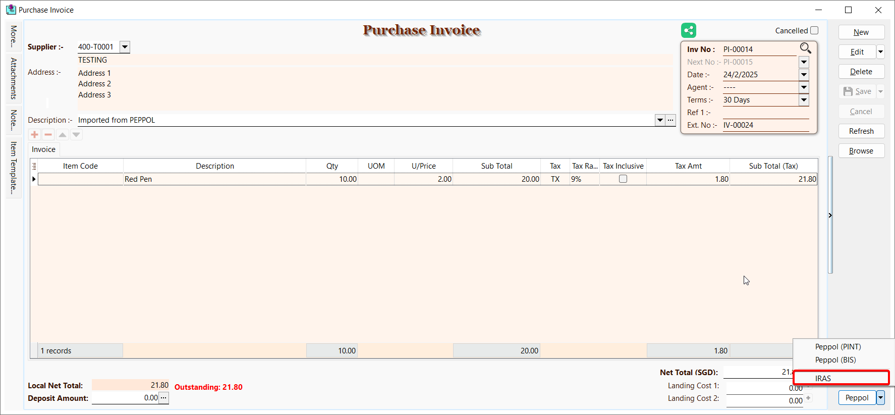

### Type 3B (PCP)

This type will groups items by tax code and submits documents to IRAS. You may use this type for petty cash purchases (PCP).

:::info[NOTE]

- Supported format: PINT
- Supported document types: Cash Purchase

:::

1. Click on **Peppol** > **IRAS**

    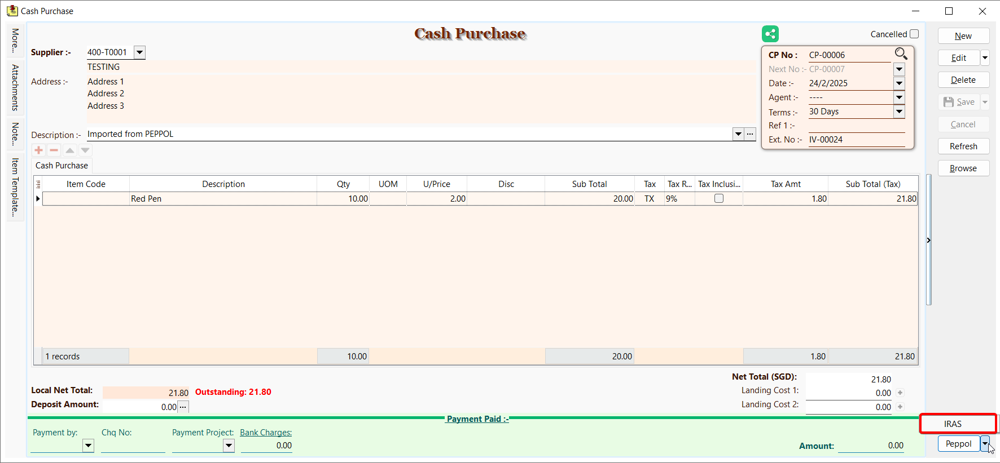

## Reporting & Reconciliation

### Log

To check the Peppol log of a document.

:::info[NOTE]
The Remark column stores the IRAS Acknowledgement ID
:::

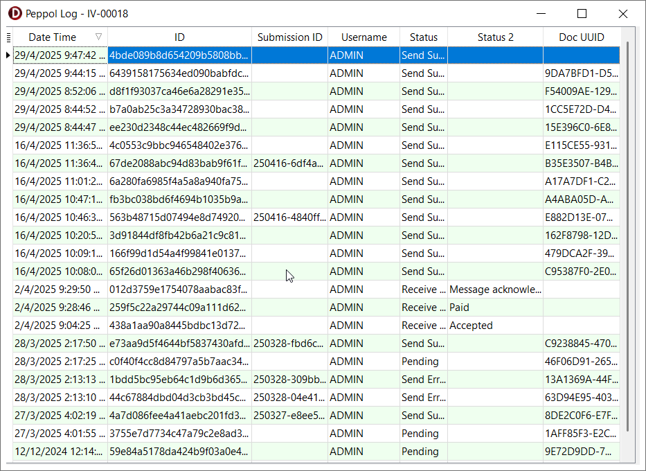

### Reconciliation

To compare document submissions in SQL Account and the Peppol network.

:::info[NOTE]
The record highlighted in red color indicate missing document submissions in SQL Account
:::

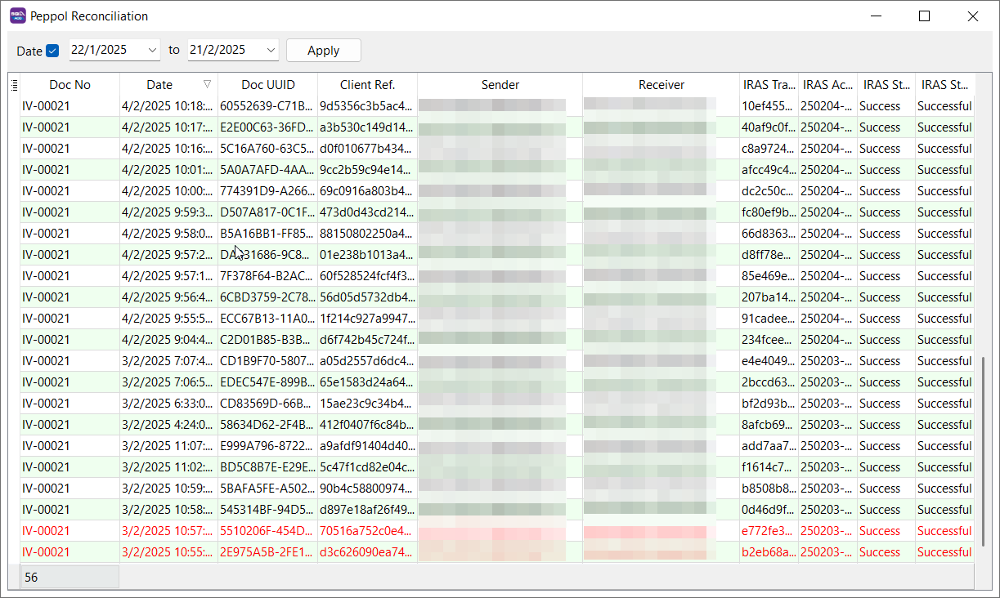
