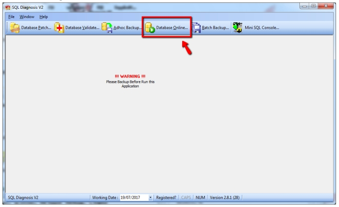

## Cause

1. Database did not shutdown properly

2. Power supply cut off/ blackout

## How to solve?

1. Download [SQL DiagnosisV2](https://download.sql.com.my/customer/Fairy/SQLDiagnosisV2-setup.exe)

2. Launch SQL DiagnosisV2

   

3. Select the DB stucked in `Shutdown` state.

   
