## Customer Work Flow (Account Receivable)

## Customer

Example of **customer (AR)** process work flow aligned with SQL Account flow:

AR = Account Receivable

* To keep the customer profile data such as addresses, telephone, fax, email, contact person, credit limits, credit terms, etc. In other words, it is your customer contacts list.

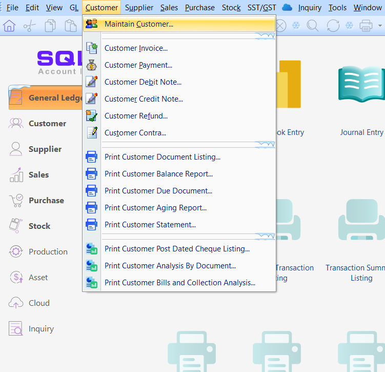

### Create New Customer
* Click the 'NEW' button.

1. Customer | Maintain Customer | New

2. Enter the customer’s name and other information accordingly.

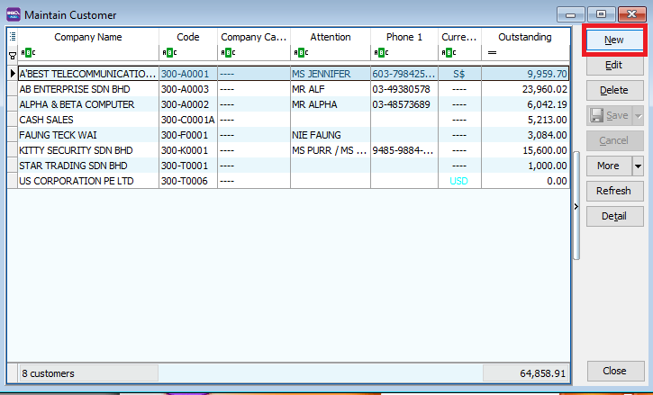

* Key in your customer's details

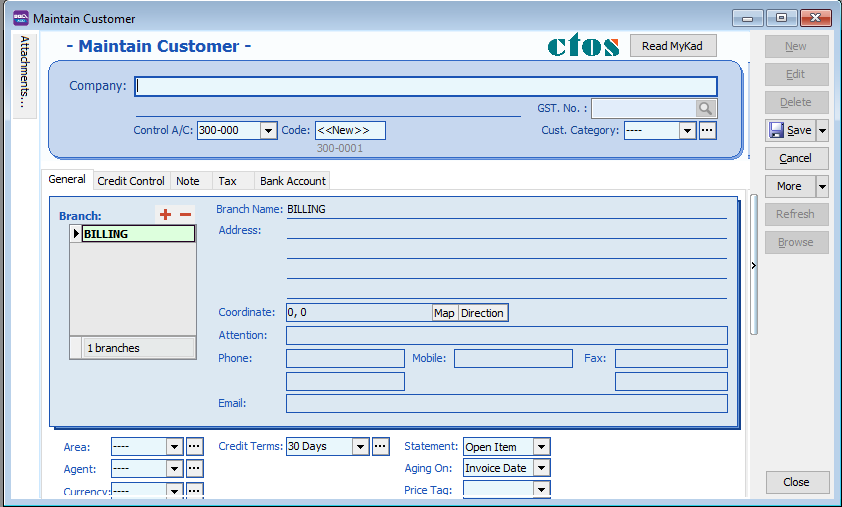

* You may input the following fields:

<table>
  <tr>
    <th>Field Name</th>
    <th>Explanation &amp; Properties</th>
  </tr>
  <tr>
    <td><b>Company</b></td>
    <td>
      <ul>
        <li>Input the customer billing company name.</li>
        <li><b>Field type:</b> Alphanumerical</li>
        <li><b>Length:</b> 100</li>
      </ul>
    </td>
  </tr>
  <tr>
    <td><b>Description 2</b> (underline below <i>Company</i>)</td>
    <td>
      <ul>
        <li>An optional field recommended to input Chinese translated name, former company name, company register no, etc.</li>
        <li><b>Field type:</b> Alphanumerical</li>
        <li><b>Length:</b> 100</li>
      </ul>
    </td>
  </tr>
  <tr>
    <td><b>Control A/c</b></td>
    <td>
      <ul>
        <li>Select an appropriate Customer Control Account to be posted to GL when customer documents are created.</li>
        <li><b>Field type:</b> Lookup from Maintain Accounts (Special Type: Customer Control Account)</li>
        <li><b>Length:</b> 10</li>
      </ul>
    </td>
  </tr>
  <tr>
    <td><b>Code</b></td>
    <td>
      <ul>
        <li>AUTO/MANUAL generate the Customer Code.</li>
        <li><b>Field type:</b> Alphanumerical</li>
        <li><b>Length:</b> 10</li>
      </ul>
    </td>
  </tr>
  <tr>
    <td><b>Cust Category</b></td>
    <td>
      <ul>
        <li>Categorize your customer for reporting purpose.</li>
        <li><b>Field type:</b> Lookup from Maintain Company Category</li>
        <li><b>Length:</b> 15</li>
      </ul>
    </td>
  </tr>
</table>

## Maintain Customer 

### General

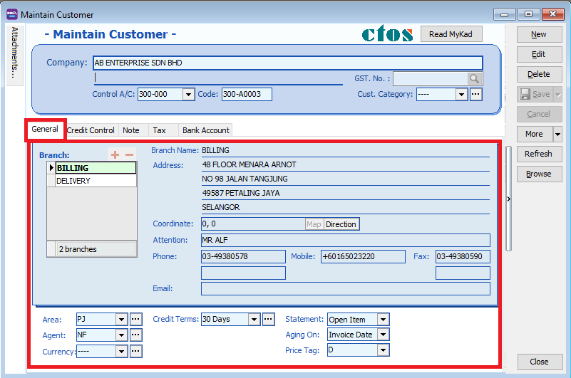

<table>
  <tr>
    <th>Field Name</th>
    <th>Explanation &amp; Properties</th>
  </tr>
  <tr>
    <td><b>Branch Name</b></td>
    <td>
      <ul>
        <li>You may maintain multiple sets of addresses by differentiating the Branch Name.</li>
        <li><b>Default Branch Name:</b> BILLING</li>
        <li><b>Field type:</b> Alphanumerical</li>
        <li><b>Length:</b> 100</li>
      </ul>
    </td>
  </tr>
  <tr>
    <td><b>Address (4 lines)</b></td>
    <td>
      <ul>
        <li>Input the company addresses.</li>
        <li><b>Field type:</b> Alphanumerical</li>
        <li><b>Length:</b> 40 (each line)</li>
      </ul>
    </td>
  </tr>
  <tr>
    <td><b>Attention</b></td>
    <td>
      <ul>
        <li>Input the contact person.</li>
        <li><b>Field type:</b> Alphanumerical</li>
        <li><b>Length:</b> 70</li>
      </ul>
    </td>
  </tr>
  <tr>
    <td><b>Phone 1 &amp; 2</b></td>
    <td>
      <ul>
        <li>Input the telephone number(s).</li>
        <li><b>Field type:</b> Alphanumerical</li>
        <li><b>Length:</b> 30</li>
      </ul>
    </td>
  </tr>
  <tr>
    <td><b>Fax 1 &amp; 2</b></td>
    <td>
      <ul>
        <li>Input the fax number(s).</li>
        <li><b>Field type:</b> Alphanumerical</li>
        <li><b>Length:</b> 30</li>
      </ul>
    </td>
  </tr>
  <tr>
    <td><b>Email</b></td>
    <td>
      <ul>
        <li>Input the email address.</li>
        <li><b>Field type:</b> Alphanumerical</li>
        <li><b>Length:</b> 60</li>
      </ul>
    </td>
  </tr>
  <tr>
    <td><b>Area</b></td>
    <td>
      <ul>
        <li>Select a default Area.</li>
        <li><b>Field type:</b> Lookup from Maintain Area</li>
        <li><b>Length:</b> 10</li>
      </ul>
    </td>
  </tr>
  <tr>
    <td><b>Agent</b></td>
    <td>
      <ul>
        <li>Select a default Agent.</li>
        <li><b>Field type:</b> Lookup from Maintain Agent</li>
        <li><b>Length:</b> 10</li>
      </ul>
    </td>
  </tr>
  <tr>
    <td><b>Currency</b></td>
    <td>
      <ul>
        <li>Select a default Currency.</li>
        <li><b>Field type:</b> Lookup from Maintain Currency</li>
        <li><b>Length:</b> 6</li>
      </ul>
    </td>
  </tr>
  <tr>
    <td><b>Credit Terms</b></td>
    <td>
      <ul>
        <li>Select a default Terms.</li>
        <li><b>Field type:</b> Lookup from Maintain Terms</li>
        <li><b>Length:</b> 10</li>
      </ul>
    </td>
  </tr>
  <tr>
    <td><b>Credit Limit</b></td>
    <td>
      <ul>
        <li>Set the credit limit (for non-Advance Credit Control module).</li>
        <li><b>Field type:</b> Numeric</li>
      </ul>
    </td>
  </tr>
  <tr>
    <td><b>Statement</b></td>
    <td>
      <ul>
        <li>Select a default statement type: <i>Open Item</i> or <i>Brought Forward</i>.</li>
        <li><b>Brought Forward:</b> Summary Statement</li>
        <li><b>Open Item:</b> Detail Statement</li>
        <li><b>Field type:</b> Option</li>
        <li><b>Default:</b> Open Item</li>
      </ul>
    </td>
  </tr>
  <tr>
    <td><b>Aging On</b></td>
    <td>
      <ul>
        <li>Select a default Aging type: <i>Invoice Date</i> or <i>Due Date</i>.</li>
        <li><b>Invoice Date:</b> based on IV Date</li>
        <li><b>Due Date:</b> based on after due date (terms)</li>
        <li><b>Field type:</b> Option</li>
        <li><b>Default:</b> Invoice Date</li>
      </ul>
    </td>
  </tr>
  <tr>
    <td><b>Price Tag</b></td>
    <td>
      <ul>
        <li>Set the price tag to the items.</li>
        <li><b>Field type:</b> Lookup from Maintain Stock Price Tag</li>
        <li><b>Length:</b> 10</li>
      </ul>
    </td>
  </tr>
</table>

1. You can categorize your customers into different groups, e.g. Category, agents, area How do you create your new agent/ area? Refer to the step below:

2. You can also insert more than one billing / delivery addresses (unlimited)

3. There are different options for viewing a customer aging and customer statement

:::note
1. Customer Statement
* Brought Forward: Summary Statement

Open Item: Detail Statement

2. Customer Aging
* Invoice Date: based on IV Date
* Due Date: Based on after due date (terms)
:::

### Note 

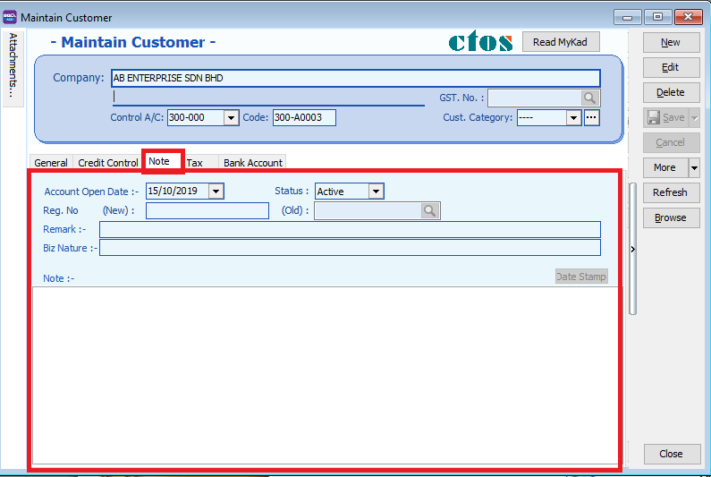

<table border="1" cellspacing="0" cellpadding="6">
  <tr>
    <th>Field Name</th>
    <th>Explanation & Properties</th>
  </tr>
  <tr>
    <td>Account Open Date</td>
    <td>
      <ul>
        <li>Represents the creation date of the account.</li>
        <li><b>Field type</b>: Date</li>
      </ul>
    </td>
  </tr>
  <tr>
    <td>Remark</td>
    <td>
      <ul>
        <li>A note that will appear in <b>Inquiry | Account Inquiry</b>.</li>
        <li>Example: "Check payment refer to Ms Lee (012-345 67890)".</li>
        <li><b>Field type</b>: Alphanumerical</li>
        <li><b>Length</b>: 80</li>
      </ul>
    </td>
  </tr>
  <tr>
    <td>Reg No. (new)</td>
    <td>
      <ul>
        <li>Company’s new registration number.</li>
        <li><b>Field type</b>: Alphanumerical</li>
        <li><b>Length</b>: 80</li>
      </ul>
    </td>
  </tr>
  <tr>
    <td>Reg No. (old)</td>
    <td>
      <ul>
        <li>Use the magnifying icon to search for the old registration number.</li>
        <li><b>Field type</b>: Alphanumerical</li>
        <li><b>Length</b>: 80</li>
      </ul>
    </td>
  </tr>
  <tr>
    <td>Biz Nature</td>
    <td>
      <ul>
        <li>Customer’s business nature.</li>
        <li>Example: Chemical Manufacturing, Car Service, etc.</li>
        <li><b>Field type</b>: Alphanumerical</li>
        <li><b>Length</b>: 100</li>
      </ul>
    </td>
  </tr>
  <tr>
    <td>Note</td>
    <td>
      <ul>
        <li>Used to record the customer knowledge base.</li>
        <li>Supports <b>Date Stamp</b> feature for tracking.</li>
        <li><b>Field type</b>: Alphanumerical</li>
        <li><b>Length</b>: Rich Text</li>
      </ul>
    </td>
  </tr>
  <tr>
    <td>Status</td>
    <td>
      <ul>
        <li>Indicates the operational state of the customer account:</li>
        <ul>
          <li><b>Active</b> → Can create official documents & print Customer Statement.</li>
          <li><b>Inactive</b> → Cannot create official documents & cannot print Customer Statement.</li>
          <li><b>Suspend</b> → Cannot create official documents but <b>can</b> print Customer Statement.</li>
          <li><b>Prospect</b> → Can create official documents & print Customer Statement.</li>
          <li><b>Pending</b> → Can create official documents & print Customer Statement.</li>
        </ul>
      </ul>
    </td>
  </tr>
</table>

### Tax

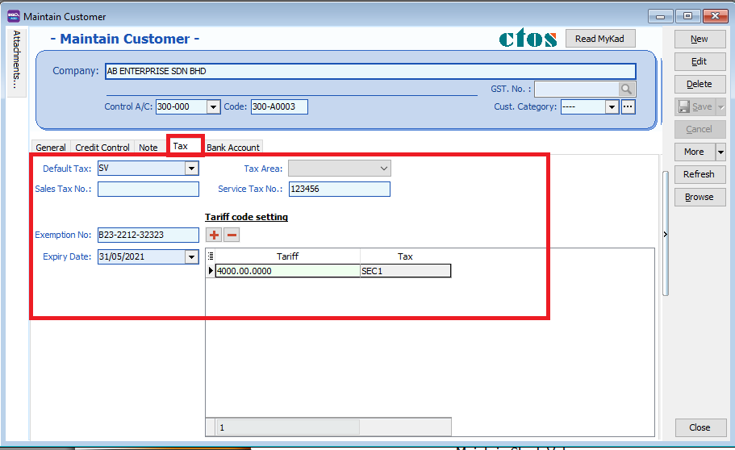

<table border="1" cellspacing="0" cellpadding="6">
  <tr>
    <th>Field Name</th>
    <th>Explanation & Properties</th>
  </tr>
  <tr>
    <td>Default Tax</td>
    <td>
      <ul>
        <li>Select a default tax code based on customer.</li>
      </ul>
    </td>
  </tr>
  <tr>
    <td>Tax Area</td>
    <td>
      <ul>
        <li>Not applicable to Malaysia/Singapore.</li>
      </ul>
    </td>
  </tr>
  <tr>
    <td>Sales Tax Area</td>
    <td>
      <ul>
        <li>Enter the company’s Sales Tax Number.</li>
      </ul>
    </td>
  </tr>
  <tr>
    <td>Service Tax Area</td>
    <td>
      <ul>
        <li>Enter the company’s Service Tax Number.</li>
      </ul>
    </td>
  </tr>
  <tr>
    <td>Exemption No</td>
    <td>
      <ul>
        <li>Input the Sales Tax Exemption number received from customer.</li>
        <li><b>Field type</b>: Alphanumerical</li>
        <li><b>Length</b>: 50</li>
      </ul>
    </td>
  </tr>
  <tr>
    <td>Expiry Date</td>
    <td>
      <ul>
        <li>Set the expiry date for tax exemption.</li>
        <li>The customer will be tax exempted before the expiry date.</li>
        <li><b>Field type</b>: Date</li>
      </ul>
    </td>
  </tr>
</table>

### Tariff Code Setting
* This setting set to customer who has supply the taxable goods under the Sales Tax (Person Exempted from Payment of Tax) Order 2018.

<table border="1" cellspacing="0" cellpadding="6">
  <tr>
    <th>Field Name</th>
    <th>Explanation & Properties</th>
  </tr>
  <tr>
    <td>Tariff</td>
    <td>
      <ul>
        <li>Add tariff code of taxable goods to be sold in exemption.</li>
        <li>
  You can find your tariff code at 
  <a href="http://mysstext.customs.gov.my/tariff/" target="_blank">
    http://mysstext.customs.gov.my/tariff/
  </a>
</li>

        <li><b>Lookup:</b> Maintain Tariff</li>
        <li><b>Related Topic:</b> Maintain Stock Item#Main_Header</li>
      </ul>
    </td>
  </tr>
  <tr>
    <td>Tax</td>
    <td>
      <ul>
        <li>Select an appropriate tax code that falls under the Person Exempted in Schedule A, B, and C.</li>
        <li><b>Schedule A tax code:</b> SEA</li>
        <li><b>Schedule B tax code:</b> SEB</li>
        <li><b>Schedule C tax codes:</b> SEC1, SEC2, SEC3, SEC4, SEC5</li>
        <li><b>Lookup:</b> Maintain Tax</li>
      </ul>
    </td>
  </tr>
</table>

* Press 'SAVE' button once you are done

After Saving, you should see all your customer's information on this screen

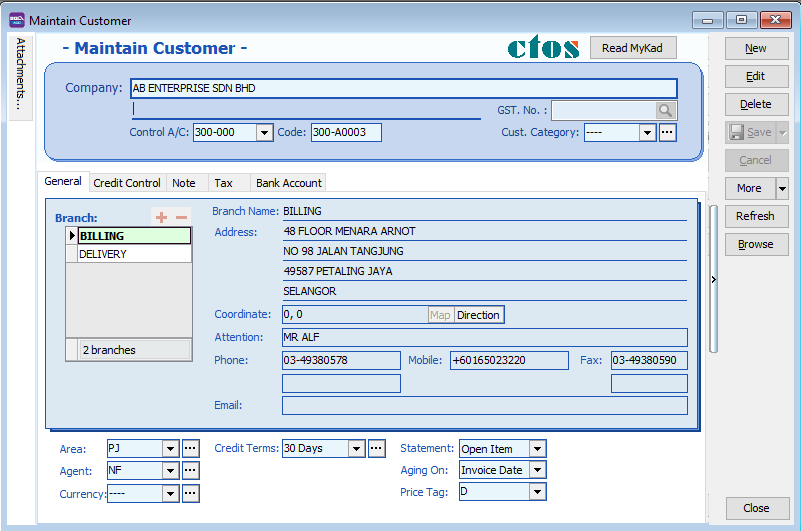

## Customer Code Format

* Customer code are generated AUTOMATICALLY after pressing the SAVE button

>IMPORTANT : 
>1. Every customer code is unique. 
>2. If the system found there is an duplicate code trying to save, users will be notify by warning message.
>See screenshot below.
>

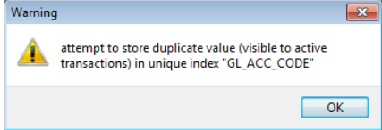

* You can set the customer code format via Tools | Options...(Customer). See screenshot below.

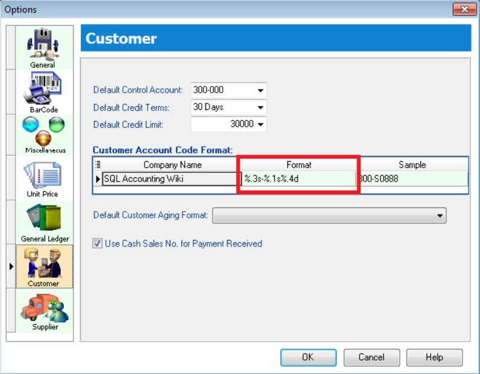

* Explanation of the Customer Code Format:

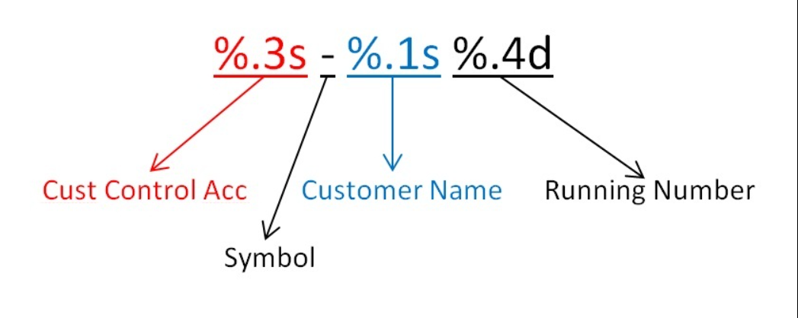

* For Example

| Company Name | Customer Control Acc | Format        | Result       |
|--------------|-----------------------|---------------|--------------|
| ABCD SDN BHD | 301-000              | %.1s-%.1s%.1d | 3-A-1        |
| ABCD SDN BHD | 301-000              | %.2s-%.2s%.2d | 30-AB-01     |
| ABCD SDN BHD | 301-000              | %.3s-%.3s%.3d | 301-ABC-001  |
| ABCD SDN BHD | 301-000              | %.4s-%.4s%.4d | 301--ABCD-0001 |

## Advance Credit Control (*Pro Package Inclusive)

* Credit Control use to control the customer outstanding within the specific overdue and credit limit given. See screenshot below.

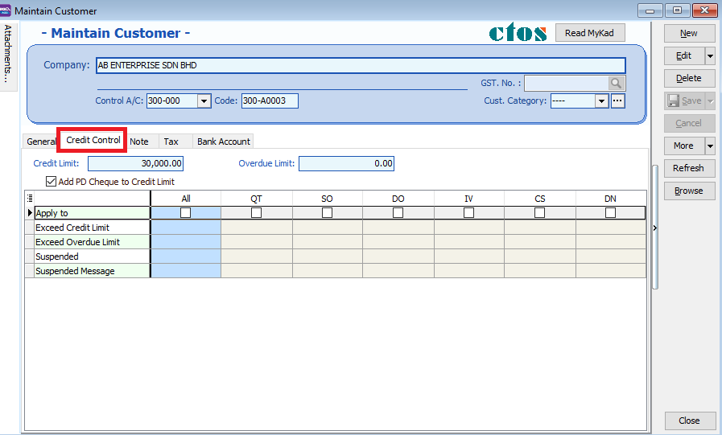

>IMPORTANT : 
>1. Depends on the user access rights to the Customer Credit Control.
>2. Override credit limit can be granted in the user access control.
>

### Credit/Overdue Limit

* Credit limit is the limit to set based on the total outstanding.
* Overdue limit is the limit to set based on the overdue outstanding only.
* Tick "Add PD Cheque to Credit Limit" to include any post dated payment to increase the credit limit.

### Exceed Credit/Overdue Limit

:::note Credit Control
Can be applied to the following document types:

1. QT - Quotation  
2. SO - Sales Order  
3. DO - Delivery Order  
4. IV - Sales Invoice  
5. CS - Cash Sales  
6. DN - Debit Note
:::

* You have to tick "Apply To" in order to set the further action (eg. unblock, block or override) to control the exceed credit and overdue limit. See screenshot below:

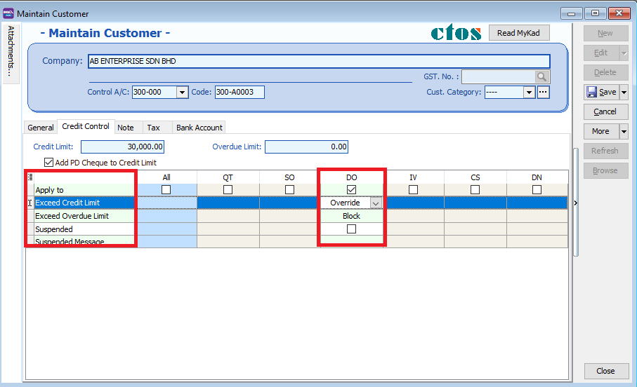

| Control Type          | Action   | ALLOW EXCEED        |
|-----------------------|----------|---------------------|
| Exceed Credit Limit   | Unblock  | YES                 |
| Exceed Credit Limit   | Block    | NO                  |
| Exceed Credit Limit   | Override | PASSWORD REQUIRED   |
| Exceed Overdue Limit  | Unblock  | YES                 |
| Exceed Overdue Limit  | Block    | NO                  |
| Exceed Overdue Limit  | Override | PASSWORD REQUIRED   |
:::note
>Unblock – No restrictions
>
>Block – Blocked for all users
>
>Override – Certain users which have access rights can key in their username & password to override.
>
>Suspended – Blocked with suspended message
>
:::
### Suspended

* You have to tick "Apply To" any document type in order to tick the SUSPENDED.
* At the same times, you can input the suspended message to prompt to the user when they try to save the documents. See screenshot below:

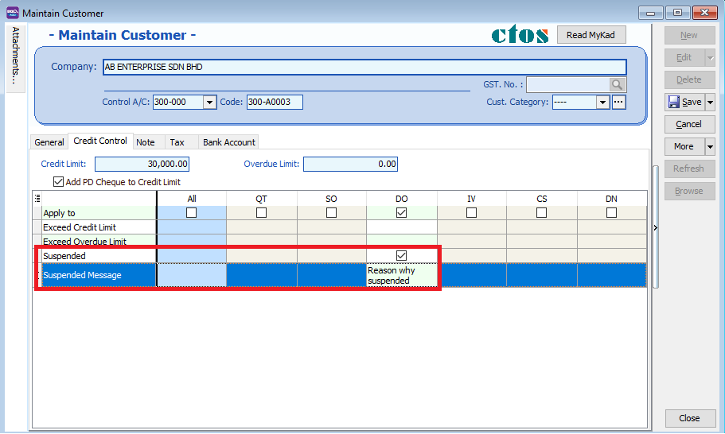

## Customer Invoice

### Customer Invoice vs Sales Invoice

The difference between Customer Invoice and Sales Invoice:

|**Customer Invoice**| **Sales Invoice**|
|---|---|
|shows only the accounts code and does not show Qty / Unit Price.| linked to the stock and account modules. Hence, we advise users who need to key in stock items to use Sales Invoice. Once the information in the Sales Invoice is updated, the information in the Customer Invoice will automatically be updated by the system.|

### Create a new Customer Invoice

   1. **Customer** | **Customer Invoice** | **New**

   2. Select **Customer Code** | insert transaction and amount.

   3. **Save**

        

## Customer Payment

### Local Bank Payment

   :::info
   Watch tutorial video here: [Youtube](https://www.youtube.com/watch?v=IjHX5ys846I&feature=youtu.be)
   :::

   1. **Customer** | **Customer Payment** | **New**

   2. Select your **Customer**

   3. Select the **bank for your account and cheque no** if applicable

   4. Key in the **customer payment amount**

   5. **Tick the corresponding invoice/debit note to be knocked off**

        

### Post Dated Cheque

   1. Search for the payment that you want to edit, click on **Edit**, right click on Customer Payment, you will see **Set Posting Date**

        

        

### Bounced Cheque

   1. Search for the payment that you want to edit, click on **Edit**, right click on Customer Payment, you will see **Bounced Status**

      

      

      After bounced, system will auto revert the payment out, you can view your ledger.

      

## Customer Credit Note

If the situation involves return stock from customer, please do Sales Credit Note and knock off it in Customer Credit Note as below step.

1. **Customer** | **Customer Credit Note**

2. **Edit** | Click **Yes**

3. **Knocked off accordingly**.

   

   If it does not involve with returned stock, e.g. discount given with

   1. **Customer** | **Customer Credit Note** | **New CN**

   2. **New** | Select **Customer** | Select **GL Account** | **Amount**

   3. **Knocked off accordingly**.

   

## Customer Refund

You can use this document to refund a customer. You can knock off with Customer Payment or Credit Note which have unapplied amounts.

1. **Customer** | **Customer Refund**.

2. Choose the **Customer** | Select your **Payment Method** | **Enter your Refund Amount**

3. **Knock off the payment or credit note and save**.

    

## Customer Contra

If you have a customer who is also a supplier, you may want to offset the outstanding customer and supplier invoices. This is known as a contra entry. You can offset the two invoices by using Customer Contra and Supplier Contra. This means that when you record the invoices as being paid, it will not affect your current bank account balance.

**Scenario:**

**If you have an outstanding sales invoice for RM200 and a purchase invoice for RM150 for the same customer or company, the actual amount owed to you is RM50 and the contra entry amount is RM150.**

### Make sure you have a valid `Contra Account`

1. Tools | Options

    

2. General Ledger | make sure you had chosen a valid Contra Account

    

### Contra Entry

   1. Go Customer | Customer Contra

        

   2. Press on NEW

        

        2a. Select your Customer Code

        2b. Enter your Contra Amount

        2c. Knock off your Invoice

        2d. Press on SAVE Button

        

   3. System will auto generated a Contra Number, jot down the number and go **Supplier | Supplier Contra** to edit it.

        

   4. Look for the Same Contra Number (refer step 2e), EDIT it.

        

      4a. Select your Supplier

      4b. Enter Contra Amount (Must be same as Customer Contra Amount)

      4c. Knock off your Supplier Invoice

      4d. Press on SAVE Button

        

After you post the contra entry:

- The outstanding amount on the sales invoice is RM50.

- The purchase invoice is fully knock off.

- When you receive the RM50, you can record this against the sales invoice using your normal Customer Payment entry.