## Print Customer Document Listing

* View all customer transactions (Invoices, Payments, Credit Notes, Debit Notes, Refunds, Contras).
* Batch print or email documents.
* At the bottom of the screen, you can see the payment details for each document

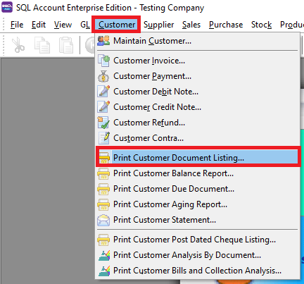

* Select which Document listing you want to see. Follow the image

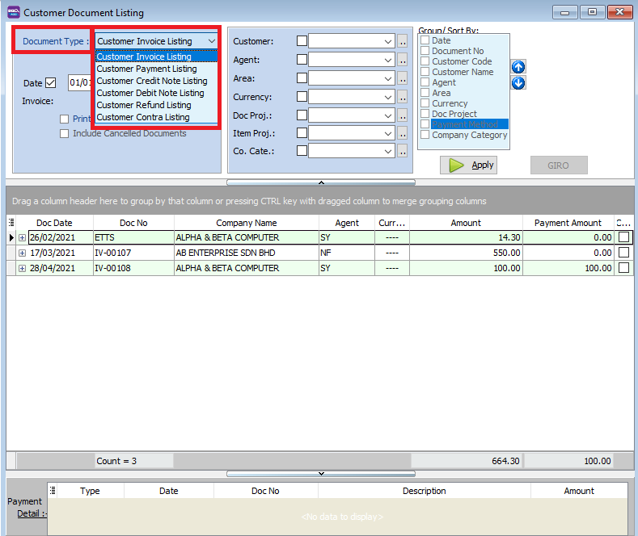

* Press Apply Button

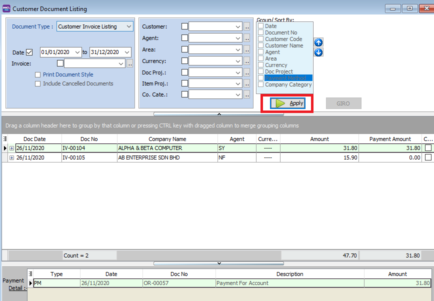

* Click Preveiw & Listing Report

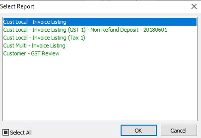

* Example of customer invoice listing report

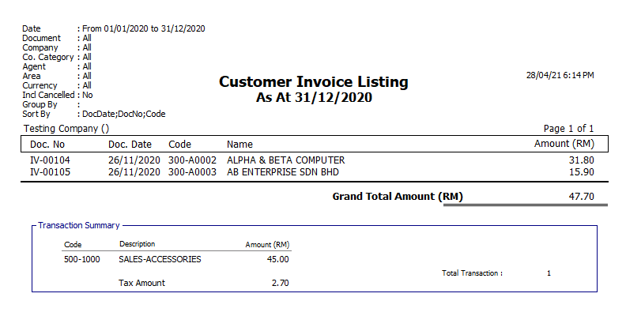

### Print Document Style 

* Tick relevant check boxes

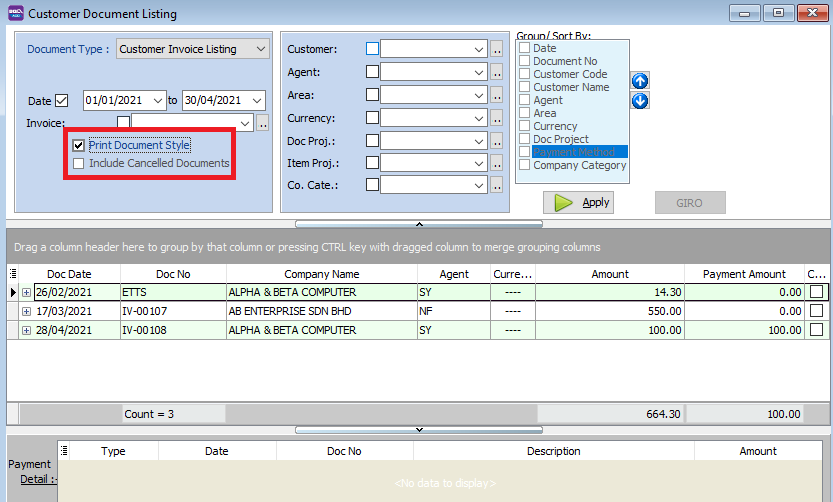

| Field Name                | Explanation                                           |
|----------------------------|-------------------------------------------------------|
| Print Document Style       | Tick this checkbox to print out bulk report or send batch email |
| Include Cancelled Documents| Tick this checkbox to include cancelled documents in the listing |

* If you Tick Print Document Style , you will see that you will able able to choose customer invoice report format.

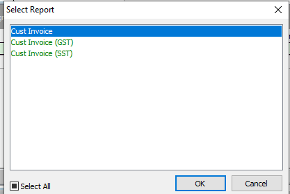
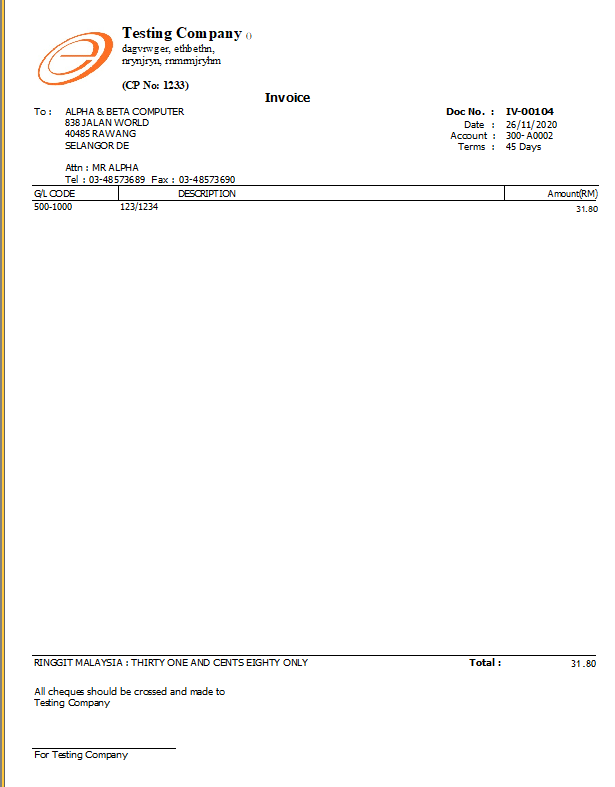

### Group/Sort by

* You can filter your documents based on Customer, Agent, Area, Currency, Project and Company Category

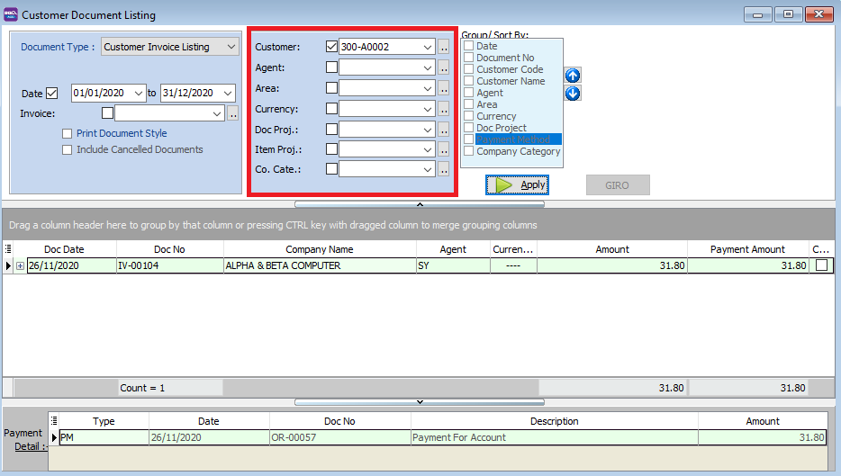

* You can use the Group by/Sort by table to choose how you want to group your report listing

* For example. you select to group by "Customer Name"

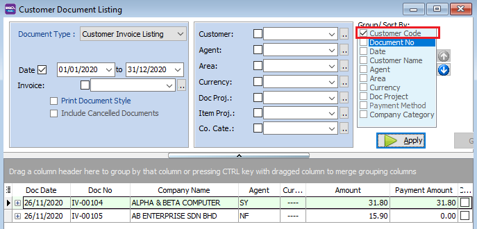

* Select the Listing Report

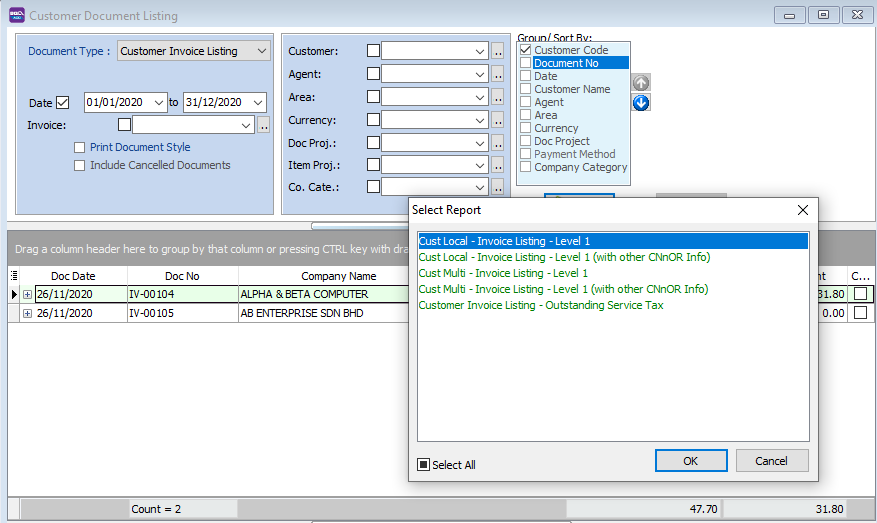

* Here is an example of the report

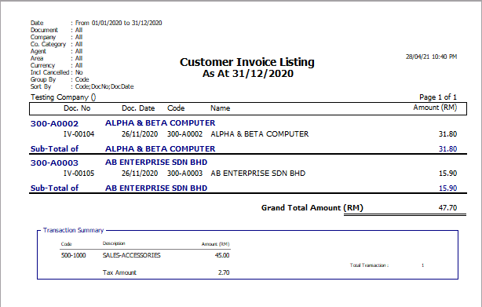

## Print Customer Balance Report 

* Print Customer Balance Report can be used for you to **see all the customer's balance**.

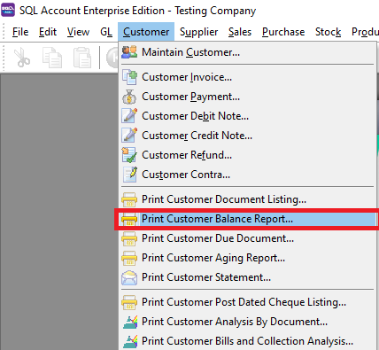

* Select the date period for the balance report

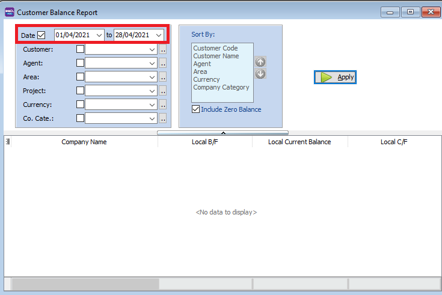

* You can filter the report selecting the customer, agent, area, project of the transaction

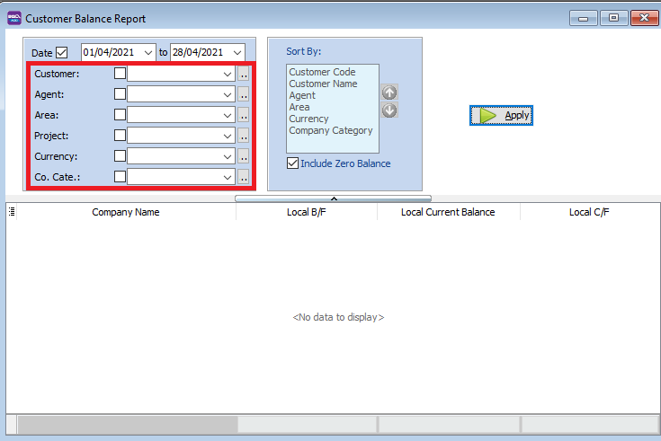

* Example, filtering by customer name. We selected 1 company ALPHA & BETA COMPUTERS

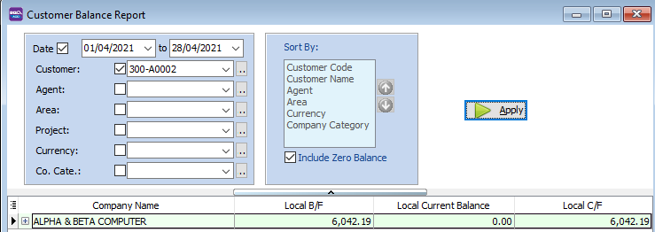

* You can click on the small + icon to expand the row and see the transactions details.

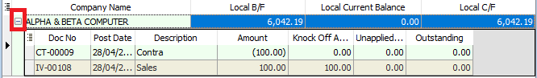

* Press the Preview icon to preview and print the report

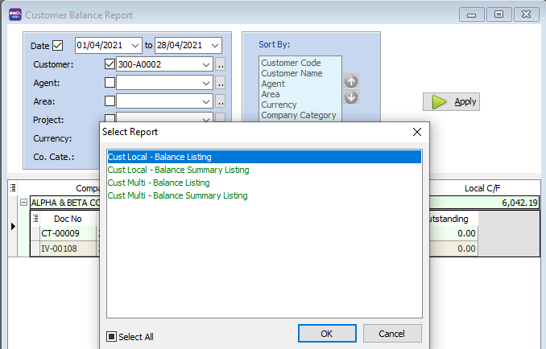

### Customer Due Document Listing

In this report, you can print a reminder letter to remind customers of outstanding amounts.

1. **Filter by Date, Document** (Invoice, Debit Note, Credit Note, Contra)

2. Overdue or Undue document.

3. System can generate by group and give you a summary on each group (group/sort by)

4. **Apply**.

    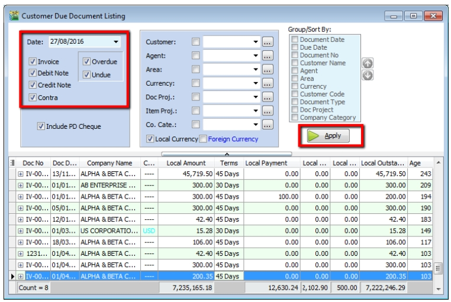

5. If you want to **print a reminder letter, make sure you tick the customer code under “group / sort by”** and **Apply**.

    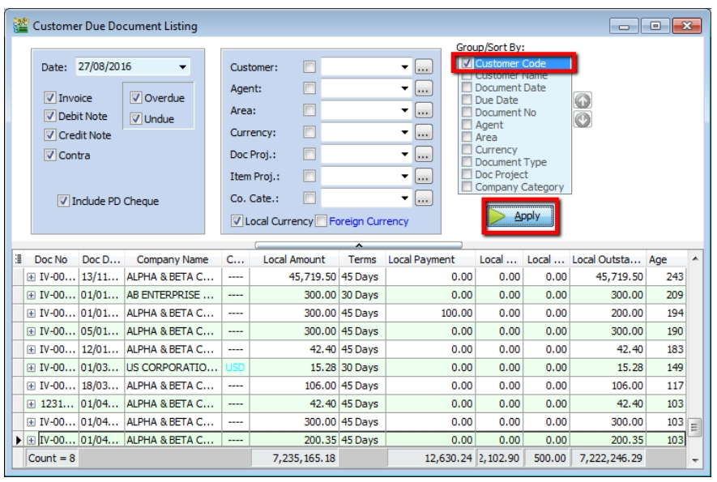

6. Preview the report and you will see **Cust Overdue Letter**, choose your preferred format.

    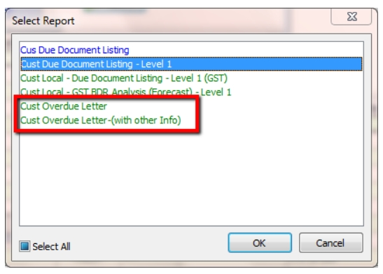

    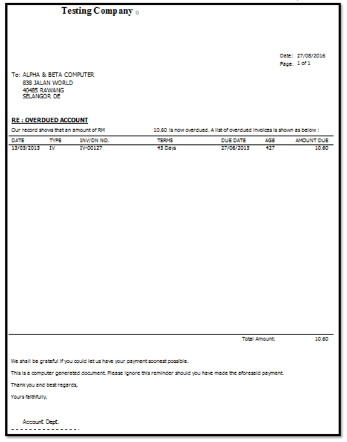

7. Customer Analysis By Document

    This report is used to analyse all customer documents in one report. You can check total Invoice, Credit Note, Debit Note, Payment and the rest of the document amount.

8. **Customer** > **Customer Analysis By Document**

9. Filter by Document Date and any others optional field to display.

10. **Apply**

    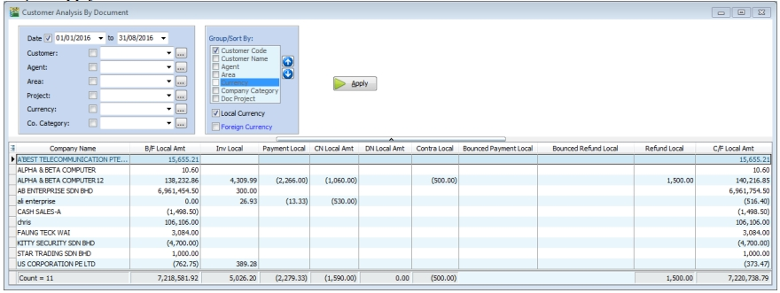